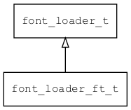

## font\_loader\_ft\_t
### 概述


freetype字体加载器。

freetype主要用于加载矢量字体(如truetype)，它功能强大，效果优异，与stb字体加载器相比，缺点是代码量比较大。
如果flash空间够大，优先使用freetype，否则使用stb。
----------------------------------
### 函数
<p id="font_loader_ft_t_methods">

| 函数名称 | 说明 | 
| -------- | ------------ | 
| <a href="#font_loader_ft_t_font_loader_ft">font\_loader\_ft</a> | 获取freetype字体加载器对象。 |
#### font\_loader\_ft 函数
-----------------------

* 函数功能：

> <p id="font_loader_ft_t_font_loader_ft">获取freetype字体加载器对象。

* 函数原型：

```
font_loader_t* font_loader_ft ();
```

* 参数说明：

| 参数 | 类型 | 说明 |
| -------- | ----- | --------- |
| 返回值 | font\_loader\_t* | 返回字体加载器对象。 |
