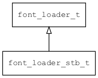

## font\_loader\_stb\_t
### 概述


stb字体加载器。

stb主要用于加载矢量字体(如truetype)，它功能强大，体积小巧。
----------------------------------
### 函数
<p id="font_loader_stb_t_methods">

| 函数名称 | 说明 | 
| -------- | ------------ | 
| <a href="#font_loader_stb_t_fargs_get_data_and_size">fargs\_get\_data\_and\_size</a> | 从参数中获取数据和长度。 |
| <a href="#font_loader_stb_t_font_loader_stb">font\_loader\_stb</a> | 获取stb字体加载器对象。 |
| <a href="#font_loader_stb_t_font_loader_stb_mono">font\_loader\_stb\_mono</a> | 获取stb mono字体加载器对象。 |
| <a href="#font_loader_stb_t_font_stb_create">font\_stb\_create</a> | 创建stb字体对象。 |
| <a href="#font_loader_stb_t_font_stb_mono_create">font\_stb\_mono\_create</a> | 创建stb mono字体对象。 |
| <a href="#font_loader_stb_t_fscript_app_conf_register">fscript\_app\_conf\_register</a> | 注册app_conf函数。 |
| <a href="#font_loader_stb_t_fscript_array_register">fscript\_array\_register</a> | 注册typed array函数。 |
| <a href="#font_loader_stb_t_fscript_bits_register">fscript\_bits\_register</a> | 注册数学函数。 |
| <a href="#font_loader_stb_t_fscript_crc_register">fscript\_crc\_register</a> | 注册crc16/crc32/cksum等函数。 |
| <a href="#font_loader_stb_t_fscript_date_time_register">fscript\_date\_time\_register</a> | 注册date time函数。 |
| <a href="#font_loader_stb_t_fscript_endian_register">fscript\_endian\_register</a> | 注册大端小断转换函数等函数。 |
| <a href="#font_loader_stb_t_fscript_ext_init">fscript\_ext\_init</a> | 注册扩展函数。 |
| <a href="#font_loader_stb_t_fscript_fs_register">fscript\_fs\_register</a> | 注册文件系统函数。 |
| <a href="#font_loader_stb_t_fscript_iostream_file_register">fscript\_iostream\_file\_register</a> | 注册iostream_file相关函数。 |
| <a href="#font_loader_stb_t_fscript_iostream_inet_register">fscript\_iostream\_inet\_register</a> | 注册iostream_inet相关函数。 |
| <a href="#font_loader_stb_t_fscript_iostream_register">fscript\_iostream\_register</a> | 注册iostream相关函数。 |
| <a href="#font_loader_stb_t_fscript_iostream_serial_register">fscript\_iostream\_serial\_register</a> | 注册iostream_serial相关函数。 |
| <a href="#font_loader_stb_t_fscript_istream_register">fscript\_istream\_register</a> | 注册istream相关等函数。 |
| <a href="#font_loader_stb_t_fscript_json_register">fscript\_json\_register</a> | 注册json函数。 |
| <a href="#font_loader_stb_t_fscript_math_register">fscript\_math\_register</a> | 注册数学函数。 |
| <a href="#font_loader_stb_t_fscript_object_register">fscript\_object\_register</a> | 注册object函数。 |
| <a href="#font_loader_stb_t_fscript_ostream_register">fscript\_ostream\_register</a> | 注册ostream相关函数。 |
| <a href="#font_loader_stb_t_fscript_rbuffer_register">fscript\_rbuffer\_register</a> | 注册rbuffer相关函数。 |
| <a href="#font_loader_stb_t_fscript_typed_array_register">fscript\_typed\_array\_register</a> | 注册typed array函数。 |
| <a href="#font_loader_stb_t_fscript_wbuffer_register">fscript\_wbuffer\_register</a> | 注册wbuffer相关函数。 |
| <a href="#font_loader_stb_t_fscript_widget_register">fscript\_widget\_register</a> | 注册widget函数。 |
#### fargs\_get\_data\_and\_size 函数
-----------------------

* 函数功能：

> <p id="font_loader_stb_t_fargs_get_data_and_size">从参数中获取数据和长度。

* 函数原型：

```
ret_t fargs_get_data_and_size (fscript_args_t* args, const uint8_t** , uint32_t* ret_size);
```

* 参数说明：

| 参数 | 类型 | 说明 |
| -------- | ----- | --------- |
| 返回值 | ret\_t | 返回RET\_OK表示成功，否则表示失败。 |
| args | fscript\_args\_t* | 参数。 |
|  | const uint8\_t** | 。 |
| ret\_size | uint32\_t* | 返回数据的长度。 |
#### font\_loader\_stb 函数
-----------------------

* 函数功能：

> <p id="font_loader_stb_t_font_loader_stb">获取stb字体加载器对象。

* 函数原型：

```
font_loader_t* font_loader_stb ();
```

* 参数说明：

| 参数 | 类型 | 说明 |
| -------- | ----- | --------- |
| 返回值 | font\_loader\_t* | 返回字体加载器对象。 |
#### font\_loader\_stb\_mono 函数
-----------------------

* 函数功能：

> <p id="font_loader_stb_t_font_loader_stb_mono">获取stb mono字体加载器对象。

* 函数原型：

```
font_loader_t* font_loader_stb_mono ();
```

* 参数说明：

| 参数 | 类型 | 说明 |
| -------- | ----- | --------- |
| 返回值 | font\_loader\_t* | 返回字体加载器对象。 |
#### font\_stb\_create 函数
-----------------------

* 函数功能：

> <p id="font_loader_stb_t_font_stb_create">创建stb字体对象。

* 函数原型：

```
font_t* font_stb_create (const char* name, const uint8_t* buff , uint32_t size);
```

* 参数说明：

| 参数 | 类型 | 说明 |
| -------- | ----- | --------- |
| 返回值 | font\_t* | 返回字体对象。 |
| name | const char* | 字体名称。 |
|  | const uint8\_t* buff | 。 |
| size | uint32\_t | 字体数据长度。 |
#### font\_stb\_mono\_create 函数
-----------------------

* 函数功能：

> <p id="font_loader_stb_t_font_stb_mono_create">创建stb mono字体对象。

* 函数原型：

```
font_t* font_stb_mono_create (const char* name, const uint8_t* buff , uint32_t size);
```

* 参数说明：

| 参数 | 类型 | 说明 |
| -------- | ----- | --------- |
| 返回值 | font\_t* | 返回字体对象。 |
| name | const char* | 字体名称。 |
|  | const uint8\_t* buff | 。 |
| size | uint32\_t | 字体数据长度。 |
#### fscript\_app\_conf\_register 函数
-----------------------

* 函数功能：

> <p id="font_loader_stb_t_fscript_app_conf_register">注册app_conf函数。

* 函数原型：

```
ret_t fscript_app_conf_register ();
```

* 参数说明：

| 参数 | 类型 | 说明 |
| -------- | ----- | --------- |
| 返回值 | ret\_t | 返回RET\_OK表示成功，否则表示失败。 |
#### fscript\_array\_register 函数
-----------------------

* 函数功能：

> <p id="font_loader_stb_t_fscript_array_register">注册typed array函数。

* 函数原型：

```
ret_t fscript_array_register ();
```

* 参数说明：

| 参数 | 类型 | 说明 |
| -------- | ----- | --------- |
| 返回值 | ret\_t | 返回RET\_OK表示成功，否则表示失败。 |
#### fscript\_bits\_register 函数
-----------------------

* 函数功能：

> <p id="font_loader_stb_t_fscript_bits_register">注册数学函数。

* 函数原型：

```
ret_t fscript_bits_register ();
```

* 参数说明：

| 参数 | 类型 | 说明 |
| -------- | ----- | --------- |
| 返回值 | ret\_t | 返回RET\_OK表示成功，否则表示失败。 |
#### fscript\_crc\_register 函数
-----------------------

* 函数功能：

> <p id="font_loader_stb_t_fscript_crc_register">注册crc16/crc32/cksum等函数。

* 函数原型：

```
ret_t fscript_crc_register ();
```

* 参数说明：

| 参数 | 类型 | 说明 |
| -------- | ----- | --------- |
| 返回值 | ret\_t | 返回RET\_OK表示成功，否则表示失败。 |
#### fscript\_date\_time\_register 函数
-----------------------

* 函数功能：

> <p id="font_loader_stb_t_fscript_date_time_register">注册date time函数。

* 函数原型：

```
ret_t fscript_date_time_register ();
```

* 参数说明：

| 参数 | 类型 | 说明 |
| -------- | ----- | --------- |
| 返回值 | ret\_t | 返回RET\_OK表示成功，否则表示失败。 |
#### fscript\_endian\_register 函数
-----------------------

* 函数功能：

> <p id="font_loader_stb_t_fscript_endian_register">注册大端小断转换函数等函数。

* 函数原型：

```
ret_t fscript_endian_register ();
```

* 参数说明：

| 参数 | 类型 | 说明 |
| -------- | ----- | --------- |
| 返回值 | ret\_t | 返回RET\_OK表示成功，否则表示失败。 |
#### fscript\_ext\_init 函数
-----------------------

* 函数功能：

> <p id="font_loader_stb_t_fscript_ext_init">注册扩展函数。

* 函数原型：

```
ret_t fscript_ext_init ();
```

* 参数说明：

| 参数 | 类型 | 说明 |
| -------- | ----- | --------- |
| 返回值 | ret\_t | 返回RET\_OK表示成功，否则表示失败。 |
#### fscript\_fs\_register 函数
-----------------------

* 函数功能：

> <p id="font_loader_stb_t_fscript_fs_register">注册文件系统函数。

* 函数原型：

```
ret_t fscript_fs_register ();
```

* 参数说明：

| 参数 | 类型 | 说明 |
| -------- | ----- | --------- |
| 返回值 | ret\_t | 返回RET\_OK表示成功，否则表示失败。 |
#### fscript\_iostream\_file\_register 函数
-----------------------

* 函数功能：

> <p id="font_loader_stb_t_fscript_iostream_file_register">注册iostream_file相关函数。

* 函数原型：

```
ret_t fscript_iostream_file_register ();
```

* 参数说明：

| 参数 | 类型 | 说明 |
| -------- | ----- | --------- |
| 返回值 | ret\_t | 返回RET\_OK表示成功，否则表示失败。 |
#### fscript\_iostream\_inet\_register 函数
-----------------------

* 函数功能：

> <p id="font_loader_stb_t_fscript_iostream_inet_register">注册iostream_inet相关函数。

* 函数原型：

```
ret_t fscript_iostream_inet_register ();
```

* 参数说明：

| 参数 | 类型 | 说明 |
| -------- | ----- | --------- |
| 返回值 | ret\_t | 返回RET\_OK表示成功，否则表示失败。 |
#### fscript\_iostream\_register 函数
-----------------------

* 函数功能：

> <p id="font_loader_stb_t_fscript_iostream_register">注册iostream相关函数。

* 函数原型：

```
ret_t fscript_iostream_register ();
```

* 参数说明：

| 参数 | 类型 | 说明 |
| -------- | ----- | --------- |
| 返回值 | ret\_t | 返回RET\_OK表示成功，否则表示失败。 |
#### fscript\_iostream\_serial\_register 函数
-----------------------

* 函数功能：

> <p id="font_loader_stb_t_fscript_iostream_serial_register">注册iostream_serial相关函数。

* 函数原型：

```
ret_t fscript_iostream_serial_register ();
```

* 参数说明：

| 参数 | 类型 | 说明 |
| -------- | ----- | --------- |
| 返回值 | ret\_t | 返回RET\_OK表示成功，否则表示失败。 |
#### fscript\_istream\_register 函数
-----------------------

* 函数功能：

> <p id="font_loader_stb_t_fscript_istream_register">注册istream相关等函数。

* 函数原型：

```
ret_t fscript_istream_register ();
```

* 参数说明：

| 参数 | 类型 | 说明 |
| -------- | ----- | --------- |
| 返回值 | ret\_t | 返回RET\_OK表示成功，否则表示失败。 |
#### fscript\_json\_register 函数
-----------------------

* 函数功能：

> <p id="font_loader_stb_t_fscript_json_register">注册json函数。

* 函数原型：

```
ret_t fscript_json_register ();
```

* 参数说明：

| 参数 | 类型 | 说明 |
| -------- | ----- | --------- |
| 返回值 | ret\_t | 返回RET\_OK表示成功，否则表示失败。 |
#### fscript\_math\_register 函数
-----------------------

* 函数功能：

> <p id="font_loader_stb_t_fscript_math_register">注册数学函数。

* 函数原型：

```
ret_t fscript_math_register ();
```

* 参数说明：

| 参数 | 类型 | 说明 |
| -------- | ----- | --------- |
| 返回值 | ret\_t | 返回RET\_OK表示成功，否则表示失败。 |
#### fscript\_object\_register 函数
-----------------------

* 函数功能：

> <p id="font_loader_stb_t_fscript_object_register">注册object函数。

* 函数原型：

```
ret_t fscript_object_register ();
```

* 参数说明：

| 参数 | 类型 | 说明 |
| -------- | ----- | --------- |
| 返回值 | ret\_t | 返回RET\_OK表示成功，否则表示失败。 |
#### fscript\_ostream\_register 函数
-----------------------

* 函数功能：

> <p id="font_loader_stb_t_fscript_ostream_register">注册ostream相关函数。

* 函数原型：

```
ret_t fscript_ostream_register ();
```

* 参数说明：

| 参数 | 类型 | 说明 |
| -------- | ----- | --------- |
| 返回值 | ret\_t | 返回RET\_OK表示成功，否则表示失败。 |
#### fscript\_rbuffer\_register 函数
-----------------------

* 函数功能：

> <p id="font_loader_stb_t_fscript_rbuffer_register">注册rbuffer相关函数。

* 函数原型：

```
ret_t fscript_rbuffer_register ();
```

* 参数说明：

| 参数 | 类型 | 说明 |
| -------- | ----- | --------- |
| 返回值 | ret\_t | 返回RET\_OK表示成功，否则表示失败。 |
#### fscript\_typed\_array\_register 函数
-----------------------

* 函数功能：

> <p id="font_loader_stb_t_fscript_typed_array_register">注册typed array函数。

* 函数原型：

```
ret_t fscript_typed_array_register ();
```

* 参数说明：

| 参数 | 类型 | 说明 |
| -------- | ----- | --------- |
| 返回值 | ret\_t | 返回RET\_OK表示成功，否则表示失败。 |
#### fscript\_wbuffer\_register 函数
-----------------------

* 函数功能：

> <p id="font_loader_stb_t_fscript_wbuffer_register">注册wbuffer相关函数。

* 函数原型：

```
ret_t fscript_wbuffer_register ();
```

* 参数说明：

| 参数 | 类型 | 说明 |
| -------- | ----- | --------- |
| 返回值 | ret\_t | 返回RET\_OK表示成功，否则表示失败。 |
#### fscript\_widget\_register 函数
-----------------------

* 函数功能：

> <p id="font_loader_stb_t_fscript_widget_register">注册widget函数。

* 函数原型：

```
ret_t fscript_widget_register ();
```

* 参数说明：

| 参数 | 类型 | 说明 |
| -------- | ----- | --------- |
| 返回值 | ret\_t | 返回RET\_OK表示成功，否则表示失败。 |
