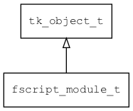

## fscript\_module\_t
### 概述


用require加载外部模块。
----------------------------------
### 函数
<p id="fscript_module_t_methods">

| 函数名称 | 说明 | 
| -------- | ------------ | 
| <a href="#fscript_module_t_fargs_get_data_and_size">fargs\_get\_data\_and\_size</a> | 从参数中获取数据和长度。 |
| <a href="#fscript_module_t_fscript_module_cast">fscript\_module\_cast</a> | 转换为fscript_module对象。 |
| <a href="#fscript_module_t_fscript_module_create">fscript\_module\_create</a> | 创建对象。 |
| <a href="#fscript_module_t_fscript_module_register">fscript\_module\_register</a> | 注册module函数。 |
| <a href="#fscript_module_t_fscript_object_register">fscript\_object\_register</a> | 注册object函数。 |
| <a href="#fscript_module_t_fscript_ostream_register">fscript\_ostream\_register</a> | 注册ostream相关函数。 |
| <a href="#fscript_module_t_fscript_rbuffer_register">fscript\_rbuffer\_register</a> | 注册rbuffer相关函数。 |
| <a href="#fscript_module_t_fscript_typed_array_register">fscript\_typed\_array\_register</a> | 注册typed array函数。 |
| <a href="#fscript_module_t_fscript_wbuffer_register">fscript\_wbuffer\_register</a> | 注册wbuffer相关函数。 |
| <a href="#fscript_module_t_fscript_widget_register">fscript\_widget\_register</a> | 注册widget函数。 |
#### fargs\_get\_data\_and\_size 函数
-----------------------

* 函数功能：

> <p id="fscript_module_t_fargs_get_data_and_size">从参数中获取数据和长度。

* 函数原型：

```
ret_t fargs_get_data_and_size (fscript_args_t* args, const uint8_t** ret_data, uint32_t* ret_size);
```

* 参数说明：

| 参数 | 类型 | 说明 |
| -------- | ----- | --------- |
| 返回值 | ret\_t | 返回RET\_OK表示成功，否则表示失败。 |
| args | fscript\_args\_t* | 参数。 |
| ret\_data | const uint8\_t** | 返回数据。 |
| ret\_size | uint32\_t* | 返回数据的长度。 |
#### fscript\_module\_cast 函数
-----------------------

* 函数功能：

> <p id="fscript_module_t_fscript_module_cast">转换为fscript_module对象。

* 函数原型：

```
fscript_module_t* fscript_module_cast (tk_object_t* obj);
```

* 参数说明：

| 参数 | 类型 | 说明 |
| -------- | ----- | --------- |
| 返回值 | fscript\_module\_t* | fscript\_module对象。 |
| obj | tk\_object\_t* | fscript\_module对象。 |
#### fscript\_module\_create 函数
-----------------------

* 函数功能：

> <p id="fscript_module_t_fscript_module_create">创建对象。

* 函数原型：

```
tk_object_t* fscript_module_create (const char* url);
```

* 参数说明：

| 参数 | 类型 | 说明 |
| -------- | ----- | --------- |
| 返回值 | tk\_object\_t* | 返回object对象。 |
| url | const char* | URL(用于读取数据) |
#### fscript\_module\_register 函数
-----------------------

* 函数功能：

> <p id="fscript_module_t_fscript_module_register">注册module函数。

* 函数原型：

```
ret_t fscript_module_register ();
```

* 参数说明：

| 参数 | 类型 | 说明 |
| -------- | ----- | --------- |
| 返回值 | ret\_t | 返回RET\_OK表示成功，否则表示失败。 |
#### fscript\_object\_register 函数
-----------------------

* 函数功能：

> <p id="fscript_module_t_fscript_object_register">注册object函数。

* 函数原型：

```
ret_t fscript_object_register ();
```

* 参数说明：

| 参数 | 类型 | 说明 |
| -------- | ----- | --------- |
| 返回值 | ret\_t | 返回RET\_OK表示成功，否则表示失败。 |
#### fscript\_ostream\_register 函数
-----------------------

* 函数功能：

> <p id="fscript_module_t_fscript_ostream_register">注册ostream相关函数。

* 函数原型：

```
ret_t fscript_ostream_register ();
```

* 参数说明：

| 参数 | 类型 | 说明 |
| -------- | ----- | --------- |
| 返回值 | ret\_t | 返回RET\_OK表示成功，否则表示失败。 |
#### fscript\_rbuffer\_register 函数
-----------------------

* 函数功能：

> <p id="fscript_module_t_fscript_rbuffer_register">注册rbuffer相关函数。

* 函数原型：

```
ret_t fscript_rbuffer_register ();
```

* 参数说明：

| 参数 | 类型 | 说明 |
| -------- | ----- | --------- |
| 返回值 | ret\_t | 返回RET\_OK表示成功，否则表示失败。 |
#### fscript\_typed\_array\_register 函数
-----------------------

* 函数功能：

> <p id="fscript_module_t_fscript_typed_array_register">注册typed array函数。

* 函数原型：

```
ret_t fscript_typed_array_register ();
```

* 参数说明：

| 参数 | 类型 | 说明 |
| -------- | ----- | --------- |
| 返回值 | ret\_t | 返回RET\_OK表示成功，否则表示失败。 |
#### fscript\_wbuffer\_register 函数
-----------------------

* 函数功能：

> <p id="fscript_module_t_fscript_wbuffer_register">注册wbuffer相关函数。

* 函数原型：

```
ret_t fscript_wbuffer_register ();
```

* 参数说明：

| 参数 | 类型 | 说明 |
| -------- | ----- | --------- |
| 返回值 | ret\_t | 返回RET\_OK表示成功，否则表示失败。 |
#### fscript\_widget\_register 函数
-----------------------

* 函数功能：

> <p id="fscript_module_t_fscript_widget_register">注册widget函数。

* 函数原型：

```
ret_t fscript_widget_register ();
```

* 参数说明：

| 参数 | 类型 | 说明 |
| -------- | ----- | --------- |
| 返回值 | ret\_t | 返回RET\_OK表示成功，否则表示失败。 |
