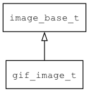

## gif\_image\_t
### 概述


GIF图片控件。

> 注意：GIF图片的尺寸大于控件大小时会自动缩小图片，但一般的嵌入式系统的硬件加速都不支持图片缩放，
所以缩放图片会导致性能明显下降。如果性能不满意时，请确认一下GIF图片的尺寸是否小余控件大小。

gif\_image\_t是[image\_base\_t](image_base_t.md)的子类控件，image\_base\_t的函数均适用于gif\_image\_t控件。

在xml中使用"gif"标签创建GIF图片控件。如：

```xml
<gif image="bee"/>
```

>更多用法请参考：
[gif
image](https://github.com/zlgopen/awtk/blob/master/design/default/ui/gif_image.xml)

在c代码中使用函数gif\_image\_create创建GIF图片控件。如：

```c
widget_t* image = gif_image_create(win, 10, 10, 200, 200);
image_set_image(image, "bee");
```

> 创建之后:
>
> 需要用widget\_set\_image设置图片名称。

> 完整示例请参考：[gif image demo](
https://github.com/zlgopen/awtk-c-demos/blob/master/demos/gif_image.c)

可用通过style来设置控件的显示风格，如背景和边框等。如：

```xml
<gif>
<style name="border">
<normal border_color="#000000" bg_color="#e0e0e0" text_color="black"/>
</style>
</gif>
```

> 更多用法请参考：[theme default](
https://github.com/zlgopen/awtk/blob/master/design/default/styles/default.xml)
----------------------------------
### 函数
<p id="gif_image_t_methods">

| 函数名称 | 说明 | 
| -------- | ------------ | 
| <a href="#gif_image_t_gif_image_cast">gif\_image\_cast</a> | 转换为gif_image对象(供脚本语言使用)。 |
| <a href="#gif_image_t_gif_image_create">gif\_image\_create</a> | 创建gif_image对象 |
#### gif\_image\_cast 函数
-----------------------

* 函数功能：

> <p id="gif_image_t_gif_image_cast">转换为gif_image对象(供脚本语言使用)。

* 函数原型：

```
widget_t* gif_image_cast (widget_t* widget);
```

* 参数说明：

| 参数 | 类型 | 说明 |
| -------- | ----- | --------- |
| 返回值 | widget\_t* | gif\_image对象。 |
| widget | widget\_t* | gif\_image对象。 |
#### gif\_image\_create 函数
-----------------------

* 函数功能：

> <p id="gif_image_t_gif_image_create">创建gif_image对象

* 函数原型：

```
widget_t* gif_image_create (widget_t* parent, xy_t x, xy_t y, wh_t w, wh_t h);
```

* 参数说明：

| 参数 | 类型 | 说明 |
| -------- | ----- | --------- |
| 返回值 | widget\_t* | 对象。 |
| parent | widget\_t* | 父控件 |
| x | xy\_t | x坐标 |
| y | xy\_t | y坐标 |
| w | wh\_t | 宽度 |
| h | wh\_t | 高度 |
