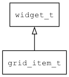

## grid\_item\_t
### 概述
 grid_item。一个简单的容器控件，一般作为grid的子控件。

### 函数

| 函数名称 | 说明 | 
| -------- | ------------ | 
| <a href="#grid_item_t_grid_item_cast">grid\_item\_cast</a> |  转换为grid_item对象(供脚本语言使用)。
 |
| <a href="#grid_item_t_grid_item_create">grid\_item\_create</a> |  创建grid_item对象
 |
### 属性

| 名属性称 | 类型 | 说明 | 
| -------- | ----- | ------------ | 
### 事件

| 事件名称 | 类型  | 说明 | 
| -------- | ----- | ------- | 
#### grid\_item\_cast 函数
-----------------------

| 参数 | 类型 | 说明 |
| -------- | ----- | --------- |
| 返回值 | widget\_t* | grid\_item对象。 |
| widget | widget\_t* | grid\_item对象。 |

 转换为grid_item对象(供脚本语言使用)。

#### grid\_item\_create 函数
-----------------------

| 参数 | 类型 | 说明 |
| -------- | ----- | --------- |
| 返回值 | widget\_t* | 对象。 |
| parent | widget\_t* | 父控件 |
| x | xy\_t | x坐标 |
| y | xy\_t | y坐标 |
| w | wh\_t | 宽度 |
| h | wh\_t | 高度 |

 创建grid_item对象

