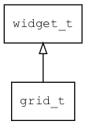

## grid\_t
### 概述


grid控件。一个简单的容器控件，用于网格排列一组控件。

它本身不提供布局功能，仅提供具有语义的标签，让xml更具有可读性。
子控件的布局可用layout\_children属性指定。
请参考[布局参数](https://github.com/zlgopen/awtk/blob/master/docs/layout.md)。

grid\_t是[widget\_t](widget_t.md)的子类控件，widget\_t的函数均适用于grid\_t控件。

在xml中使用"grid"标签创建grid。如：

```xml
<grid x="0" y="0" w="100%" h="100%" children_layout="default(c=2,r=2,m=5,s=5)">
<button name="open:basic" text="Basic"/>
<button name="open:button" text="Buttons"/>
<button name="open:edit" text="Edits"/>
<button name="open:keyboard" text="KeyBoard"/>
</grid>
```

可用通过style来设置控件的显示风格，如背景颜色等。如：

```xml
<style name="default" border_color="#a0a0a0">
<normal     bg_color="#f0f0f0" />
</style>
```
----------------------------------
### 函数
<p id="grid_t_methods">

| 函数名称 | 说明 | 
| -------- | ------------ | 
| <a href="#grid_t_grid_cast">grid\_cast</a> | 转换为grid对象(供脚本语言使用)。 |
| <a href="#grid_t_grid_create">grid\_create</a> | 创建grid对象 |
#### grid\_cast 函数
-----------------------

* 函数功能：

> <p id="grid_t_grid_cast">转换为grid对象(供脚本语言使用)。

* 函数原型：

```
widget_t* grid_cast (widget_t* widget);
```

* 参数说明：

| 参数 | 类型 | 说明 |
| -------- | ----- | --------- |
| 返回值 | widget\_t* | grid对象。 |
| widget | widget\_t* | grid对象。 |
#### grid\_create 函数
-----------------------

* 函数功能：

> <p id="grid_t_grid_create">创建grid对象

* 函数原型：

```
widget_t* grid_create (widget_t* parent, xy_t x, xy_t y, wh_t w, wh_t h);
```

* 参数说明：

| 参数 | 类型 | 说明 |
| -------- | ----- | --------- |
| 返回值 | widget\_t* | 对象。 |
| parent | widget\_t* | 父控件 |
| x | xy\_t | x坐标 |
| y | xy\_t | y坐标 |
| w | wh\_t | 宽度 |
| h | wh\_t | 高度 |
