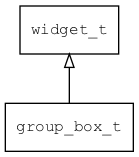

## group\_box\_t
### 概述


分组控件。

单选按钮在同一个父控件中是互斥的，所以通常将相关的单选按钮放在一个group\_box中。

它本身不提供布局功能，仅提供具有语义的标签，让xml更具有可读性。
子控件的布局可用layout\_children属性指定。
请参考[布局参数](https://github.com/zlgopen/awtk/blob/master/docs/layout.md)。

group\_box\_t是[widget\_t](widget_t.md)的子类控件，widget\_t的函数均适用于group\_box\_t控件。

在xml中使用"group\_box"标签创建group\_box。如：

```xml
<group_box x="20" y="230" w="50%" h="90" children_layout="default(r=3,c=1,ym=2,s=10)" >
<radio_button name="r1" text="Book"/>
<radio_button name="r2" text="Food"/>
<radio_button name="r3" text="Pencil" value="true"/>
</group_box>
```

可用通过style来设置控件的显示风格，如背景颜色等。如：

```xml
<style name="default" border_color="#a0a0a0">
<normal     bg_color="#f0f0f0" />
</style>
```
----------------------------------
### 函数
<p id="group_box_t_methods">

| 函数名称 | 说明 | 
| -------- | ------------ | 
| <a href="#group_box_t_group_box_cast">group\_box\_cast</a> | 转换为group_box对象(供脚本语言使用)。 |
| <a href="#group_box_t_group_box_create">group\_box\_create</a> | 创建group_box对象 |
#### group\_box\_cast 函数
-----------------------

* 函数功能：

> <p id="group_box_t_group_box_cast">转换为group_box对象(供脚本语言使用)。

* 函数原型：

```
widget_t* group_box_cast (widget_t* widget);
```

* 参数说明：

| 参数 | 类型 | 说明 |
| -------- | ----- | --------- |
| 返回值 | widget\_t* | group\_box对象。 |
| widget | widget\_t* | group\_box对象。 |
#### group\_box\_create 函数
-----------------------

* 函数功能：

> <p id="group_box_t_group_box_create">创建group_box对象

* 函数原型：

```
widget_t* group_box_create (widget_t* parent, xy_t x, xy_t y, wh_t w, wh_t h);
```

* 参数说明：

| 参数 | 类型 | 说明 |
| -------- | ----- | --------- |
| 返回值 | widget\_t* | 对象。 |
| parent | widget\_t* | 父控件 |
| x | xy\_t | x坐标 |
| y | xy\_t | y坐标 |
| w | wh\_t | 宽度 |
| h | wh\_t | 高度 |
