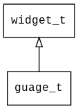

## guage\_t
### 概述


 表盘控件。
### 函数
<p id="guage_t_methods">

| 函数名称 | 说明 | 
| -------- | ------------ | 
| <a href="#guage_t_guage_cast">guage\_cast</a> | 转换为guage对象(供脚本语言使用)。 |
| <a href="#guage_t_guage_create">guage\_create</a> | 创建guage对象 |
| <a href="#guage_t_guage_set_draw_type">guage\_set\_draw\_type</a> | 设置图片的显示方式。 |
| <a href="#guage_t_guage_set_image">guage\_set\_image</a> | 设置背景图片的名称。 |
### 属性
<p id="guage_t_properties">

| 名属性称 | 类型 | 说明 | 
| -------- | ----- | ------------ | 
| <a href="#guage_t_draw_type">draw\_type</a> | image\_draw\_type\_t | 图片的绘制方式。 |
| <a href="#guage_t_image">image</a> | char* | 背景图片。 |
#### guage\_cast 函数
-----------------------

* 函数功能：

> <p id="guage_t_guage_cast"> 转换为guage对象(供脚本语言使用)。


* 函数原型：

```
widget_t* guage_cast (widget_t* widget);
```

* 参数说明：

| 参数 | 类型 | 说明 |
| -------- | ----- | --------- |
| 返回值 | widget\_t* | guage对象。 |
| widget | widget\_t* | guage对象。 |
#### guage\_create 函数
-----------------------

* 函数功能：

> <p id="guage_t_guage_create"> 创建guage对象


* 函数原型：

```
widget_t* guage_create (widget_t* parent, xy_t x, xy_t y, wh_t w, wh_t h);
```

* 参数说明：

| 参数 | 类型 | 说明 |
| -------- | ----- | --------- |
| 返回值 | widget\_t* | 对象。 |
| parent | widget\_t* | 父控件 |
| x | xy\_t | x坐标 |
| y | xy\_t | y坐标 |
| w | wh\_t | 宽度 |
| h | wh\_t | 高度 |
#### guage\_set\_draw\_type 函数
-----------------------

* 函数功能：

> <p id="guage_t_guage_set_draw_type"> 设置图片的显示方式。


* 函数原型：

```
ret_t guage_set_draw_type (widget_t* widget, image_draw_type_t draw_type);
```

* 参数说明：

| 参数 | 类型 | 说明 |
| -------- | ----- | --------- |
| 返回值 | ret\_t | 返回RET\_OK表示成功，否则表示失败。 |
| widget | widget\_t* | image对象。 |
| draw\_type | image\_draw\_type\_t | 显示方式。 |
#### guage\_set\_image 函数
-----------------------

* 函数功能：

> <p id="guage_t_guage_set_image"> 设置背景图片的名称。


* 函数原型：

```
ret_t guage_set_image (widget_t* widget, char* name);
```

* 参数说明：

| 参数 | 类型 | 说明 |
| -------- | ----- | --------- |
| 返回值 | ret\_t | 返回RET\_OK表示成功，否则表示失败。 |
| widget | widget\_t* | image对象。 |
| name | char* | 图片名称，该图片必须存在于资源管理器。 |
#### draw\_type 属性
-----------------------
> <p id="guage_t_draw_type"> 图片的绘制方式。


* 类型：image\_draw\_type\_t

| 特性 | 是否支持 |
| -------- | ----- |
| 可直接读取 | 是 |
| 可直接修改 | 否 |
| 可持久化   | 是 |
| 可脚本化   | 是 |
| 可在IDE中设置 | 是 |
| 可在XML中设置 | 是 |
| 可通过widget\_get\_prop读取 | 是 |
| 可通过widget\_set\_prop修改 | 是 |
#### image 属性
-----------------------
> <p id="guage_t_image"> 背景图片。


* 类型：char*

| 特性 | 是否支持 |
| -------- | ----- |
| 可直接读取 | 是 |
| 可直接修改 | 否 |
| 可持久化   | 是 |
| 可脚本化   | 是 |
| 可在IDE中设置 | 是 |
| 可在XML中设置 | 是 |
| 可通过widget\_get\_prop读取 | 是 |
| 可通过widget\_set\_prop修改 | 是 |
