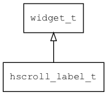

## hscroll\_label\_t
### 概述


可水平滚动的文本控件，方便实现长文本滚动。


hscroll\_label\_t是[widget\_t](widget_t.md)的子类控件，widget\_t的函数均适用于hscroll\_label\_t控件。

在xml中使用"hscroll\_label"标签创建行号控件，一般配合mledit使用。如：

```xml
```

> 更多用法请参考：[mledit.xml](
https://github.com/zlgopen/awtk/blob/master/design/default/ui/mledit.xml)

可用通过style来设置控件的显示风格，如字体的大小和颜色等等。如：

```xml
<style name="default" text_color="black">
<normal   />
<focused  />
</style>
```

> 更多用法请参考：
[theme default](
https://github.com/zlgopen/awtk/blob/master/design/default/styles/default.xml)
----------------------------------
### 函数
<p id="hscroll_label_t_methods">

| 函数名称 | 说明 | 
| -------- | ------------ | 
| <a href="#hscroll_label_t_hscroll_label_cast">hscroll\_label\_cast</a> | 转换为hscroll_label对象(供脚本语言使用)。 |
| <a href="#hscroll_label_t_hscroll_label_create">hscroll\_label\_create</a> | 创建hscroll_label对象 |
| <a href="#hscroll_label_t_hscroll_label_set_duration">hscroll\_label\_set\_duration</a> | 设置duration。 |
| <a href="#hscroll_label_t_hscroll_label_set_ellipses">hscroll\_label\_set\_ellipses</a> | 设置ellipses。 |
| <a href="#hscroll_label_t_hscroll_label_set_loop">hscroll\_label\_set\_loop</a> | 设置loop。 |
| <a href="#hscroll_label_t_hscroll_label_set_lull">hscroll\_label\_set\_lull</a> | 设置lull。 |
| <a href="#hscroll_label_t_hscroll_label_set_only_focus">hscroll\_label\_set\_only\_focus</a> | 设置only_focus。 |
| <a href="#hscroll_label_t_hscroll_label_set_only_parent_focus">hscroll\_label\_set\_only\_parent\_focus</a> | 设置only_parent_focus。 |
| <a href="#hscroll_label_t_hscroll_label_set_xoffset">hscroll\_label\_set\_xoffset</a> | 设置x偏移(一般无需用户调用)。。 |
| <a href="#hscroll_label_t_hscroll_label_set_yoyo">hscroll\_label\_set\_yoyo</a> | 设置yoyo。 |
| <a href="#hscroll_label_t_hscroll_label_start">hscroll\_label\_start</a> | 启动(一般无需用户调用)。 |
| <a href="#hscroll_label_t_hscroll_label_stop">hscroll\_label\_stop</a> | 停止(一般无需用户调用)。 |
### 属性
<p id="hscroll_label_t_properties">

| 属性名称 | 类型 | 说明 | 
| -------- | ----- | ------------ | 
| <a href="#hscroll_label_t_duration">duration</a> | int32\_t | 完整的滚动一次需要的时间(ms)，缺省5000ms。 |
| <a href="#hscroll_label_t_ellipses">ellipses</a> | bool\_t | 文本显示不下时，在行尾显示省略号(缺省FALSE)。 |
| <a href="#hscroll_label_t_loop">loop</a> | bool\_t | loop是否循环滚动(缺省FALSE)。 |
| <a href="#hscroll_label_t_lull">lull</a> | int32\_t | 滚动之间的间歇时间(ms)，缺省3000ms。 |
| <a href="#hscroll_label_t_only_focus">only\_focus</a> | bool\_t | 只有处于focus时才滚动(缺省否)。 |
| <a href="#hscroll_label_t_only_parent_focus">only\_parent\_focus</a> | bool\_t | 只有父控件处于focus时才滚动(缺省否)。 |
| <a href="#hscroll_label_t_text_w">text\_w</a> | int32\_t | 文本的宽度。 |
| <a href="#hscroll_label_t_xoffset">xoffset</a> | int32\_t | 偏移量。 |
| <a href="#hscroll_label_t_yoyo">yoyo</a> | bool\_t | 是否往返滚动(缺省FALSE)。 |
#### hscroll\_label\_cast 函数
-----------------------

* 函数功能：

> <p id="hscroll_label_t_hscroll_label_cast">转换为hscroll_label对象(供脚本语言使用)。

* 函数原型：

```
widget_t* hscroll_label_cast (widget_t* widget);
```

* 参数说明：

| 参数 | 类型 | 说明 |
| -------- | ----- | --------- |
| 返回值 | widget\_t* | hscroll\_label对象。 |
| widget | widget\_t* | hscroll\_label对象。 |
#### hscroll\_label\_create 函数
-----------------------

* 函数功能：

> <p id="hscroll_label_t_hscroll_label_create">创建hscroll_label对象

* 函数原型：

```
widget_t* hscroll_label_create (widget_t* parent, xy_t x, xy_t y, wh_t w, wh_t h);
```

* 参数说明：

| 参数 | 类型 | 说明 |
| -------- | ----- | --------- |
| 返回值 | widget\_t* | 对象。 |
| parent | widget\_t* | 父控件 |
| x | xy\_t | x坐标 |
| y | xy\_t | y坐标 |
| w | wh\_t | 宽度 |
| h | wh\_t | 高度 |
#### hscroll\_label\_set\_duration 函数
-----------------------

* 函数功能：

> <p id="hscroll_label_t_hscroll_label_set_duration">设置duration。

* 函数原型：

```
ret_t hscroll_label_set_duration (widget_t* widget, int32_t duration);
```

* 参数说明：

| 参数 | 类型 | 说明 |
| -------- | ----- | --------- |
| 返回值 | ret\_t | 返回RET\_OK表示成功，否则表示失败。 |
| widget | widget\_t* | 控件对象。 |
| duration | int32\_t | 滚动时间(ms)。 |
#### hscroll\_label\_set\_ellipses 函数
-----------------------

* 函数功能：

> <p id="hscroll_label_t_hscroll_label_set_ellipses">设置ellipses。

* 函数原型：

```
ret_t hscroll_label_set_ellipses (widget_t* widget, bool_t ellipses);
```

* 参数说明：

| 参数 | 类型 | 说明 |
| -------- | ----- | --------- |
| 返回值 | ret\_t | 返回RET\_OK表示成功，否则表示失败。 |
| widget | widget\_t* | 控件对象。 |
| ellipses | bool\_t | 是否在文本超长时在行尾显示"..."。 |
#### hscroll\_label\_set\_loop 函数
-----------------------

* 函数功能：

> <p id="hscroll_label_t_hscroll_label_set_loop">设置loop。

* 函数原型：

```
ret_t hscroll_label_set_loop (widget_t* widget, bool_t loop);
```

* 参数说明：

| 参数 | 类型 | 说明 |
| -------- | ----- | --------- |
| 返回值 | ret\_t | 返回RET\_OK表示成功，否则表示失败。 |
| widget | widget\_t* | 控件对象。 |
| loop | bool\_t | 是否循环滚动。 |
#### hscroll\_label\_set\_lull 函数
-----------------------

* 函数功能：

> <p id="hscroll_label_t_hscroll_label_set_lull">设置lull。

* 函数原型：

```
ret_t hscroll_label_set_lull (widget_t* widget, int32_t lull);
```

* 参数说明：

| 参数 | 类型 | 说明 |
| -------- | ----- | --------- |
| 返回值 | ret\_t | 返回RET\_OK表示成功，否则表示失败。 |
| widget | widget\_t* | 控件对象。 |
| lull | int32\_t | 间歇时间(ms)。 |
#### hscroll\_label\_set\_only\_focus 函数
-----------------------

* 函数功能：

> <p id="hscroll_label_t_hscroll_label_set_only_focus">设置only_focus。

* 函数原型：

```
ret_t hscroll_label_set_only_focus (widget_t* widget, bool_t only_focus);
```

* 参数说明：

| 参数 | 类型 | 说明 |
| -------- | ----- | --------- |
| 返回值 | ret\_t | 返回RET\_OK表示成功，否则表示失败。 |
| widget | widget\_t* | 控件对象。 |
| only\_focus | bool\_t | 是否只有处于focus时才滚动。 |
#### hscroll\_label\_set\_only\_parent\_focus 函数
-----------------------

* 函数功能：

> <p id="hscroll_label_t_hscroll_label_set_only_parent_focus">设置only_parent_focus。

* 函数原型：

```
ret_t hscroll_label_set_only_parent_focus (widget_t* widget, bool_t only_parent_focus);
```

* 参数说明：

| 参数 | 类型 | 说明 |
| -------- | ----- | --------- |
| 返回值 | ret\_t | 返回RET\_OK表示成功，否则表示失败。 |
| widget | widget\_t* | 控件对象。 |
| only\_parent\_focus | bool\_t | 是否只有处于focus时才滚动。 |
#### hscroll\_label\_set\_xoffset 函数
-----------------------

* 函数功能：

> <p id="hscroll_label_t_hscroll_label_set_xoffset">设置x偏移(一般无需用户调用)。。

* 函数原型：

```
ret_t hscroll_label_set_xoffset (widget_t* widget, int32_t xoffset);
```

* 参数说明：

| 参数 | 类型 | 说明 |
| -------- | ----- | --------- |
| 返回值 | ret\_t | 返回RET\_OK表示成功，否则表示失败。 |
| widget | widget\_t* | 控件对象。 |
| xoffset | int32\_t | x偏移。 |
#### hscroll\_label\_set\_yoyo 函数
-----------------------

* 函数功能：

> <p id="hscroll_label_t_hscroll_label_set_yoyo">设置yoyo。

* 函数原型：

```
ret_t hscroll_label_set_yoyo (widget_t* widget, bool_t yoyo);
```

* 参数说明：

| 参数 | 类型 | 说明 |
| -------- | ----- | --------- |
| 返回值 | ret\_t | 返回RET\_OK表示成功，否则表示失败。 |
| widget | widget\_t* | 控件对象。 |
| yoyo | bool\_t | 是否往返滚动。 |
#### hscroll\_label\_start 函数
-----------------------

* 函数功能：

> <p id="hscroll_label_t_hscroll_label_start">启动(一般无需用户调用)。

* 函数原型：

```
ret_t hscroll_label_start (widget_t* widget);
```

* 参数说明：

| 参数 | 类型 | 说明 |
| -------- | ----- | --------- |
| 返回值 | ret\_t | 返回RET\_OK表示成功，否则表示失败。 |
| widget | widget\_t* | 控件对象。 |
#### hscroll\_label\_stop 函数
-----------------------

* 函数功能：

> <p id="hscroll_label_t_hscroll_label_stop">停止(一般无需用户调用)。

* 函数原型：

```
ret_t hscroll_label_stop (widget_t* widget);
```

* 参数说明：

| 参数 | 类型 | 说明 |
| -------- | ----- | --------- |
| 返回值 | ret\_t | 返回RET\_OK表示成功，否则表示失败。 |
| widget | widget\_t* | 控件对象。 |
#### duration 属性
-----------------------
> <p id="hscroll_label_t_duration">完整的滚动一次需要的时间(ms)，缺省5000ms。

* 类型：int32\_t

| 特性 | 是否支持 |
| -------- | ----- |
| 可直接读取 | 是 |
| 可直接修改 | 否 |
| 可脚本化   | 是 |
| 可在XML中设置 | 是 |
| 可通过widget\_get\_prop读取 | 是 |
| 可通过widget\_set\_prop修改 | 是 |
#### ellipses 属性
-----------------------
> <p id="hscroll_label_t_ellipses">文本显示不下时，在行尾显示省略号(缺省FALSE)。

* 类型：bool\_t

| 特性 | 是否支持 |
| -------- | ----- |
| 可直接读取 | 是 |
| 可直接修改 | 否 |
| 可持久化   | 是 |
| 可脚本化   | 是 |
| 可在IDE中设置 | 是 |
| 可在XML中设置 | 是 |
| 可通过widget\_get\_prop读取 | 是 |
| 可通过widget\_set\_prop修改 | 是 |
#### loop 属性
-----------------------
> <p id="hscroll_label_t_loop">loop是否循环滚动(缺省FALSE)。

* 类型：bool\_t

| 特性 | 是否支持 |
| -------- | ----- |
| 可直接读取 | 是 |
| 可直接修改 | 否 |
| 可持久化   | 是 |
| 可脚本化   | 是 |
| 可在IDE中设置 | 是 |
| 可在XML中设置 | 是 |
| 可通过widget\_get\_prop读取 | 是 |
| 可通过widget\_set\_prop修改 | 是 |
#### lull 属性
-----------------------
> <p id="hscroll_label_t_lull">滚动之间的间歇时间(ms)，缺省3000ms。

* 类型：int32\_t

| 特性 | 是否支持 |
| -------- | ----- |
| 可直接读取 | 是 |
| 可直接修改 | 否 |
| 可持久化   | 是 |
| 可脚本化   | 是 |
| 可在IDE中设置 | 是 |
| 可在XML中设置 | 是 |
| 可通过widget\_get\_prop读取 | 是 |
| 可通过widget\_set\_prop修改 | 是 |
#### only\_focus 属性
-----------------------
> <p id="hscroll_label_t_only_focus">只有处于focus时才滚动(缺省否)。

* 类型：bool\_t

| 特性 | 是否支持 |
| -------- | ----- |
| 可直接读取 | 是 |
| 可直接修改 | 否 |
| 可持久化   | 是 |
| 可脚本化   | 是 |
| 可在IDE中设置 | 是 |
| 可在XML中设置 | 是 |
| 可通过widget\_get\_prop读取 | 是 |
| 可通过widget\_set\_prop修改 | 是 |
#### only\_parent\_focus 属性
-----------------------
> <p id="hscroll_label_t_only_parent_focus">只有父控件处于focus时才滚动(缺省否)。

* 类型：bool\_t

| 特性 | 是否支持 |
| -------- | ----- |
| 可直接读取 | 是 |
| 可直接修改 | 否 |
| 可持久化   | 是 |
| 可脚本化   | 是 |
| 可在IDE中设置 | 是 |
| 可在XML中设置 | 是 |
| 可通过widget\_get\_prop读取 | 是 |
| 可通过widget\_set\_prop修改 | 是 |
#### text\_w 属性
-----------------------
> <p id="hscroll_label_t_text_w">文本的宽度。

* 类型：int32\_t

| 特性 | 是否支持 |
| -------- | ----- |
| 可直接读取 | 是 |
| 可直接修改 | 否 |
| 可脚本化   | 是 |
| 可在XML中设置 | 是 |
| 可通过widget\_get\_prop读取 | 是 |
| 可通过widget\_set\_prop修改 | 是 |
#### xoffset 属性
-----------------------
> <p id="hscroll_label_t_xoffset">偏移量。

* 类型：int32\_t

| 特性 | 是否支持 |
| -------- | ----- |
| 可直接读取 | 是 |
| 可直接修改 | 否 |
| 可脚本化   | 是 |
| 可在XML中设置 | 是 |
| 可通过widget\_get\_prop读取 | 是 |
| 可通过widget\_set\_prop修改 | 是 |
#### yoyo 属性
-----------------------
> <p id="hscroll_label_t_yoyo">是否往返滚动(缺省FALSE)。

* 类型：bool\_t

| 特性 | 是否支持 |
| -------- | ----- |
| 可直接读取 | 是 |
| 可直接修改 | 否 |
| 可持久化   | 是 |
| 可脚本化   | 是 |
| 可在IDE中设置 | 是 |
| 可在XML中设置 | 是 |
| 可通过widget\_get\_prop读取 | 是 |
| 可通过widget\_set\_prop修改 | 是 |
