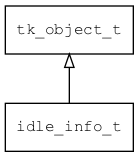

## idle\_info\_t
### 概述


单个idle的信息。
----------------------------------
### 函数
<p id="idle_info_t_methods">

| 函数名称 | 说明 | 
| -------- | ------------ | 
| <a href="#idle_info_t_idle_info_cast">idle\_info\_cast</a> | 转换为idle_info对象(供脚本语言使用)。 |
### 属性
<p id="idle_info_t_properties">

| 属性名称 | 类型 | 说明 | 
| -------- | ----- | ------------ | 
| <a href="#idle_info_t_ctx">ctx</a> | void* | idle回调函数上下文。 |
| <a href="#idle_info_t_id">id</a> | uint32\_t | idle的ID |
| <a href="#idle_info_t_on_destroy">on\_destroy</a> | tk\_destroy\_t | idle销毁时的回调函数。 |
| <a href="#idle_info_t_on_destroy_ctx">on\_destroy\_ctx</a> | tk\_destroy\_t | idle销毁时的回调函数的上下文。 |
| <a href="#idle_info_t_on_idle">on\_idle</a> | idle\_func\_t | idle回调函数。 |
#### idle\_info\_cast 函数
-----------------------

* 函数功能：

> <p id="idle_info_t_idle_info_cast">转换为idle_info对象(供脚本语言使用)。

* 函数原型：

```
idle_info_t* idle_info_cast (idle_info_t* idle);
```

* 参数说明：

| 参数 | 类型 | 说明 |
| -------- | ----- | --------- |
| 返回值 | idle\_info\_t* | idle\_info对象。 |
| idle | idle\_info\_t* | idle\_info对象。 |
#### ctx 属性
-----------------------
> <p id="idle_info_t_ctx">idle回调函数上下文。

* 类型：void*

| 特性 | 是否支持 |
| -------- | ----- |
| 可直接读取 | 是 |
| 可直接修改 | 否 |
| 可脚本化   | 是 |
#### id 属性
-----------------------
> <p id="idle_info_t_id">idle的ID

> 为TK\_INVALID\_ID时表示无效idle。

* 类型：uint32\_t

| 特性 | 是否支持 |
| -------- | ----- |
| 可直接读取 | 是 |
| 可直接修改 | 否 |
| 可脚本化   | 是 |
#### on\_destroy 属性
-----------------------
> <p id="idle_info_t_on_destroy">idle销毁时的回调函数。

* 类型：tk\_destroy\_t

| 特性 | 是否支持 |
| -------- | ----- |
| 可直接读取 | 是 |
| 可直接修改 | 否 |
#### on\_destroy\_ctx 属性
-----------------------
> <p id="idle_info_t_on_destroy_ctx">idle销毁时的回调函数的上下文。

* 类型：tk\_destroy\_t

| 特性 | 是否支持 |
| -------- | ----- |
| 可直接读取 | 是 |
| 可直接修改 | 否 |
#### on\_idle 属性
-----------------------
> <p id="idle_info_t_on_idle">idle回调函数。

* 类型：idle\_func\_t

| 特性 | 是否支持 |
| -------- | ----- |
| 可直接读取 | 是 |
| 可直接修改 | 否 |
