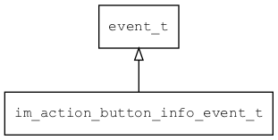

## im\_action\_button\_info\_event\_t
### 概述

设置软键盘上的action按钮的信息事件。
----------------------------------
### 属性

| 属性名称 | 类型 | 说明 | 
| -------- | ----- | ------------ | 
| <a href="#im_action_button_info_event_t_enable">enable</a> | bool\_t | 软键盘上的action按钮启用。 |
| <a href="#im_action_button_info_event_t_text">text</a> | char* | 软键盘上的action按钮显示的文本。 |
#### enable 属性
-----------------------
> 
软键盘上的action按钮启用。

* 类型：bool\_t

| 特性 | 是否支持 |
| -------- | ----- |
| 可直接读取 | 是 |
| 可直接修改 | 否 |
#### text 属性
-----------------------
> 
软键盘上的action按钮显示的文本。

* 类型：char*

| 特性 | 是否支持 |
| -------- | ----- |
| 可直接读取 | 是 |
| 可直接修改 | 否 |
