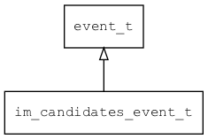

## im\_candidates\_event\_t
### 概述

输入法请求显示候选字的事件。
----------------------------------
### 属性

| 属性名称 | 类型 | 说明 | 
| -------- | ----- | ------------ | 
| <a href="#im_candidates_event_t_candidates">candidates</a> | char* | 可选的文本，多个文本以\0分隔。如：里\0李\0力\0离\0 |
| <a href="#im_candidates_event_t_candidates_nr">candidates\_nr</a> | uint32\_t | 可选的文本的个数。 |
| <a href="#im_candidates_event_t_selected;">selected;</a> | int32\_t | 缺省选中某个候选字，小余0不选择任何候选字 。 |
#### candidates 属性
-----------------------
> 
可选的文本，多个文本以\0分隔。如：里\0李\0力\0离\0

* 类型：char*

| 特性 | 是否支持 |
| -------- | ----- |
| 可直接读取 | 是 |
| 可直接修改 | 否 |
#### candidates\_nr 属性
-----------------------
> 
可选的文本的个数。

* 类型：uint32\_t

| 特性 | 是否支持 |
| -------- | ----- |
| 可直接读取 | 是 |
| 可直接修改 | 否 |
#### selected; 属性
-----------------------
> 
缺省选中某个候选字，小余0不选择任何候选字 。

* 类型：int32\_t

| 特性 | 是否支持 |
| -------- | ----- |
| 可直接读取 | 是 |
| 可直接修改 | 否 |
