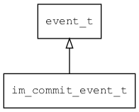

## im\_commit\_event\_t
### 概述

输入法提交输入的文本事件。
----------------------------------
### 属性

| 属性名称 | 类型 | 说明 | 
| -------- | ----- | ------------ | 
| <a href="#im_commit_event_t_replace;">replace;</a> | bool\_t | 是否替换原来的文本。 |
| <a href="#im_commit_event_t_text">text</a> | char* | 提交的文本。 |
#### replace; 属性
-----------------------
> 
是否替换原来的文本。

* 类型：bool\_t

| 特性 | 是否支持 |
| -------- | ----- |
| 可直接读取 | 是 |
| 可直接修改 | 否 |
#### text 属性
-----------------------
> 
提交的文本。

* 类型：char*

| 特性 | 是否支持 |
| -------- | ----- |
| 可直接读取 | 是 |
| 可直接修改 | 否 |
