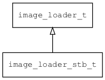

## image\_loader\_stb\_t
### 概述


stb图片加载器。

stb主要用于加载jpg/png/gif等格式的图片，它功能强大，体积小巧。
----------------------------------
### 函数
<p id="image_loader_stb_t_methods">

| 函数名称 | 说明 | 
| -------- | ------------ | 
| <a href="#image_loader_stb_t_image_loader_stb">image\_loader\_stb</a> | 获取stb图片加载器对象。 |
| <a href="#image_loader_stb_t_stb_load_image">stb\_load\_image</a> | 加载图片。 |
#### image\_loader\_stb 函数
-----------------------

* 函数功能：

> <p id="image_loader_stb_t_image_loader_stb">获取stb图片加载器对象。

* 函数原型：

```
image_loader_t* image_loader_stb ();
```

* 参数说明：

| 参数 | 类型 | 说明 |
| -------- | ----- | --------- |
| 返回值 | image\_loader\_t* | 返回图片加载器对象。 |
#### stb\_load\_image 函数
-----------------------

* 函数功能：

> <p id="image_loader_stb_t_stb_load_image">加载图片。

* 函数原型：

```
ret_t stb_load_image (int32_t subtype, const uint8_t* buff, uint32_t buff_size, bitmap_t* image, bool_t require_bgra, bool_t enable_bgr565, bool_t enable_rgb565);
```

* 参数说明：

| 参数 | 类型 | 说明 |
| -------- | ----- | --------- |
| 返回值 | ret\_t | 返回RET\_OK表示成功，否则表示失败。 |
| subtype | int32\_t | 资源类型。 |
| buff | const uint8\_t* | 资源数据。 |
| buff\_size | uint32\_t | 资源数据长度。 |
| image | bitmap\_t* | image 对象。 |
| require\_bgra | bool\_t | require\_bgra |
| enable\_bgr565 | bool\_t | enable\_bgr565 |
| enable\_rgb565 | bool\_t | enable\_rgb565 |
