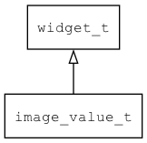

## image\_value\_t
### 概述


图片值控件。

可以用图片来表示如电池电量、WIFI信号强度和其它各种数值的值。

其原理如下：

* 1.把value以format为格式转换成字符串。
* 2.把每个字符与image(图片文件名前缀)映射成一个图片名。
* 3.最后把这些图片显示出来。

如果设置click\_add\_delta为非0，那么点击时自动增加指定的增量，值超过最大值时回到最小值,
或者值超过最小值时回到最大值。

image\_value\_t是[widget\_t](widget_t.md)的子类控件，widget\_t的函数均适用于image\_value\_t控件。

在xml中使用"image\_value"标签创建图片值控件。如：

```xml
<image_value  value="0" image="num_" />
```

> 更多用法请参考：
[image\_value](https://github.com/zlgopen/awtk/blob/master/design/default/ui/image_value.xml)

在c代码中使用函数image\_value\_create创建图片值控件。如：

```c
image_value = image_value_create(win, 10, 10, 200, 200);
image_value_set_image(image_value, "num_");
image_value_set_value(image_value, 100);
```

> 完整示例请参考：
[image_value demo](https://github.com/zlgopen/awtk-c-demos/blob/master/demos/image_value.c)

可用通过style来设置控件的显示风格，如背景颜色和边框等等，不过一般情况并不需要。
----------------------------------
### 函数
<p id="image_value_t_methods">

| 函数名称 | 说明 | 
| -------- | ------------ | 
| <a href="#image_value_t_image_value_cast">image\_value\_cast</a> | 转换为image_value对象(供脚本语言使用)。 |
| <a href="#image_value_t_image_value_create">image\_value\_create</a> | 创建image_value对象 |
| <a href="#image_value_t_image_value_set_click_add_delta">image\_value\_set\_click\_add\_delta</a> | 设置点击时加上的增量。 |
| <a href="#image_value_t_image_value_set_format">image\_value\_set\_format</a> | 设置格式。 |
| <a href="#image_value_t_image_value_set_image">image\_value\_set\_image</a> | 设置图片前缀。 |
| <a href="#image_value_t_image_value_set_max">image\_value\_set\_max</a> | 设置最大值。 |
| <a href="#image_value_t_image_value_set_min">image\_value\_set\_min</a> | 设置最小值。 |
| <a href="#image_value_t_image_value_set_value">image\_value\_set\_value</a> | 设置值。 |
### 属性
<p id="image_value_t_properties">

| 属性名称 | 类型 | 说明 | 
| -------- | ----- | ------------ | 
| <a href="#image_value_t_click_add_delta">click\_add\_delta</a> | float\_t | 点击时加上一个增量。 |
| <a href="#image_value_t_format">format</a> | char* | 数值到字符串转换时的格式，缺省为"%d"。 |
| <a href="#image_value_t_image">image</a> | char* | 图片名称的前缀。 |
| <a href="#image_value_t_max">max</a> | float\_t | 最大值(如果设置了click\_add\_delta，到达最大值后回到最小值)。 |
| <a href="#image_value_t_min">min</a> | float\_t | 最小值(如果设置了click\_add\_delta，到达最小值后回到最大值)。 |
| <a href="#image_value_t_value">value</a> | float\_t | 值。 |
### 事件
<p id="image_value_t_events">

| 事件名称 | 类型  | 说明 | 
| -------- | ----- | ------- | 
| EVT\_VALUE\_WILL\_CHANGE | event\_t | 值即将改变事件(click\_add\_delta为非0时，点击触发)。 |
| EVT\_VALUE\_CHANGED | event\_t | 值改变事件(click\_add\_delta为非0时，点击触发)。 |
#### image\_value\_cast 函数
-----------------------

* 函数功能：

> <p id="image_value_t_image_value_cast">转换为image_value对象(供脚本语言使用)。

* 函数原型：

```
widget_t* image_value_cast (widget_t* widget);
```

* 参数说明：

| 参数 | 类型 | 说明 |
| -------- | ----- | --------- |
| 返回值 | widget\_t* | image\_value对象。 |
| widget | widget\_t* | image\_value对象。 |
#### image\_value\_create 函数
-----------------------

* 函数功能：

> <p id="image_value_t_image_value_create">创建image_value对象

* 函数原型：

```
widget_t* image_value_create (widget_t* parent, xy_t x, xy_t y, wh_t w, wh_t h);
```

* 参数说明：

| 参数 | 类型 | 说明 |
| -------- | ----- | --------- |
| 返回值 | widget\_t* | 对象。 |
| parent | widget\_t* | 父控件 |
| x | xy\_t | x坐标 |
| y | xy\_t | y坐标 |
| w | wh\_t | 宽度 |
| h | wh\_t | 高度 |
#### image\_value\_set\_click\_add\_delta 函数
-----------------------

* 函数功能：

> <p id="image_value_t_image_value_set_click_add_delta">设置点击时加上的增量。

* 函数原型：

```
ret_t image_value_set_click_add_delta (widget_t* widget, float_t delta);
```

* 参数说明：

| 参数 | 类型 | 说明 |
| -------- | ----- | --------- |
| 返回值 | ret\_t | 返回RET\_OK表示成功，否则表示失败。 |
| widget | widget\_t* | image\_value对象。 |
| delta | float\_t | 增量。 |
#### image\_value\_set\_format 函数
-----------------------

* 函数功能：

> <p id="image_value_t_image_value_set_format">设置格式。

* 函数原型：

```
ret_t image_value_set_format (widget_t* widget, const char* format);
```

* 参数说明：

| 参数 | 类型 | 说明 |
| -------- | ----- | --------- |
| 返回值 | ret\_t | 返回RET\_OK表示成功，否则表示失败。 |
| widget | widget\_t* | image\_value对象。 |
| format | const char* | 格式。 |
#### image\_value\_set\_image 函数
-----------------------

* 函数功能：

> <p id="image_value_t_image_value_set_image">设置图片前缀。

* 函数原型：

```
ret_t image_value_set_image (widget_t* widget, const char* image);
```

* 参数说明：

| 参数 | 类型 | 说明 |
| -------- | ----- | --------- |
| 返回值 | ret\_t | 返回RET\_OK表示成功，否则表示失败。 |
| widget | widget\_t* | image\_value对象。 |
| image | const char* | 图片前缀。 |
#### image\_value\_set\_max 函数
-----------------------

* 函数功能：

> <p id="image_value_t_image_value_set_max">设置最大值。

* 函数原型：

```
ret_t image_value_set_max (widget_t* widget, float_t max);
```

* 参数说明：

| 参数 | 类型 | 说明 |
| -------- | ----- | --------- |
| 返回值 | ret\_t | 返回RET\_OK表示成功，否则表示失败。 |
| widget | widget\_t* | image\_max对象。 |
| max | float\_t | 最大值。 |
#### image\_value\_set\_min 函数
-----------------------

* 函数功能：

> <p id="image_value_t_image_value_set_min">设置最小值。

* 函数原型：

```
ret_t image_value_set_min (widget_t* widget, float_t min);
```

* 参数说明：

| 参数 | 类型 | 说明 |
| -------- | ----- | --------- |
| 返回值 | ret\_t | 返回RET\_OK表示成功，否则表示失败。 |
| widget | widget\_t* | image\_min对象。 |
| min | float\_t | 最小值。 |
#### image\_value\_set\_value 函数
-----------------------

* 函数功能：

> <p id="image_value_t_image_value_set_value">设置值。

* 函数原型：

```
ret_t image_value_set_value (widget_t* widget, float_t value);
```

* 参数说明：

| 参数 | 类型 | 说明 |
| -------- | ----- | --------- |
| 返回值 | ret\_t | 返回RET\_OK表示成功，否则表示失败。 |
| widget | widget\_t* | image\_value对象。 |
| value | float\_t | 值。 |
#### click\_add\_delta 属性
-----------------------
> <p id="image_value_t_click_add_delta">点击时加上一个增量。

* 类型：float\_t

| 特性 | 是否支持 |
| -------- | ----- |
| 可直接读取 | 是 |
| 可直接修改 | 否 |
| 可持久化   | 是 |
| 可脚本化   | 是 |
| 可在IDE中设置 | 是 |
| 可在XML中设置 | 是 |
| 可通过widget\_get\_prop读取 | 是 |
| 可通过widget\_set\_prop修改 | 是 |
#### format 属性
-----------------------
> <p id="image_value_t_format">数值到字符串转换时的格式，缺省为"%d"。

* 类型：char*

| 特性 | 是否支持 |
| -------- | ----- |
| 可直接读取 | 是 |
| 可直接修改 | 否 |
| 可持久化   | 是 |
| 可脚本化   | 是 |
| 可在IDE中设置 | 是 |
| 可在XML中设置 | 是 |
| 可通过widget\_get\_prop读取 | 是 |
| 可通过widget\_set\_prop修改 | 是 |
#### image 属性
-----------------------
> <p id="image_value_t_image">图片名称的前缀。

* 类型：char*

| 特性 | 是否支持 |
| -------- | ----- |
| 可直接读取 | 是 |
| 可直接修改 | 否 |
| 可持久化   | 是 |
| 可脚本化   | 是 |
| 可在IDE中设置 | 是 |
| 可在XML中设置 | 是 |
| 可通过widget\_get\_prop读取 | 是 |
| 可通过widget\_set\_prop修改 | 是 |
#### max 属性
-----------------------
> <p id="image_value_t_max">最大值(如果设置了click\_add\_delta，到达最大值后回到最小值)。

* 类型：float\_t

| 特性 | 是否支持 |
| -------- | ----- |
| 可直接读取 | 是 |
| 可直接修改 | 否 |
| 可持久化   | 是 |
| 可脚本化   | 是 |
| 可在IDE中设置 | 是 |
| 可在XML中设置 | 是 |
| 可通过widget\_get\_prop读取 | 是 |
| 可通过widget\_set\_prop修改 | 是 |
#### min 属性
-----------------------
> <p id="image_value_t_min">最小值(如果设置了click\_add\_delta，到达最小值后回到最大值)。

* 类型：float\_t

| 特性 | 是否支持 |
| -------- | ----- |
| 可直接读取 | 是 |
| 可直接修改 | 否 |
| 可持久化   | 是 |
| 可脚本化   | 是 |
| 可在IDE中设置 | 是 |
| 可在XML中设置 | 是 |
| 可通过widget\_get\_prop读取 | 是 |
| 可通过widget\_set\_prop修改 | 是 |
#### value 属性
-----------------------
> <p id="image_value_t_value">值。

* 类型：float\_t

| 特性 | 是否支持 |
| -------- | ----- |
| 可直接读取 | 是 |
| 可直接修改 | 否 |
| 可持久化   | 是 |
| 可脚本化   | 是 |
| 可在IDE中设置 | 是 |
| 可在XML中设置 | 是 |
| 可通过widget\_get\_prop读取 | 是 |
| 可通过widget\_set\_prop修改 | 是 |
