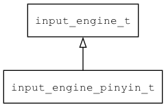

## input\_engine\_pinyin\_t
### 概述


拼音输入法引擎实现。

基于谷歌拼音输入法实现。
----------------------------------
### 函数
<p id="input_engine_pinyin_t_methods">

| 函数名称 | 说明 | 
| -------- | ------------ | 
| <a href="#input_engine_pinyin_t_input_engine_create">input\_engine\_create</a> | 创建拼音输入法引擎对象。 |
#### input\_engine\_create 函数
-----------------------

* 函数功能：

> <p id="input_engine_pinyin_t_input_engine_create">创建拼音输入法引擎对象。

* 函数原型：

```
input_engine_t* input_engine_create ();
```

* 参数说明：

| 参数 | 类型 | 说明 |
| -------- | ----- | --------- |
| 返回值 | input\_engine\_t* | 返回输入法引擎对象。 |
