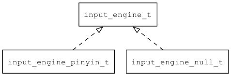

## input\_engine\_t
### 概述
输入法引擎接口。

常见的实现方式有以下几种：

* 空实现。用于不需要输入法的嵌入式平台。

* 拼音输入法实现。用于需要输入法的嵌入式平台。



----------------------------------
### 函数
<p id="input_engine_t_methods">

| 函数名称 | 说明 | 
| -------- | ------------ | 
| <a href="#input_engine_t_input_engine_create">input\_engine\_create</a> | 创建输入法引擎对象。 |
| <a href="#input_engine_t_input_engine_destroy">input\_engine\_destroy</a> | 销毁输入法引擎对象。 |
| <a href="#input_engine_t_input_engine_input">input\_engine\_input</a> | 输入新的按键，并更新候选字。 |
| <a href="#input_engine_t_input_engine_reset_input">input\_engine\_reset\_input</a> | 清除所有输入的按键组合和候选字。 |
| <a href="#input_engine_t_input_engine_search">input\_engine\_search</a> | 根据按键组合，更新候选字，并通过输入法对象提交候选字和pre候选字。 |
### 属性
<p id="input_engine_t_properties">

| 属性名称 | 类型 | 说明 | 
| -------- | ----- | ------------ | 
#### input\_engine\_create 函数
-----------------------

* 函数功能：

> <p id="input_engine_t_input_engine_create">创建输入法引擎对象。

* 函数原型：

```
input_engine_t* input_engine_create (input_method_t* im);
```

* 参数说明：

| 参数 | 类型 | 说明 |
| -------- | ----- | --------- |
| 返回值 | input\_engine\_t* | 返回输入法引擎对象。 |
| im | input\_method\_t* | 输入法对象。 |
#### input\_engine\_destroy 函数
-----------------------

* 函数功能：

> <p id="input_engine_t_input_engine_destroy">销毁输入法引擎对象。

* 函数原型：

```
ret_t input_engine_destroy (input_engine_t* engine);
```

* 参数说明：

| 参数 | 类型 | 说明 |
| -------- | ----- | --------- |
| 返回值 | ret\_t | 返回RET\_OK表示成功，否则表示失败。 |
| engine | input\_engine\_t* | 输入法引擎对象。 |
#### input\_engine\_input 函数
-----------------------

* 函数功能：

> <p id="input_engine_t_input_engine_input">输入新的按键，并更新候选字。

* 函数原型：

```
ret_t input_engine_input (input_engine_t* engine, int key);
```

* 参数说明：

| 参数 | 类型 | 说明 |
| -------- | ----- | --------- |
| 返回值 | ret\_t | 返回RET\_OK表示成功，否则表示失败。 |
| engine | input\_engine\_t* | 输入法引擎对象。 |
| key | int | 键值。 |
#### input\_engine\_reset\_input 函数
-----------------------

* 函数功能：

> <p id="input_engine_t_input_engine_reset_input">清除所有输入的按键组合和候选字。

* 函数原型：

```
ret_t input_engine_reset_input (input_engine_t* engine);
```

* 参数说明：

| 参数 | 类型 | 说明 |
| -------- | ----- | --------- |
| 返回值 | ret\_t | 返回RET\_OK表示成功，否则表示失败。 |
| engine | input\_engine\_t* | 输入法引擎对象。 |
#### input\_engine\_search 函数
-----------------------

* 函数功能：

> <p id="input_engine_t_input_engine_search">根据按键组合，更新候选字，并通过输入法对象提交候选字和pre候选字。

* 函数原型：

```
ret_t input_engine_search (input_engine_t* engine, const char* keys);
```

* 参数说明：

| 参数 | 类型 | 说明 |
| -------- | ----- | --------- |
| 返回值 | ret\_t | 返回RET\_OK表示成功，否则表示失败。 |
| engine | input\_engine\_t* | 输入法引擎对象。 |
| keys | const char* | 按键组合。 |
