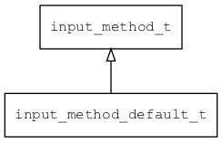

## input\_method\_default\_t
### 概述


 
 缺省输入法实现。


### 函数
<p id="input_method_default_t_methods">

| 函数名称 | 说明 | 
| -------- | ------------ | 
| <a href="#input_method_default_t_input_method_default_create">input\_method\_default\_create</a> |  |
#### input\_method\_default\_create 函数
-----------------------

* 函数功能：

> <p id="input_method_default_t_input_method_default_create">
 创建缺省输入法对象。


* 函数原型：

```
input_method_t* input_method_default_create ();
```

* 参数说明：

| 参数 | 类型 | 说明 |
| -------- | ----- | --------- |
| 返回值 | input\_method\_t* | 返回输入法对象。 |
