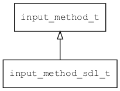

## input\_method\_sdl\_t
### 概述


SDL输入法实现。

SDL输入法使用平台自身的输入法引擎，一般在桌面Linux、MacOS、Windows、Android和iOS上使用。
----------------------------------
### 函数
<p id="input_method_sdl_t_methods">

| 函数名称 | 说明 | 
| -------- | ------------ | 
| <a href="#input_method_sdl_t_input_method_sdl_create">input\_method\_sdl\_create</a> | 创建SDL输入法对象。 |
#### input\_method\_sdl\_create 函数
-----------------------

* 函数功能：

> <p id="input_method_sdl_t_input_method_sdl_create">创建SDL输入法对象。

* 函数原型：

```
input_method_t* input_method_sdl_create ();
```

* 参数说明：

| 参数 | 类型 | 说明 |
| -------- | ----- | --------- |
| 返回值 | input\_method\_t* | 返回输入法对象。 |
