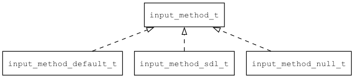

## input\_method\_t
### 概述
输入法接口。

常见的实现方式有以下几种：

* 空实现。用于不需要输入法的嵌入式平台。

* 缺省实现。用于需要输入法的嵌入式平台。

* 基于SDL实现的平台原生输入法。用于桌面系统和手机系统。




> 输入类型请参考：[input\_type](input_type_t.md)
----------------------------------
### 函数
<p id="input_method_t_methods">

| 函数名称 | 说明 | 
| -------- | ------------ | 
| <a href="#input_method_t_input_method">input\_method</a> | 获取全局输入法对象。 |
| <a href="#input_method_t_input_method_commit_text">input\_method\_commit\_text</a> | 提交输入文本。 |
| <a href="#input_method_t_input_method_commit_text_ex">input\_method\_commit\_text\_ex</a> | 提交输入文本。 |
| <a href="#input_method_t_input_method_create">input\_method\_create</a> | 创建输入法对象。在具体实现中实现。 |
| <a href="#input_method_t_input_method_destroy">input\_method\_destroy</a> | 销毁输入法对象。在具体实现中实现。 |
| <a href="#input_method_t_input_method_dispatch">input\_method\_dispatch</a> | 分发一个事件。 |
| <a href="#input_method_t_input_method_dispatch_action">input\_method\_dispatch\_action</a> | 软键盘上的action按钮被点击时，调用本函数分发EVT_IM_ACTION事件。 |
| <a href="#input_method_t_input_method_dispatch_candidates">input\_method\_dispatch\_candidates</a> | 请求显示候选字。 |
| <a href="#input_method_t_input_method_dispatch_key">input\_method\_dispatch\_key</a> | 提交按键。 |
| <a href="#input_method_t_input_method_dispatch_to_widget">input\_method\_dispatch\_to\_widget</a> | 分发一个事件当前焦点控件。 |
| <a href="#input_method_t_input_method_off">input\_method\_off</a> | 注销指定事件的处理函数。 |
| <a href="#input_method_t_input_method_on">input\_method\_on</a> | 注册指定事件的处理函数。 |
| <a href="#input_method_t_input_method_request">input\_method\_request</a> | 打开或关闭输入法。 |
| <a href="#input_method_t_input_method_set">input\_method\_set</a> | 设置全局输入法对象。 |
| <a href="#input_method_t_input_method_update_action_button_info">input\_method\_update\_action\_button\_info</a> | 设置软键盘上的action按钮的信息。 |
### 属性
<p id="input_method_t_properties">

| 属性名称 | 类型 | 说明 | 
| -------- | ----- | ------------ | 
| <a href="#input_method_t_action_button_enable">action\_button\_enable</a> | bool\_t | 软键盘的上的action按钮是否可用。 |
| <a href="#input_method_t_action_button_enable">action\_button\_enable</a> | bool\_t | 软键盘的上的action按钮文本。 |
| <a href="#input_method_t_input_type">input\_type</a> | input\_type\_t | 当前输入的类型。 |
#### input\_method 函数
-----------------------

* 函数功能：

> <p id="input_method_t_input_method">获取全局输入法对象。

* 函数原型：

```
input_method_t* input_method ();
```

* 参数说明：

| 参数 | 类型 | 说明 |
| -------- | ----- | --------- |
| 返回值 | input\_method\_t* | 成功返回输入法对象，失败返回NULL。 |
#### input\_method\_commit\_text 函数
-----------------------

* 函数功能：

> <p id="input_method_t_input_method_commit_text">提交输入文本。

* 函数原型：

```
ret_t input_method_commit_text (input_method_t* im, char* text);
```

* 参数说明：

| 参数 | 类型 | 说明 |
| -------- | ----- | --------- |
| 返回值 | ret\_t | 返回RET\_OK表示成功，否则表示失败。 |
| im | input\_method\_t* | 输入法对象。 |
| text | char* | 文本。 |
#### input\_method\_commit\_text\_ex 函数
-----------------------

* 函数功能：

> <p id="input_method_t_input_method_commit_text_ex">提交输入文本。

* 函数原型：

```
ret_t input_method_commit_text_ex (input_method_t* im, bool_t replace, char* text);
```

* 参数说明：

| 参数 | 类型 | 说明 |
| -------- | ----- | --------- |
| 返回值 | ret\_t | 返回RET\_OK表示成功，否则表示失败。 |
| im | input\_method\_t* | 输入法对象。 |
| replace | bool\_t | 是否替换原来的文本。 |
| text | char* | 文本。 |
#### input\_method\_create 函数
-----------------------

* 函数功能：

> <p id="input_method_t_input_method_create">创建输入法对象。在具体实现中实现。

* 函数原型：

```
input_method_t* input_method_create ();
```

* 参数说明：

| 参数 | 类型 | 说明 |
| -------- | ----- | --------- |
| 返回值 | input\_method\_t* | 成功返回输入法对象，失败返回NULL。 |
#### input\_method\_destroy 函数
-----------------------

* 函数功能：

> <p id="input_method_t_input_method_destroy">销毁输入法对象。在具体实现中实现。

* 函数原型：

```
ret_t input_method_destroy (input_method_t* im);
```

* 参数说明：

| 参数 | 类型 | 说明 |
| -------- | ----- | --------- |
| 返回值 | ret\_t | 返回RET\_OK表示成功，否则表示失败。 |
| im | input\_method\_t* | 输入法对象。 |
#### input\_method\_dispatch 函数
-----------------------

* 函数功能：

> <p id="input_method_t_input_method_dispatch">分发一个事件。

* 函数原型：

```
ret_t input_method_dispatch (input_method_t* im, event_t* e);
```

* 参数说明：

| 参数 | 类型 | 说明 |
| -------- | ----- | --------- |
| 返回值 | ret\_t | 返回RET\_OK表示成功，否则表示失败。 |
| im | input\_method\_t* | 控件对象。 |
| e | event\_t* | 事件。 |
#### input\_method\_dispatch\_action 函数
-----------------------

* 函数功能：

> <p id="input_method_t_input_method_dispatch_action">软键盘上的action按钮被点击时，调用本函数分发EVT_IM_ACTION事件。

* 函数原型：

```
ret_t input_method_dispatch_action (input_method_t* im);
```

* 参数说明：

| 参数 | 类型 | 说明 |
| -------- | ----- | --------- |
| 返回值 | ret\_t | 返回RET\_OK表示成功，否则表示失败。 |
| im | input\_method\_t* | 输入法对象。 |
#### input\_method\_dispatch\_candidates 函数
-----------------------

* 函数功能：

> <p id="input_method_t_input_method_dispatch_candidates">请求显示候选字。

* 函数原型：

```
ret_t input_method_dispatch_candidates (input_method_t* im, char* strs, uint32_t nr);
```

* 参数说明：

| 参数 | 类型 | 说明 |
| -------- | ----- | --------- |
| 返回值 | ret\_t | 返回RET\_OK表示成功，否则表示失败。 |
| im | input\_method\_t* | 输入法对象。 |
| strs | char* | 候选字列表。 |
| nr | uint32\_t | 候选字个数。 |
#### input\_method\_dispatch\_key 函数
-----------------------

* 函数功能：

> <p id="input_method_t_input_method_dispatch_key">提交按键。

* 函数原型：

```
ret_t input_method_dispatch_key (input_method_t* im, uint32_t key);
```

* 参数说明：

| 参数 | 类型 | 说明 |
| -------- | ----- | --------- |
| 返回值 | ret\_t | 返回RET\_OK表示成功，否则表示失败。 |
| im | input\_method\_t* | 输入法对象。 |
| key | uint32\_t | 键值。 |
#### input\_method\_dispatch\_to\_widget 函数
-----------------------

* 函数功能：

> <p id="input_method_t_input_method_dispatch_to_widget">分发一个事件当前焦点控件。

* 函数原型：

```
ret_t input_method_dispatch_to_widget (input_method_t* im, event_t* e);
```

* 参数说明：

| 参数 | 类型 | 说明 |
| -------- | ----- | --------- |
| 返回值 | ret\_t | 返回RET\_OK表示成功，否则表示失败。 |
| im | input\_method\_t* | 控件对象。 |
| e | event\_t* | 事件。 |
#### input\_method\_off 函数
-----------------------

* 函数功能：

> <p id="input_method_t_input_method_off">注销指定事件的处理函数。

* 函数原型：

```
ret_t input_method_off (input_method_t* im, uint32_t id);
```

* 参数说明：

| 参数 | 类型 | 说明 |
| -------- | ----- | --------- |
| 返回值 | ret\_t | 返回RET\_OK表示成功，否则表示失败。 |
| im | input\_method\_t* | 输入法对象。 |
| id | uint32\_t | input\_method\_on返回的ID。 |
#### input\_method\_on 函数
-----------------------

* 函数功能：

> <p id="input_method_t_input_method_on">注册指定事件的处理函数。

* 函数原型：

```
uint32_t input_method_on (input_method_t* im, event_type_t type, event_func_t on_event, void* ctx);
```

* 参数说明：

| 参数 | 类型 | 说明 |
| -------- | ----- | --------- |
| 返回值 | uint32\_t | 返回id，用于input\_method\_off。 |
| im | input\_method\_t* | 输入法对象。 |
| type | event\_type\_t | 事件类型。 |
| on\_event | event\_func\_t | 事件处理函数。 |
| ctx | void* | 事件处理函数上下文。 |
#### input\_method\_request 函数
-----------------------

* 函数功能：

> <p id="input_method_t_input_method_request">打开或关闭输入法。

* 函数原型：

```
ret_t input_method_request (input_method_t* im, widget_t* widget);
```

* 参数说明：

| 参数 | 类型 | 说明 |
| -------- | ----- | --------- |
| 返回值 | ret\_t | 返回RET\_OK表示成功，否则表示失败。 |
| im | input\_method\_t* | 输入法对象。 |
| widget | widget\_t* | 焦点控件，为NULL时关闭输入法，非NULL时打开输入法。 |
#### input\_method\_set 函数
-----------------------

* 函数功能：

> <p id="input_method_t_input_method_set">设置全局输入法对象。

* 函数原型：

```
ret_t input_method_set (input_method_t* im);
```

* 参数说明：

| 参数 | 类型 | 说明 |
| -------- | ----- | --------- |
| 返回值 | ret\_t | 返回RET\_OK表示成功，否则表示失败。 |
| im | input\_method\_t* | 输入法对象。 |
#### input\_method\_update\_action\_button\_info 函数
-----------------------

* 函数功能：

> <p id="input_method_t_input_method_update_action_button_info">设置软键盘上的action按钮的信息。

* 函数原型：

```
ret_t input_method_update_action_button_info (input_method_t* im, char* text, bool_t enable);
```

* 参数说明：

| 参数 | 类型 | 说明 |
| -------- | ----- | --------- |
| 返回值 | ret\_t | 返回RET\_OK表示成功，否则表示失败。 |
| im | input\_method\_t* | 输入法对象。 |
| text | char* | 按钮的文本。 |
| enable | bool\_t | 按钮的是否可用。 |
#### action\_button\_enable 属性
-----------------------
> <p id="input_method_t_action_button_enable">软键盘的上的action按钮是否可用。

* 类型：bool\_t

| 特性 | 是否支持 |
| -------- | ----- |
| 可直接读取 | 是 |
| 可直接修改 | 否 |
#### action\_button\_enable 属性
-----------------------
> <p id="input_method_t_action_button_enable">软键盘的上的action按钮文本。

* 类型：bool\_t

| 特性 | 是否支持 |
| -------- | ----- |
| 可直接读取 | 是 |
| 可直接修改 | 否 |
#### input\_type 属性
-----------------------
> <p id="input_method_t_input_type">当前输入的类型。

* 类型：input\_type\_t

| 特性 | 是否支持 |
| -------- | ----- |
| 可直接读取 | 是 |
| 可直接修改 | 否 |
