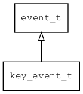

## key\_event\_t
### 概述


按键事件。
----------------------------------
### 函数
<p id="key_event_t_methods">

| 函数名称 | 说明 | 
| -------- | ------------ | 
| <a href="#key_event_t_key_event_cast">key\_event\_cast</a> | 把event对象转key_event_t对象，主要给脚本语言使用。 |
| <a href="#key_event_t_key_event_init">key\_event\_init</a> | 初始化事件。 |
### 属性
<p id="key_event_t_properties">

| 属性名称 | 类型 | 说明 | 
| -------- | ----- | ------------ | 
| <a href="#key_event_t_alt">alt</a> | bool\_t | alt键是否按下。 |
| <a href="#key_event_t_capslock">capslock</a> | bool\_t | capslock键是否按下。 |
| <a href="#key_event_t_cmd">cmd</a> | bool\_t | left shift键是否按下。 |
| <a href="#key_event_t_ctrl">ctrl</a> | bool\_t | right alt键是否按下。 |
| <a href="#key_event_t_key">key</a> | uint32\_t | 键值。 |
| <a href="#key_event_t_lalt">lalt</a> | bool\_t | left alt键是否按下。 |
| <a href="#key_event_t_lctrl">lctrl</a> | bool\_t | left ctrl键是否按下。 |
| <a href="#key_event_t_lshift">lshift</a> | bool\_t | left shift键是否按下。 |
| <a href="#key_event_t_menu">menu</a> | bool\_t | menu键是否按下。 |
| <a href="#key_event_t_ralt">ralt</a> | bool\_t | right alt键是否按下。 |
| <a href="#key_event_t_rctrl">rctrl</a> | bool\_t | right ctrl键是否按下。 |
| <a href="#key_event_t_rshift">rshift</a> | bool\_t | right shift键是否按下。 |
| <a href="#key_event_t_shift">shift</a> | bool\_t | shift键是否按下。 |
#### key\_event\_cast 函数
-----------------------

* 函数功能：

> <p id="key_event_t_key_event_cast">把event对象转key_event_t对象，主要给脚本语言使用。

* 函数原型：

```
key_event_t* key_event_cast (event_t* event);
```

* 参数说明：

| 参数 | 类型 | 说明 |
| -------- | ----- | --------- |
| 返回值 | key\_event\_t* | event对象。 |
| event | event\_t* | event对象。 |
#### key\_event\_init 函数
-----------------------

* 函数功能：

> <p id="key_event_t_key_event_init">初始化事件。

* 函数原型：

```
event_t* key_event_init (key_event_t* event, void* target, uint32_t type, int32_t key);
```

* 参数说明：

| 参数 | 类型 | 说明 |
| -------- | ----- | --------- |
| 返回值 | event\_t* | event对象。 |
| event | key\_event\_t* | event对象。 |
| target | void* | 事件目标。 |
| type | uint32\_t | 事件类型。 |
| key | int32\_t | key的值。 |
#### alt 属性
-----------------------
> <p id="key_event_t_alt">alt键是否按下。

* 类型：bool\_t

| 特性 | 是否支持 |
| -------- | ----- |
| 可直接读取 | 是 |
| 可直接修改 | 否 |
| 可脚本化   | 是 |
#### capslock 属性
-----------------------
> <p id="key_event_t_capslock">capslock键是否按下。

* 类型：bool\_t

| 特性 | 是否支持 |
| -------- | ----- |
| 可直接读取 | 是 |
| 可直接修改 | 否 |
| 可脚本化   | 是 |
#### cmd 属性
-----------------------
> <p id="key_event_t_cmd">left shift键是否按下。
cmd/win键是否按下。

* 类型：bool\_t

| 特性 | 是否支持 |
| -------- | ----- |
| 可直接读取 | 是 |
| 可直接修改 | 否 |
| 可脚本化   | 是 |
#### ctrl 属性
-----------------------
> <p id="key_event_t_ctrl">right alt键是否按下。
ctrl键是否按下。

* 类型：bool\_t

| 特性 | 是否支持 |
| -------- | ----- |
| 可直接读取 | 是 |
| 可直接修改 | 否 |
| 可脚本化   | 是 |
#### key 属性
-----------------------
> <p id="key_event_t_key">键值。

* 类型：uint32\_t

| 特性 | 是否支持 |
| -------- | ----- |
| 可直接读取 | 是 |
| 可直接修改 | 否 |
| 可脚本化   | 是 |
#### lalt 属性
-----------------------
> <p id="key_event_t_lalt">left alt键是否按下。

* 类型：bool\_t

| 特性 | 是否支持 |
| -------- | ----- |
| 可直接读取 | 是 |
| 可直接修改 | 否 |
| 可脚本化   | 是 |
#### lctrl 属性
-----------------------
> <p id="key_event_t_lctrl">left ctrl键是否按下。

* 类型：bool\_t

| 特性 | 是否支持 |
| -------- | ----- |
| 可直接读取 | 是 |
| 可直接修改 | 否 |
| 可脚本化   | 是 |
#### lshift 属性
-----------------------
> <p id="key_event_t_lshift">left shift键是否按下。

* 类型：bool\_t

| 特性 | 是否支持 |
| -------- | ----- |
| 可直接读取 | 是 |
| 可直接修改 | 否 |
| 可脚本化   | 是 |
#### menu 属性
-----------------------
> <p id="key_event_t_menu">menu键是否按下。

* 类型：bool\_t

| 特性 | 是否支持 |
| -------- | ----- |
| 可直接读取 | 是 |
| 可直接修改 | 否 |
| 可脚本化   | 是 |
#### ralt 属性
-----------------------
> <p id="key_event_t_ralt">right alt键是否按下。

* 类型：bool\_t

| 特性 | 是否支持 |
| -------- | ----- |
| 可直接读取 | 是 |
| 可直接修改 | 否 |
| 可脚本化   | 是 |
#### rctrl 属性
-----------------------
> <p id="key_event_t_rctrl">right ctrl键是否按下。

* 类型：bool\_t

| 特性 | 是否支持 |
| -------- | ----- |
| 可直接读取 | 是 |
| 可直接修改 | 否 |
| 可脚本化   | 是 |
#### rshift 属性
-----------------------
> <p id="key_event_t_rshift">right shift键是否按下。

* 类型：bool\_t

| 特性 | 是否支持 |
| -------- | ----- |
| 可直接读取 | 是 |
| 可直接修改 | 否 |
| 可脚本化   | 是 |
#### shift 属性
-----------------------
> <p id="key_event_t_shift">shift键是否按下。

* 类型：bool\_t

| 特性 | 是否支持 |
| -------- | ----- |
| 可直接读取 | 是 |
| 可直接修改 | 否 |
| 可脚本化   | 是 |
