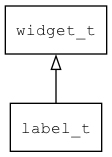

## label\_t
### 概述


文本控件。用于显示一行或多行文本。

文本控件不会根据文本的长度自动换行，只有文本内容包含换行符时才会换行。

如需自动换行请使用[rich\_text\_t](rich_text_t.md)控件。

label\_t是[widget\_t](widget_t.md)的子类控件，widget\_t的函数均适用于label\_t控件。

在xml中使用"label"标签创建文本控件。如：

```xml
<label style="center" text="center"/>
```

> 更多用法请参考：[label.xml](
https://github.com/zlgopen/awtk/blob/master/design/default/ui/label.xml)

在c代码中使用函数label\_create创建文本控件。如：

```c
widget_t* label = label_create(win, 10, 10, 128, 30);
widget_set_text(label, L"hello awtk!");
```

> 创建之后，需要用widget\_set\_text或widget\_set\_text\_utf8设置文本内容。

> 完整示例请参考：[label demo](
https://github.com/zlgopen/awtk-c-demos/blob/master/demos/label.c)

可用通过style来设置控件的显示风格，如字体的大小和颜色等等。如：

```xml
<style name="left">
<normal text_color="red" text_align_h="left" border_color="#a0a0a0" margin="4" />
</style>
```

> 更多用法请参考：
[theme default](
https://github.com/zlgopen/awtk/blob/master/design/default/styles/default.xml#L144)
----------------------------------
### 函数
<p id="label_t_methods">

| 函数名称 | 说明 | 
| -------- | ------------ | 
| <a href="#label_t_label_cast">label\_cast</a> | 转换为label对象(供脚本语言使用)。 |
| <a href="#label_t_label_create">label\_create</a> | 创建label对象 |
| <a href="#label_t_label_resize_to_content">label\_resize\_to\_content</a> | 根据文本内容调节控件大小。 |
| <a href="#label_t_label_set_length">label\_set\_length</a> | 设置显示字符的个数(小余0时全部显示)。。 |
### 属性
<p id="label_t_properties">

| 属性名称 | 类型 | 说明 | 
| -------- | ----- | ------------ | 
| <a href="#label_t_length">length</a> | int32\_t | 显示字符的个数(小余0时全部显示)。 |
#### label\_cast 函数
-----------------------

* 函数功能：

> <p id="label_t_label_cast">转换为label对象(供脚本语言使用)。

* 函数原型：

```
widget_t* label_cast (widget_t* widget);
```

* 参数说明：

| 参数 | 类型 | 说明 |
| -------- | ----- | --------- |
| 返回值 | widget\_t* | label对象。 |
| widget | widget\_t* | label对象。 |
#### label\_create 函数
-----------------------

* 函数功能：

> <p id="label_t_label_create">创建label对象

* 函数原型：

```
widget_t* label_create (widget_t* parent, xy_t x, xy_t y, wh_t w, wh_t h);
```

* 参数说明：

| 参数 | 类型 | 说明 |
| -------- | ----- | --------- |
| 返回值 | widget\_t* | 对象。 |
| parent | widget\_t* | 父控件 |
| x | xy\_t | x坐标 |
| y | xy\_t | y坐标 |
| w | wh\_t | 宽度 |
| h | wh\_t | 高度 |
#### label\_resize\_to\_content 函数
-----------------------

* 函数功能：

> <p id="label_t_label_resize_to_content">根据文本内容调节控件大小。

* 函数原型：

```
ret_t label_resize_to_content (widget_t* widget, uint32_t min_w, uint32_t max_w, uint32_t min_h, uint32_t max_h);
```

* 参数说明：

| 参数 | 类型 | 说明 |
| -------- | ----- | --------- |
| 返回值 | ret\_t | 返回RET\_OK表示成功，否则表示失败。 |
| widget | widget\_t* | 控件对象。 |
| min\_w | uint32\_t | 最小宽度。 |
| max\_w | uint32\_t | 最大宽度。 |
| min\_h | uint32\_t | 最小高度。 |
| max\_h | uint32\_t | 最大高度。 |
#### label\_set\_length 函数
-----------------------

* 函数功能：

> <p id="label_t_label_set_length">设置显示字符的个数(小余0时全部显示)。。

* 函数原型：

```
ret_t label_set_length (widget_t* widget, int32_t length);
```

* 参数说明：

| 参数 | 类型 | 说明 |
| -------- | ----- | --------- |
| 返回值 | ret\_t | 返回RET\_OK表示成功，否则表示失败。 |
| widget | widget\_t* | 控件对象。 |
| length | int32\_t | 最大可显示字符个数。 |
#### length 属性
-----------------------
> <p id="label_t_length">显示字符的个数(小余0时全部显示)。
主要用于动态改变显示字符的个数，来实现类似[拨号中...]的动画效果。

* 类型：int32\_t

| 特性 | 是否支持 |
| -------- | ----- |
| 可直接读取 | 是 |
| 可直接修改 | 否 |
| 可持久化   | 是 |
| 可脚本化   | 是 |
| 可在IDE中设置 | 是 |
| 可在XML中设置 | 是 |
| 可通过widget\_get\_prop读取 | 是 |
| 可通过widget\_set\_prop修改 | 是 |
