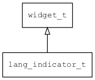

## lang\_indicator\_t
### 概述


输入法语言指示器。

用于显示输入法的输入语言或类型，主要用于T9输入法。

lang_indicator\_t是[widget\_t](widget_t.md)的子类控件，widget\_t的函数均适用于lang_indicator\_t控件。

在xml中使用"lang_indicator"标签创建lang_indicator。如：

```xml
<lang_indicator x="0" y="0" w="100%" h="100%" children_layout="default(c=2,r=2,m=5,s=5)">
</lang_indicator>
```

可用通过style来设置控件的显示风格，如背景颜色等。如：

```xml
<style name="default" border_color="#a0a0a0">
<normal     bg_color="#f0f0f0" />
</style>
```
----------------------------------
### 函数
<p id="lang_indicator_t_methods">

| 函数名称 | 说明 | 
| -------- | ------------ | 
| <a href="#lang_indicator_t_lang_indicator_cast">lang\_indicator\_cast</a> | 转换为lang_indicator对象(供脚本语言使用)。 |
| <a href="#lang_indicator_t_lang_indicator_create">lang\_indicator\_create</a> | 创建lang_indicator对象 |
| <a href="#lang_indicator_t_lang_indicator_set_image">lang\_indicator\_set\_image</a> | 设置缺省获得焦点的子控件(可用控件名或类型)。 |
### 属性
<p id="lang_indicator_t_properties">

| 属性名称 | 类型 | 说明 | 
| -------- | ----- | ------------ | 
| <a href="#lang_indicator_t_image">image</a> | char* | 如果希望用图片格式显示，本属性用于指定图片的前缀。 |
#### lang\_indicator\_cast 函数
-----------------------

* 函数功能：

> <p id="lang_indicator_t_lang_indicator_cast">转换为lang_indicator对象(供脚本语言使用)。

* 函数原型：

```
widget_t* lang_indicator_cast (widget_t* widget);
```

* 参数说明：

| 参数 | 类型 | 说明 |
| -------- | ----- | --------- |
| 返回值 | widget\_t* | lang\_indicator对象。 |
| widget | widget\_t* | lang\_indicator对象。 |
#### lang\_indicator\_create 函数
-----------------------

* 函数功能：

> <p id="lang_indicator_t_lang_indicator_create">创建lang_indicator对象

* 函数原型：

```
widget_t* lang_indicator_create (widget_t* parent, xy_t x, xy_t y, wh_t w, wh_t h);
```

* 参数说明：

| 参数 | 类型 | 说明 |
| -------- | ----- | --------- |
| 返回值 | widget\_t* | 对象。 |
| parent | widget\_t* | 父控件 |
| x | xy\_t | x坐标 |
| y | xy\_t | y坐标 |
| w | wh\_t | 宽度 |
| h | wh\_t | 高度 |
#### lang\_indicator\_set\_image 函数
-----------------------

* 函数功能：

> <p id="lang_indicator_t_lang_indicator_set_image">设置缺省获得焦点的子控件(可用控件名或类型)。

* 函数原型：

```
ret_t lang_indicator_set_image (widget_t* widget, const char* image);
```

* 参数说明：

| 参数 | 类型 | 说明 |
| -------- | ----- | --------- |
| 返回值 | ret\_t | 返回RET\_OK表示成功，否则表示失败。 |
| widget | widget\_t* | 控件对象。 |
| image | const char* | 缺省获得焦点的子控件(可用控件名或类型)。 |
#### image 属性
-----------------------
> <p id="lang_indicator_t_image">如果希望用图片格式显示，本属性用于指定图片的前缀。

* 类型：char*

| 特性 | 是否支持 |
| -------- | ----- |
| 可直接读取 | 是 |
| 可直接修改 | 否 |
| 可持久化   | 是 |
| 可脚本化   | 是 |
| 可在IDE中设置 | 是 |
| 可在XML中设置 | 是 |
| 可通过widget\_get\_prop读取 | 是 |
| 可通过widget\_set\_prop修改 | 是 |
