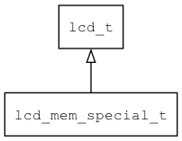

## lcd\_mem\_special\_t
### 概述


特殊的LCD。

通过重载flush函数来提交GUI绘制的结果到硬件。适用于：

* lcd 硬件不支持framebuffer，如SPI接口的屏。
* lcd 硬件支持framebuffer，但是其格式特殊，AWTK目前不支持。可以用flush进行格式转换。
----------------------------------
### 函数
<p id="lcd_mem_special_t_methods">

| 函数名称 | 说明 | 
| -------- | ------------ | 
| <a href="#lcd_mem_special_t_lcd_mem_special_create">lcd\_mem\_special\_create</a> | 创建lcd对象。 |
#### lcd\_mem\_special\_create 函数
-----------------------

* 函数功能：

> <p id="lcd_mem_special_t_lcd_mem_special_create">创建lcd对象。

* 函数原型：

```
lcd_t* lcd_mem_special_create (wh_t w, wh_t h, bitmap_format_t format, lcd_flush_t flush, lcd_resize_t on_resize, lcd_destroy_t on_destroy, void* ctx);
```

* 参数说明：

| 参数 | 类型 | 说明 |
| -------- | ----- | --------- |
| 返回值 | lcd\_t* | 返回lcd对象。 |
| w | wh\_t | 宽度。 |
| h | wh\_t | 高度。 |
| format | bitmap\_format\_t | 离线lcd的格式。一般用 BITMAP\_FMT\_BGR565 或 BITMAP\_FMT\_RGBA8888。 |
| flush | lcd\_flush\_t | 回调函数，用于刷新GUI数据到实际的LCD。 |
| on\_resize | lcd\_resize\_t | 用于调整LCD的大小。一般用NULL即可。 |
| on\_destroy | lcd\_destroy\_t | lcd销毁时的回调函数。 |
| ctx | void* | 回调函数的上下文。 |
