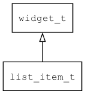

## list\_item\_t
### 概述


列表项控件。

列表项控件是一个简单的容器控件，一般作为列表视图中滚动视图的子控件。

list\_item\_t是[widget\_t](widget_t.md)的子类控件，widget\_t的函数均适用于list\_item\_t控件。

在xml中使用"list\_item"标签创建列表项控件。如：

```xml
<list_view x="0"  y="30" w="100%" h="-80" item_height="60">
<scroll_view name="view" x="0"  y="0" w="100%" h="100%">
<list_item style="odd" children_layout="default(rows=1,cols=0)">
<image draw_type="icon" w="30" image="earth"/>
<label w="-30" text="1.Hello AWTK !">
<switch x="r:10" y="m" w="60" h="20"/>
</label>
</list_item>
...
</scroll_view>
</list_view>
```

> 更多用法请参考：[list\_view\_m.xml](
https://github.com/zlgopen/awtk/blob/master/design/default/ui/list_view_m.xml)

在c代码中使用函数list\_item\_create创建列表项控件。如：

```c
widget_t* list_item = list_item_create(scroll_view, 0, 0, 0, 0);
```

> 列表项控件大小一般由列表控制，不需指定xywh参数。

可以用style来实现可点击或不可点击的效果。如：

```xml
<style name="odd_clickable" border_color="#a0a0a0"  border="bottom" text_color="black">
<normal     bg_color="#f5f5f5" />
<pressed    bg_color="#c0c0c0" />
<over       bg_color="#f5f5f5" />
</style>
```

> 更多用法请参考：[theme default](
https://github.com/zlgopen/awtk/blob/master/design/default/styles/default.xml#L372)
----------------------------------
### 函数
<p id="list_item_t_methods">

| 函数名称 | 说明 | 
| -------- | ------------ | 
| <a href="#list_item_t_list_item_cast">list\_item\_cast</a> | 转换为list_item对象(供脚本语言使用)。 |
| <a href="#list_item_t_list_item_create">list\_item\_create</a> | 创建list_item对象 |
#### list\_item\_cast 函数
-----------------------

* 函数功能：

> <p id="list_item_t_list_item_cast">转换为list_item对象(供脚本语言使用)。

* 函数原型：

```
widget_t* list_item_cast (widget_t* widget);
```

* 参数说明：

| 参数 | 类型 | 说明 |
| -------- | ----- | --------- |
| 返回值 | widget\_t* | list\_item对象。 |
| widget | widget\_t* | list\_item对象。 |
#### list\_item\_create 函数
-----------------------

* 函数功能：

> <p id="list_item_t_list_item_create">创建list_item对象

* 函数原型：

```
widget_t* list_item_create (widget_t* parent, xy_t x, xy_t y, wh_t w, wh_t h);
```

* 参数说明：

| 参数 | 类型 | 说明 |
| -------- | ----- | --------- |
| 返回值 | widget\_t* | 对象。 |
| parent | widget\_t* | 父控件 |
| x | xy\_t | x坐标 |
| y | xy\_t | y坐标 |
| w | wh\_t | 宽度 |
| h | wh\_t | 高度 |
