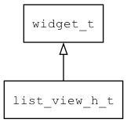

## list\_view\_h\_t
### 概述


 水平ListView控件。

----------------------------------
### 函数
<p id="list_view_h_t_methods">

| 函数名称 | 说明 | 
| -------- | ------------ | 
| <a href="#list_view_h_t_list_view_h_cast">list\_view\_h\_cast</a> | 转换为list_view_h对象(供脚本语言使用)。 |
| <a href="#list_view_h_t_list_view_h_create">list\_view\_h\_create</a> | 创建list_view_h对象 |
| <a href="#list_view_h_t_list_view_h_set_item_width">list\_view\_h\_set\_item\_width</a> | 设置列表项的宽度。 |
| <a href="#list_view_h_t_list_view_h_set_spacing">list\_view\_h\_set\_spacing</a> | 设置列表项的间距。 |
### 属性
<p id="list_view_h_t_properties">

| 名属性称 | 类型 | 说明 | 
| -------- | ----- | ------------ | 
| <a href="#list_view_h_t_item_width">item\_width</a> | int32\_t | 列表项的宽度。 |
| <a href="#list_view_h_t_spacing">spacing</a> | int32\_t | 间距。 |
#### list\_view\_h\_cast 函数
-----------------------

* 函数功能：

> <p id="list_view_h_t_list_view_h_cast"> 转换为list_view_h对象(供脚本语言使用)。


* 函数原型：

```
widget_t* list_view_h_cast (widget_t* widget);
```

* 参数说明：

| 参数 | 类型 | 说明 |
| -------- | ----- | --------- |
| 返回值 | widget\_t* | list\_view\_h对象。 |
| widget | widget\_t* | list\_view\_h对象。 |
#### list\_view\_h\_create 函数
-----------------------

* 函数功能：

> <p id="list_view_h_t_list_view_h_create"> 创建list_view_h对象


* 函数原型：

```
widget_t* list_view_h_create (widget_t* parent, xy_t x, xy_t y, wh_t w, wh_t h);
```

* 参数说明：

| 参数 | 类型 | 说明 |
| -------- | ----- | --------- |
| 返回值 | widget\_t* | 对象。 |
| parent | widget\_t* | 父控件 |
| x | xy\_t | x坐标 |
| y | xy\_t | y坐标 |
| w | wh\_t | 宽度 |
| h | wh\_t | 高度 |
#### list\_view\_h\_set\_item\_width 函数
-----------------------

* 函数功能：

> <p id="list_view_h_t_list_view_h_set_item_width"> 设置列表项的宽度。


* 函数原型：

```
ret_t list_view_h_set_item_width (widget_t* widget, int32_t item_width);
```

* 参数说明：

| 参数 | 类型 | 说明 |
| -------- | ----- | --------- |
| 返回值 | ret\_t | 返回RET\_OK表示成功，否则表示失败。 |
| widget | widget\_t* | 控件对象。 |
| item\_width | int32\_t | 列表项的宽度。 |
#### list\_view\_h\_set\_spacing 函数
-----------------------

* 函数功能：

> <p id="list_view_h_t_list_view_h_set_spacing"> 设置列表项的间距。


* 函数原型：

```
ret_t list_view_h_set_spacing (widget_t* widget, int32_t spacing);
```

* 参数说明：

| 参数 | 类型 | 说明 |
| -------- | ----- | --------- |
| 返回值 | ret\_t | 返回RET\_OK表示成功，否则表示失败。 |
| widget | widget\_t* | 控件对象。 |
| spacing | int32\_t | 列表项的间距。 |
#### item\_width 属性
-----------------------
> <p id="list_view_h_t_item_width"> 列表项的宽度。


* 类型：int32\_t

| 特性 | 是否支持 |
| -------- | ----- |
| 可直接读取 | 是 |
| 可直接修改 | 否 |
| 可持久化   | 是 |
| 可脚本化   | 是 |
| 可在IDE中设置 | 是 |
| 可在XML中设置 | 是 |
| 可通过widget\_get\_prop读取 | 是 |
| 可通过widget\_set\_prop修改 | 是 |
#### spacing 属性
-----------------------
> <p id="list_view_h_t_spacing"> 间距。


* 类型：int32\_t

| 特性 | 是否支持 |
| -------- | ----- |
| 可直接读取 | 是 |
| 可直接修改 | 否 |
| 可持久化   | 是 |
| 可脚本化   | 是 |
| 可在IDE中设置 | 是 |
| 可在XML中设置 | 是 |
| 可通过widget\_get\_prop读取 | 是 |
| 可通过widget\_set\_prop修改 | 是 |
