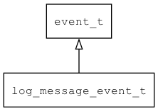

## log\_message\_event\_t
### 概述


日志事件。
----------------------------------
### 函数
<p id="log_message_event_t_methods">

| 函数名称 | 说明 | 
| -------- | ------------ | 
| <a href="#log_message_event_t_log_message_event_cast">log\_message\_event\_cast</a> | 把event对象转log_message_event_t对象。 |
| <a href="#log_message_event_t_log_message_event_init">log\_message\_event\_init</a> | 初始化事件。 |
### 属性
<p id="log_message_event_t_properties">

| 属性名称 | 类型 | 说明 | 
| -------- | ----- | ------------ | 
| <a href="#log_message_event_t_level">level</a> | log\_level\_t | 级别。 |
| <a href="#log_message_event_t_message">message</a> | const char* | 日志。 |
#### log\_message\_event\_cast 函数
-----------------------

* 函数功能：

> <p id="log_message_event_t_log_message_event_cast">把event对象转log_message_event_t对象。

* 函数原型：

```
log_message_event_t* log_message_event_cast (event_t* event);
```

* 参数说明：

| 参数 | 类型 | 说明 |
| -------- | ----- | --------- |
| 返回值 | log\_message\_event\_t* | event对象。 |
| event | event\_t* | event对象。 |
#### log\_message\_event\_init 函数
-----------------------

* 函数功能：

> <p id="log_message_event_t_log_message_event_init">初始化事件。

* 函数原型：

```
event_t* log_message_event_init (log_message_event_t* event, log_level_t level, const char* message);
```

* 参数说明：

| 参数 | 类型 | 说明 |
| -------- | ----- | --------- |
| 返回值 | event\_t* | event对象。 |
| event | log\_message\_event\_t* | event对象。 |
| level | log\_level\_t | 级别。 |
| message | const char* | 日志。 |
#### level 属性
-----------------------
> <p id="log_message_event_t_level">级别。

* 类型：log\_level\_t

| 特性 | 是否支持 |
| -------- | ----- |
| 可直接读取 | 是 |
| 可直接修改 | 否 |
#### message 属性
-----------------------
> <p id="log_message_event_t_message">日志。

* 类型：const char*

| 特性 | 是否支持 |
| -------- | ----- |
| 可直接读取 | 是 |
| 可直接修改 | 否 |
