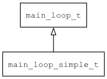

## main\_loop\_simple\_t
### 概述


简单的主循环。
----------------------------------
### 函数
<p id="main_loop_simple_t_methods">

| 函数名称 | 说明 | 
| -------- | ------------ | 
| <a href="#main_loop_simple_t_main_loop_post_key_event">main\_loop\_post\_key\_event</a> | 发送按键事件。 |
| <a href="#main_loop_simple_t_main_loop_post_multi_gesture_event">main\_loop\_post\_multi\_gesture\_event</a> | 发送多点触控事件。 |
| <a href="#main_loop_simple_t_main_loop_post_pointer_event">main\_loop\_post\_pointer\_event</a> | 发送指针事件。 |
| <a href="#main_loop_simple_t_main_loop_simple_init">main\_loop\_simple\_init</a> | 初始化main_loop_simple_t对象。 |
| <a href="#main_loop_simple_t_main_loop_simple_reset">main\_loop\_simple\_reset</a> | 销毁main_loop_simple_t对象。 |
#### main\_loop\_post\_key\_event 函数
-----------------------

* 函数功能：

> <p id="main_loop_simple_t_main_loop_post_key_event">发送按键事件。

* 函数原型：

```
ret_t main_loop_post_key_event (main_loop_t* l, bool_t pressed, uint8_t key);
```

* 参数说明：

| 参数 | 类型 | 说明 |
| -------- | ----- | --------- |
| 返回值 | ret\_t | 返回RET\_OK表示成功，否则表示失败。 |
| l | main\_loop\_t* | 主循环对象。 |
| pressed | bool\_t | 是否按下。 |
| key | uint8\_t | 按键。 |
#### main\_loop\_post\_multi\_gesture\_event 函数
-----------------------

* 函数功能：

> <p id="main_loop_simple_t_main_loop_post_multi_gesture_event">发送多点触控事件。

* 函数原型：

```
ret_t main_loop_post_multi_gesture_event (main_loop_t* l, multi_gesture_event_t* event);
```

* 参数说明：

| 参数 | 类型 | 说明 |
| -------- | ----- | --------- |
| 返回值 | ret\_t | 返回RET\_OK表示成功，否则表示失败。 |
| l | main\_loop\_t* | 主循环对象。 |
| event | multi\_gesture\_event\_t* | 事件。 |
#### main\_loop\_post\_pointer\_event 函数
-----------------------

* 函数功能：

> <p id="main_loop_simple_t_main_loop_post_pointer_event">发送指针事件。

* 函数原型：

```
ret_t main_loop_post_pointer_event (main_loop_t* l, bool_t pressed, xy_t x, xy_t y);
```

* 参数说明：

| 参数 | 类型 | 说明 |
| -------- | ----- | --------- |
| 返回值 | ret\_t | 返回RET\_OK表示成功，否则表示失败。 |
| l | main\_loop\_t* | 主循环对象。 |
| pressed | bool\_t | 是否按下。 |
| x | xy\_t | x坐标。 |
| y | xy\_t | y坐标。 |
#### main\_loop\_simple\_init 函数
-----------------------

* 函数功能：

> <p id="main_loop_simple_t_main_loop_simple_init">初始化main_loop_simple_t对象。

* 函数原型：

```
main_loop_simple_t* main_loop_simple_init (int w, int h, main_loop_queue_event_t queue_event, main_loop_recv_event_t recv_event);
```

* 参数说明：

| 参数 | 类型 | 说明 |
| -------- | ----- | --------- |
| 返回值 | main\_loop\_simple\_t* | 返回main\_loop\_simple\_t对象。 |
| w | int | 宽度。 |
| h | int | 高度。 |
| queue\_event | main\_loop\_queue\_event\_t | 队列事件处理函数。 |
| recv\_event | main\_loop\_recv\_event\_t | 接收事件处理函数。 |
#### main\_loop\_simple\_reset 函数
-----------------------

* 函数功能：

> <p id="main_loop_simple_t_main_loop_simple_reset">销毁main_loop_simple_t对象。

* 函数原型：

```
ret_t main_loop_simple_reset (main_loop_simple_t* loop);
```

* 参数说明：

| 参数 | 类型 | 说明 |
| -------- | ----- | --------- |
| 返回值 | ret\_t | 返回RET\_OK表示成功，否则表示失败。 |
| loop | main\_loop\_simple\_t* | main\_loop\_simple\_t对象。 |
