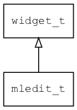

## mledit\_t
### 概述


多行编辑器控件。

mledit\_t是[widget\_t](widget_t.md)的子类控件，widget\_t的函数均适用于mledit\_t控件。

在xml中使用"mledit"标签创建多行编辑器控件。如：

```xml
<mledit x="c" y="m" w="300" h="300" />
```

> 更多用法请参考：[mledit.xml](
https://github.com/zlgopen/awtk/blob/master/design/default/ui/mledit.xml)

在c代码中使用函数mledit\_create创建多行编辑器控件。如：

```c
widget_t* tc = mledit_create(win, 10, 10, 240, 240);
```

> 完整示例请参考：[mledit demo](
https://github.com/zlgopen/awtk-c-demos/blob/master/demos/mledit.c)

time\_clock一般不需要设置style。
----------------------------------
### 函数
<p id="mledit_t_methods">

| 函数名称 | 说明 | 
| -------- | ------------ | 
| <a href="#mledit_t_mledit_cast">mledit\_cast</a> | 转换为mledit对象(供脚本语言使用)。 |
| <a href="#mledit_t_mledit_create">mledit\_create</a> | 创建mledit对象 |
| <a href="#mledit_t_mledit_set_cursor">mledit\_set\_cursor</a> | 设置编辑器光标位置。 |
| <a href="#mledit_t_mledit_set_focus">mledit\_set\_focus</a> | 设置为焦点。 |
| <a href="#mledit_t_mledit_set_keyboard">mledit\_set\_keyboard</a> | 设置自定义软键盘名称。 |
| <a href="#mledit_t_mledit_set_max_lines">mledit\_set\_max\_lines</a> | 设置编辑器的最大行数。 |
| <a href="#mledit_t_mledit_set_readonly">mledit\_set\_readonly</a> | 设置编辑器是否为只读。 |
| <a href="#mledit_t_mledit_set_scroll_line">mledit\_set\_scroll\_line</a> | 设置编辑器滚动速度。 |
| <a href="#mledit_t_mledit_set_tips">mledit\_set\_tips</a> | 设置编辑器的输入提示。 |
| <a href="#mledit_t_mledit_set_tr_tips">mledit\_set\_tr\_tips</a> | 获取翻译之后的文本，然后调用mledit_set_tips。 |
| <a href="#mledit_t_mledit_set_wrap_word">mledit\_set\_wrap\_word</a> | 设置编辑器是否自动折行。 |
### 属性
<p id="mledit_t_properties">

| 属性名称 | 类型 | 说明 | 
| -------- | ----- | ------------ | 
| <a href="#mledit_t_bottom_margin">bottom\_margin</a> | uint8\_t | 下边距。 |
| <a href="#mledit_t_keyboard">keyboard</a> | char* | 自定义软键盘名称。 |
| <a href="#mledit_t_left_margin">left\_margin</a> | uint8\_t | 左边距。 |
| <a href="#mledit_t_max_lines">max\_lines</a> | uint32\_t | 最大行数。 |
| <a href="#mledit_t_readonly">readonly</a> | bool\_t | 编辑器是否为只读。 |
| <a href="#mledit_t_right_margin">right\_margin</a> | uint8\_t | 右边距。 |
| <a href="#mledit_t_scroll_line">scroll\_line</a> | uint32\_t | 鼠标一次滚动行数。 |
| <a href="#mledit_t_tips">tips</a> | char* | 输入提示。 |
| <a href="#mledit_t_top_margin">top\_margin</a> | uint8\_t | 上边距。 |
| <a href="#mledit_t_tr_tips">tr\_tips</a> | char* | 保存用于翻译的提示信息。 |
| <a href="#mledit_t_wrap_word">wrap\_word</a> | bool\_t | 是否自动折行。 |
### 事件
<p id="mledit_t_events">

| 事件名称 | 类型  | 说明 | 
| -------- | ----- | ------- | 
| EVT\_VALUE\_CHANGING | event\_t | 文本正在改变事件(编辑中)。 |
| EVT\_VALUE\_CHANGED | event\_t | 文本改变事件。 |
#### mledit\_cast 函数
-----------------------

* 函数功能：

> <p id="mledit_t_mledit_cast">转换为mledit对象(供脚本语言使用)。

* 函数原型：

```
widget_t* mledit_cast (widget_t* widget);
```

* 参数说明：

| 参数 | 类型 | 说明 |
| -------- | ----- | --------- |
| 返回值 | widget\_t* | mledit对象。 |
| widget | widget\_t* | mledit对象。 |
#### mledit\_create 函数
-----------------------

* 函数功能：

> <p id="mledit_t_mledit_create">创建mledit对象

* 函数原型：

```
widget_t* mledit_create (widget_t* parent, xy_t x, xy_t y, wh_t w, wh_t h);
```

* 参数说明：

| 参数 | 类型 | 说明 |
| -------- | ----- | --------- |
| 返回值 | widget\_t* | 对象。 |
| parent | widget\_t* | 父控件 |
| x | xy\_t | x坐标 |
| y | xy\_t | y坐标 |
| w | wh\_t | 宽度 |
| h | wh\_t | 高度 |
#### mledit\_set\_cursor 函数
-----------------------

* 函数功能：

> <p id="mledit_t_mledit_set_cursor">设置编辑器光标位置。

* 函数原型：

```
ret_t mledit_set_cursor (widget_t* widget, uint32_t cursor);
```

* 参数说明：

| 参数 | 类型 | 说明 |
| -------- | ----- | --------- |
| 返回值 | ret\_t | 返回RET\_OK表示成功，否则表示失败。 |
| widget | widget\_t* | widget对象。 |
| cursor | uint32\_t | 光标位置。 |
#### mledit\_set\_focus 函数
-----------------------

* 函数功能：

> <p id="mledit_t_mledit_set_focus">设置为焦点。

* 函数原型：

```
ret_t mledit_set_focus (widget_t* widget, bool_t focus);
```

* 参数说明：

| 参数 | 类型 | 说明 |
| -------- | ----- | --------- |
| 返回值 | ret\_t | 返回RET\_OK表示成功，否则表示失败。 |
| widget | widget\_t* | widget对象。 |
| focus | bool\_t | 是否为焦点。 |
#### mledit\_set\_keyboard 函数
-----------------------

* 函数功能：

> <p id="mledit_t_mledit_set_keyboard">设置自定义软键盘名称。

* 函数原型：

```
ret_t mledit_set_keyboard (widget_t* widget, char* keyboard);
```

* 参数说明：

| 参数 | 类型 | 说明 |
| -------- | ----- | --------- |
| 返回值 | ret\_t | 返回RET\_OK表示成功，否则表示失败。 |
| widget | widget\_t* | widget对象。 |
| keyboard | char* | 键盘名称(相应UI资源必须存在)。 |
#### mledit\_set\_max\_lines 函数
-----------------------

* 函数功能：

> <p id="mledit_t_mledit_set_max_lines">设置编辑器的最大行数。

* 函数原型：

```
ret_t mledit_set_max_lines (widget_t* widget, uint32_t max_lines);
```

* 参数说明：

| 参数 | 类型 | 说明 |
| -------- | ----- | --------- |
| 返回值 | ret\_t | 返回RET\_OK表示成功，否则表示失败。 |
| widget | widget\_t* | widget对象。 |
| max\_lines | uint32\_t | 最大行数。 |
#### mledit\_set\_readonly 函数
-----------------------

* 函数功能：

> <p id="mledit_t_mledit_set_readonly">设置编辑器是否为只读。

* 函数原型：

```
ret_t mledit_set_readonly (widget_t* widget, bool_t readonly);
```

* 参数说明：

| 参数 | 类型 | 说明 |
| -------- | ----- | --------- |
| 返回值 | ret\_t | 返回RET\_OK表示成功，否则表示失败。 |
| widget | widget\_t* | widget对象。 |
| readonly | bool\_t | 只读。 |
#### mledit\_set\_scroll\_line 函数
-----------------------

* 函数功能：

> <p id="mledit_t_mledit_set_scroll_line">设置编辑器滚动速度。

* 函数原型：

```
ret_t mledit_set_scroll_line (widget_t* widget, uint32_t scroll_line);
```

* 参数说明：

| 参数 | 类型 | 说明 |
| -------- | ----- | --------- |
| 返回值 | ret\_t | 返回RET\_OK表示成功，否则表示失败。 |
| widget | widget\_t* | widget对象。 |
| scroll\_line | uint32\_t | 滚动行数。 |
#### mledit\_set\_tips 函数
-----------------------

* 函数功能：

> <p id="mledit_t_mledit_set_tips">设置编辑器的输入提示。

* 函数原型：

```
ret_t mledit_set_tips (widget_t* widget, char* tips);
```

* 参数说明：

| 参数 | 类型 | 说明 |
| -------- | ----- | --------- |
| 返回值 | ret\_t | 返回RET\_OK表示成功，否则表示失败。 |
| widget | widget\_t* | widget对象。 |
| tips | char* | 输入提示。 |
#### mledit\_set\_tr\_tips 函数
-----------------------

* 函数功能：

> <p id="mledit_t_mledit_set_tr_tips">获取翻译之后的文本，然后调用mledit_set_tips。

* 函数原型：

```
ret_t mledit_set_tr_tips (widget_t* widget, const char* tr_tips);
```

* 参数说明：

| 参数 | 类型 | 说明 |
| -------- | ----- | --------- |
| 返回值 | ret\_t | 返回RET\_OK表示成功，否则表示失败。 |
| widget | widget\_t* | 控件对象。 |
| tr\_tips | const char* | 提示信息。 |
#### mledit\_set\_wrap\_word 函数
-----------------------

* 函数功能：

> <p id="mledit_t_mledit_set_wrap_word">设置编辑器是否自动折行。

* 函数原型：

```
ret_t mledit_set_wrap_word (widget_t* widget, bool_t wrap_word);
```

* 参数说明：

| 参数 | 类型 | 说明 |
| -------- | ----- | --------- |
| 返回值 | ret\_t | 返回RET\_OK表示成功，否则表示失败。 |
| widget | widget\_t* | widget对象。 |
| wrap\_word | bool\_t | 是否自动折行。 |
#### bottom\_margin 属性
-----------------------
> <p id="mledit_t_bottom_margin">下边距。

* 类型：uint8\_t

| 特性 | 是否支持 |
| -------- | ----- |
| 可直接读取 | 是 |
| 可直接修改 | 否 |
| 可持久化   | 是 |
| 可脚本化   | 是 |
| 可在IDE中设置 | 是 |
| 可在XML中设置 | 是 |
| 可通过widget\_get\_prop读取 | 是 |
| 可通过widget\_set\_prop修改 | 是 |
#### keyboard 属性
-----------------------
> <p id="mledit_t_keyboard">自定义软键盘名称。

* 类型：char*

| 特性 | 是否支持 |
| -------- | ----- |
| 可直接读取 | 是 |
| 可直接修改 | 否 |
| 可持久化   | 是 |
| 可脚本化   | 是 |
| 可在IDE中设置 | 是 |
| 可在XML中设置 | 是 |
| 可通过widget\_get\_prop读取 | 是 |
| 可通过widget\_set\_prop修改 | 是 |
#### left\_margin 属性
-----------------------
> <p id="mledit_t_left_margin">左边距。

* 类型：uint8\_t

| 特性 | 是否支持 |
| -------- | ----- |
| 可直接读取 | 是 |
| 可直接修改 | 否 |
| 可持久化   | 是 |
| 可脚本化   | 是 |
| 可在IDE中设置 | 是 |
| 可在XML中设置 | 是 |
| 可通过widget\_get\_prop读取 | 是 |
| 可通过widget\_set\_prop修改 | 是 |
#### max\_lines 属性
-----------------------
> <p id="mledit_t_max_lines">最大行数。

* 类型：uint32\_t

| 特性 | 是否支持 |
| -------- | ----- |
| 可直接读取 | 是 |
| 可直接修改 | 否 |
| 可持久化   | 是 |
| 可脚本化   | 是 |
| 可在IDE中设置 | 是 |
| 可在XML中设置 | 是 |
| 可通过widget\_get\_prop读取 | 是 |
| 可通过widget\_set\_prop修改 | 是 |
#### readonly 属性
-----------------------
> <p id="mledit_t_readonly">编辑器是否为只读。

* 类型：bool\_t

| 特性 | 是否支持 |
| -------- | ----- |
| 可直接读取 | 是 |
| 可直接修改 | 否 |
| 可持久化   | 是 |
| 可脚本化   | 是 |
| 可在IDE中设置 | 是 |
| 可在XML中设置 | 是 |
| 可通过widget\_get\_prop读取 | 是 |
| 可通过widget\_set\_prop修改 | 是 |
#### right\_margin 属性
-----------------------
> <p id="mledit_t_right_margin">右边距。

* 类型：uint8\_t

| 特性 | 是否支持 |
| -------- | ----- |
| 可直接读取 | 是 |
| 可直接修改 | 否 |
| 可持久化   | 是 |
| 可脚本化   | 是 |
| 可在IDE中设置 | 是 |
| 可在XML中设置 | 是 |
| 可通过widget\_get\_prop读取 | 是 |
| 可通过widget\_set\_prop修改 | 是 |
#### scroll\_line 属性
-----------------------
> <p id="mledit_t_scroll_line">鼠标一次滚动行数。

* 类型：uint32\_t

| 特性 | 是否支持 |
| -------- | ----- |
| 可直接读取 | 是 |
| 可直接修改 | 否 |
| 可持久化   | 是 |
| 可脚本化   | 是 |
| 可在IDE中设置 | 是 |
| 可在XML中设置 | 是 |
| 可通过widget\_get\_prop读取 | 是 |
| 可通过widget\_set\_prop修改 | 是 |
#### tips 属性
-----------------------
> <p id="mledit_t_tips">输入提示。

* 类型：char*

| 特性 | 是否支持 |
| -------- | ----- |
| 可直接读取 | 是 |
| 可直接修改 | 否 |
| 可持久化   | 是 |
| 可脚本化   | 是 |
| 可在IDE中设置 | 是 |
| 可在XML中设置 | 是 |
| 可通过widget\_get\_prop读取 | 是 |
| 可通过widget\_set\_prop修改 | 是 |
#### top\_margin 属性
-----------------------
> <p id="mledit_t_top_margin">上边距。

* 类型：uint8\_t

| 特性 | 是否支持 |
| -------- | ----- |
| 可直接读取 | 是 |
| 可直接修改 | 否 |
| 可持久化   | 是 |
| 可脚本化   | 是 |
| 可在IDE中设置 | 是 |
| 可在XML中设置 | 是 |
| 可通过widget\_get\_prop读取 | 是 |
| 可通过widget\_set\_prop修改 | 是 |
#### tr\_tips 属性
-----------------------
> <p id="mledit_t_tr_tips">保存用于翻译的提示信息。

* 类型：char*

| 特性 | 是否支持 |
| -------- | ----- |
| 可直接读取 | 是 |
| 可直接修改 | 否 |
| 可持久化   | 是 |
| 可脚本化   | 是 |
| 可在IDE中设置 | 是 |
| 可在XML中设置 | 是 |
| 可通过widget\_get\_prop读取 | 是 |
| 可通过widget\_set\_prop修改 | 是 |
#### wrap\_word 属性
-----------------------
> <p id="mledit_t_wrap_word">是否自动折行。

* 类型：bool\_t

| 特性 | 是否支持 |
| -------- | ----- |
| 可直接读取 | 是 |
| 可直接修改 | 否 |
| 可持久化   | 是 |
| 可脚本化   | 是 |
| 可在IDE中设置 | 是 |
| 可在XML中设置 | 是 |
| 可通过widget\_get\_prop读取 | 是 |
| 可通过widget\_set\_prop修改 | 是 |
