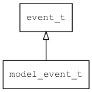

## model\_event\_t
### 概述


model变化事件。
----------------------------------
### 函数
<p id="model_event_t_methods">

| 函数名称 | 说明 | 
| -------- | ------------ | 
| <a href="#model_event_t_model_event_cast">model\_event\_cast</a> | 把event对象转model_event_t对象。 |
| <a href="#model_event_t_model_event_init">model\_event\_init</a> | 初始化事件。 |
### 属性
<p id="model_event_t_properties">

| 属性名称 | 类型 | 说明 | 
| -------- | ----- | ------------ | 
| <a href="#model_event_t_change_type">change\_type</a> | const char* | 变化类型(update/add/remove)。 |
| <a href="#model_event_t_model">model</a> | tk\_object\_t* | 模型。 |
| <a href="#model_event_t_name">name</a> | const char* | 模型名称。 |
#### model\_event\_cast 函数
-----------------------

* 函数功能：

> <p id="model_event_t_model_event_cast">把event对象转model_event_t对象。

* 函数原型：

```
model_event_t* model_event_cast (event_t* event);
```

* 参数说明：

| 参数 | 类型 | 说明 |
| -------- | ----- | --------- |
| 返回值 | model\_event\_t* | event对象。 |
| event | event\_t* | event对象。 |
#### model\_event\_init 函数
-----------------------

* 函数功能：

> <p id="model_event_t_model_event_init">初始化事件。

* 函数原型：

```
event_t* model_event_init (model_event_t* event, const char* name, const char* change_type, tk_object_t* model);
```

* 参数说明：

| 参数 | 类型 | 说明 |
| -------- | ----- | --------- |
| 返回值 | event\_t* | event对象。 |
| event | model\_event\_t* | event对象。 |
| name | const char* | 名称。 |
| change\_type | const char* | 变化类型。 |
| model | tk\_object\_t* | 模型。 |
#### change\_type 属性
-----------------------
> <p id="model_event_t_change_type">变化类型(update/add/remove)。

* 类型：const char*

| 特性 | 是否支持 |
| -------- | ----- |
| 可直接读取 | 是 |
| 可直接修改 | 否 |
| 可脚本化   | 是 |
#### model 属性
-----------------------
> <p id="model_event_t_model">模型。

* 类型：tk\_object\_t*

| 特性 | 是否支持 |
| -------- | ----- |
| 可直接读取 | 是 |
| 可直接修改 | 否 |
| 可脚本化   | 是 |
#### name 属性
-----------------------
> <p id="model_event_t_name">模型名称。

* 类型：const char*

| 特性 | 是否支持 |
| -------- | ----- |
| 可直接读取 | 是 |
| 可直接修改 | 否 |
| 可脚本化   | 是 |
