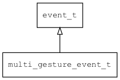

## multi\_gesture\_event\_t
### 概述


多点触摸手势事件。
----------------------------------
### 函数
<p id="multi_gesture_event_t_methods">

| 函数名称 | 说明 | 
| -------- | ------------ | 
| <a href="#multi_gesture_event_t_multi_gesture_event_cast">multi\_gesture\_event\_cast</a> | 把event对象转multi_gesture_event_t对象，主要给脚本语言使用。 |
| <a href="#multi_gesture_event_t_multi_gesture_event_init">multi\_gesture\_event\_init</a> | 初始化事件。 |
### 属性
<p id="multi_gesture_event_t_properties">

| 属性名称 | 类型 | 说明 | 
| -------- | ----- | ------------ | 
| <a href="#multi_gesture_event_t_distance">distance</a> | float | 两点间的距离增量。(-1,0)表示缩小，(0-1)表示增加。 |
| <a href="#multi_gesture_event_t_rotation">rotation</a> | float | 旋转角度(幅度)增量。（单位弧度） |
| <a href="#multi_gesture_event_t_x">x</a> | xy\_t | 中心点x坐标。 |
| <a href="#multi_gesture_event_t_y">y</a> | xy\_t | 中心点y坐标。 |
#### multi\_gesture\_event\_cast 函数
-----------------------

* 函数功能：

> <p id="multi_gesture_event_t_multi_gesture_event_cast">把event对象转multi_gesture_event_t对象，主要给脚本语言使用。

* 函数原型：

```
multi_gesture_event_t* multi_gesture_event_cast (event_t* event);
```

* 参数说明：

| 参数 | 类型 | 说明 |
| -------- | ----- | --------- |
| 返回值 | multi\_gesture\_event\_t* | event对象。 |
| event | event\_t* | event对象。 |
#### multi\_gesture\_event\_init 函数
-----------------------

* 函数功能：

> <p id="multi_gesture_event_t_multi_gesture_event_init">初始化事件。

* 函数原型：

```
event_t* multi_gesture_event_init (multi_gesture_event_t* event, void* target, int32_t x, int32_t y, float rotation, float distance);
```

* 参数说明：

| 参数 | 类型 | 说明 |
| -------- | ----- | --------- |
| 返回值 | event\_t* | event对象。 |
| event | multi\_gesture\_event\_t* | event对象。 |
| target | void* | 事件目标。 |
| x | int32\_t | x的值。 |
| y | int32\_t | y的值。 |
| rotation | float | 旋转角度(幅度)增量。 |
| distance | float | 两点间的距离增量。(-1,0)表示缩小，(0-1)表示增加。 |
#### distance 属性
-----------------------
> <p id="multi_gesture_event_t_distance">两点间的距离增量。(-1,0)表示缩小，(0-1)表示增加。

* 类型：float

| 特性 | 是否支持 |
| -------- | ----- |
| 可直接读取 | 是 |
| 可直接修改 | 否 |
| 可脚本化   | 是 |
#### rotation 属性
-----------------------
> <p id="multi_gesture_event_t_rotation">旋转角度(幅度)增量。（单位弧度）

* 类型：float

| 特性 | 是否支持 |
| -------- | ----- |
| 可直接读取 | 是 |
| 可直接修改 | 否 |
| 可脚本化   | 是 |
#### x 属性
-----------------------
> <p id="multi_gesture_event_t_x">中心点x坐标。

* 类型：xy\_t

| 特性 | 是否支持 |
| -------- | ----- |
| 可直接读取 | 是 |
| 可直接修改 | 否 |
| 可脚本化   | 是 |
#### y 属性
-----------------------
> <p id="multi_gesture_event_t_y">中心点y坐标。

* 类型：xy\_t

| 特性 | 是否支持 |
| -------- | ----- |
| 可直接读取 | 是 |
| 可直接修改 | 否 |
| 可脚本化   | 是 |
