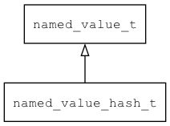

## named\_value\_hash\_t
### 概述


带有散列值的命名的值。
----------------------------------
### 函数
<p id="named_value_hash_t_methods">

| 函数名称 | 说明 | 
| -------- | ------------ | 
| <a href="#named_value_hash_t_named_value_hash_clone">named\_value\_hash\_clone</a> | 克隆named_value_hash对象。 |
| <a href="#named_value_hash_t_named_value_hash_compare">named\_value\_hash\_compare</a> | 比较。 |
| <a href="#named_value_hash_t_named_value_hash_compare_by_hash">named\_value\_hash\_compare\_by\_hash</a> | 比较。 |
| <a href="#named_value_hash_t_named_value_hash_create">named\_value\_hash\_create</a> | 创建named_value_hash对象。 |
| <a href="#named_value_hash_t_named_value_hash_create_ex">named\_value\_hash\_create\_ex</a> | 创建named_value_hash对象。 |
| <a href="#named_value_hash_t_named_value_hash_deinit">named\_value\_hash\_deinit</a> | 重置named_value_hash对象。 |
| <a href="#named_value_hash_t_named_value_hash_destroy">named\_value\_hash\_destroy</a> | 销毁named_value_hash对象。 |
| <a href="#named_value_hash_t_named_value_hash_get_hash_from_str">named\_value\_hash\_get\_hash\_from\_str</a> | 获取字符串散列值。 |
| <a href="#named_value_hash_t_named_value_hash_init">named\_value\_hash\_init</a> | 初始化。 |
| <a href="#named_value_hash_t_named_value_hash_set_name">named\_value\_hash\_set\_name</a> | 设置散列值。 |
### 属性
<p id="named_value_hash_t_properties">

| 属性名称 | 类型 | 说明 | 
| -------- | ----- | ------------ | 
| <a href="#named_value_hash_t_hash">hash</a> | uint64\_t | 散列值。 |
#### named\_value\_hash\_clone 函数
-----------------------

* 函数功能：

> <p id="named_value_hash_t_named_value_hash_clone">克隆named_value_hash对象。

* 函数原型：

```
named_value_hash_t* named_value_hash_clone (named_value_hash_t* nvh);
```

* 参数说明：

| 参数 | 类型 | 说明 |
| -------- | ----- | --------- |
| 返回值 | named\_value\_hash\_t* | 返回named\_value\_hash对象。 |
| nvh | named\_value\_hash\_t* | named\_value\_hash对象。 |
#### named\_value\_hash\_compare 函数
-----------------------

* 函数功能：

> <p id="named_value_hash_t_named_value_hash_compare">比较。

* 函数原型：

```
int32_t named_value_hash_compare (const named_value_hash_t* nvh, const named_value_hash_t* other);
```

* 参数说明：

| 参数 | 类型 | 说明 |
| -------- | ----- | --------- |
| 返回值 | int32\_t | 返回RET\_OK表示成功，否则表示失败。 |
| nvh | const named\_value\_hash\_t* | named\_value\_hash对象。 |
| other | const named\_value\_hash\_t* | named\_value\_hash对象。 |
#### named\_value\_hash\_compare\_by\_hash 函数
-----------------------

* 函数功能：

> <p id="named_value_hash_t_named_value_hash_compare_by_hash">比较。

* 函数原型：

```
int32_t named_value_hash_compare_by_hash (const named_value_hash_t* nvh, uint64_t hash);
```

* 参数说明：

| 参数 | 类型 | 说明 |
| -------- | ----- | --------- |
| 返回值 | int32\_t | 返回RET\_OK表示成功，否则表示失败。 |
| nvh | const named\_value\_hash\_t* | named\_value\_hash对象。 |
| hash | uint64\_t | 散列值。 |
#### named\_value\_hash\_create 函数
-----------------------

* 函数功能：

> <p id="named_value_hash_t_named_value_hash_create">创建named_value_hash对象。

* 函数原型：

```
named_value_hash_t* named_value_hash_create ();
```

* 参数说明：

| 参数 | 类型 | 说明 |
| -------- | ----- | --------- |
| 返回值 | named\_value\_hash\_t* | 返回named\_value\_hash对象。 |
#### named\_value\_hash\_create\_ex 函数
-----------------------

* 函数功能：

> <p id="named_value_hash_t_named_value_hash_create_ex">创建named_value_hash对象。

* 函数原型：

```
named_value_hash_t* named_value_hash_create_ex (const char* name, const value_t* value);
```

* 参数说明：

| 参数 | 类型 | 说明 |
| -------- | ----- | --------- |
| 返回值 | named\_value\_hash\_t* | 返回named\_value\_hash对象。 |
| name | const char* | 名称。 |
| value | const value\_t* | 值。 |
#### named\_value\_hash\_deinit 函数
-----------------------

* 函数功能：

> <p id="named_value_hash_t_named_value_hash_deinit">重置named_value_hash对象。

* 函数原型：

```
ret_t named_value_hash_deinit (named_value_hash_t* nvh);
```

* 参数说明：

| 参数 | 类型 | 说明 |
| -------- | ----- | --------- |
| 返回值 | ret\_t | 返回RET\_OK表示成功，否则表示失败。 |
| nvh | named\_value\_hash\_t* | named\_value\_hash对象。 |
#### named\_value\_hash\_destroy 函数
-----------------------

* 函数功能：

> <p id="named_value_hash_t_named_value_hash_destroy">销毁named_value_hash对象。

* 函数原型：

```
ret_t named_value_hash_destroy (named_value_hash_t* nvh);
```

* 参数说明：

| 参数 | 类型 | 说明 |
| -------- | ----- | --------- |
| 返回值 | ret\_t | 返回RET\_OK表示成功，否则表示失败。 |
| nvh | named\_value\_hash\_t* | named\_value\_hash对象。 |
#### named\_value\_hash\_get\_hash\_from\_str 函数
-----------------------

* 函数功能：

> <p id="named_value_hash_t_named_value_hash_get_hash_from_str">获取字符串散列值。

* 函数原型：

```
uint64_t named_value_hash_get_hash_from_str (const char* str);
```

* 参数说明：

| 参数 | 类型 | 说明 |
| -------- | ----- | --------- |
| 返回值 | uint64\_t | 返回散列值。 |
| str | const char* | 字符串。 |
#### named\_value\_hash\_init 函数
-----------------------

* 函数功能：

> <p id="named_value_hash_t_named_value_hash_init">初始化。

* 函数原型：

```
named_value_hash_t* named_value_hash_init (named_value_hash_t* nvh, const char* name, const value_t* value);
```

* 参数说明：

| 参数 | 类型 | 说明 |
| -------- | ----- | --------- |
| 返回值 | named\_value\_hash\_t* | 返回named\_value\_hash对象。 |
| nvh | named\_value\_hash\_t* | named\_value\_hash对象。 |
| name | const char* | 名称。 |
| value | const value\_t* | 值。 |
#### named\_value\_hash\_set\_name 函数
-----------------------

* 函数功能：

> <p id="named_value_hash_t_named_value_hash_set_name">设置散列值。

* 函数原型：

```
ret_t named_value_hash_set_name (named_value_hash_t* nvh, const char* name);
```

* 参数说明：

| 参数 | 类型 | 说明 |
| -------- | ----- | --------- |
| 返回值 | ret\_t | 返回RET\_OK表示成功，否则表示失败。 |
| nvh | named\_value\_hash\_t* | named\_value\_hash对象。 |
| name | const char* | 名称。 |
#### hash 属性
-----------------------
> <p id="named_value_hash_t_hash">散列值。

* 类型：uint64\_t

| 特性 | 是否支持 |
| -------- | ----- |
| 可直接读取 | 是 |
| 可直接修改 | 否 |
