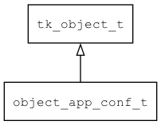

## object\_app\_conf\_t
### 概述


* 将用户配置和默认配置包装起来。
* 优先读取用户配置。
* 默认配置只读，用户配置可读写。
----------------------------------
### 函数
<p id="object_app_conf_t_methods">

| 函数名称 | 说明 | 
| -------- | ------------ | 
| <a href="#object_app_conf_t_object_app_conf_cast">object\_app\_conf\_cast</a> | 转换为object_app_conf对象。 |
| <a href="#object_app_conf_t_object_app_conf_create">object\_app\_conf\_create</a> | 创建对象。 |
#### object\_app\_conf\_cast 函数
-----------------------

* 函数功能：

> <p id="object_app_conf_t_object_app_conf_cast">转换为object_app_conf对象。

* 函数原型：

```
object_app_conf_t* object_app_conf_cast (tk_object_t* obj);
```

* 参数说明：

| 参数 | 类型 | 说明 |
| -------- | ----- | --------- |
| 返回值 | object\_app\_conf\_t* | object\_app\_conf对象。 |
| obj | tk\_object\_t* | object\_app\_conf对象。 |
#### object\_app\_conf\_create 函数
-----------------------

* 函数功能：

> <p id="object_app_conf_t_object_app_conf_create">创建对象。

* 函数原型：

```
tk_object_t* object_app_conf_create (tk_object_t* user_obj, tk_object_t* default_obj);
```

* 参数说明：

| 参数 | 类型 | 说明 |
| -------- | ----- | --------- |
| 返回值 | tk\_object\_t* | 返回object对象。 |
| user\_obj | tk\_object\_t* | 用户配置。 |
| default\_obj | tk\_object\_t* | 默认配置。 |
