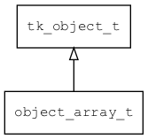

## object\_array\_t
### 概述


简单的动态数组，内部存放value对象。

访问时属性名称为：

* "size"/"length" 用于获取数组的长度。
* index 用于访问属性，-1可以用来追加新元素。
----------------------------------
### 函数
<p id="object_array_t_methods">

| 函数名称 | 说明 | 
| -------- | ------------ | 
| <a href="#object_array_t_object_array_clear_props">object\_array\_clear\_props</a> | 清除全部属性。 |
| <a href="#object_array_t_object_array_clone">object\_array\_clone</a> | 克隆对象。 |
| <a href="#object_array_t_object_array_create">object\_array\_create</a> | 创建对象。 |
| <a href="#object_array_t_object_array_unref">object\_array\_unref</a> | for script gc |
### 属性
<p id="object_array_t_properties">

| 属性名称 | 类型 | 说明 | 
| -------- | ----- | ------------ | 
| <a href="#object_array_t_props">props</a> | value\_t | 属性数组。 |
| <a href="#object_array_t_props_capacity">props\_capacity</a> | uint32\_t | 属性数组的容量。 |
| <a href="#object_array_t_props_size">props\_size</a> | uint32\_t | 属性个数。 |
#### object\_array\_clear\_props 函数
-----------------------

* 函数功能：

> <p id="object_array_t_object_array_clear_props">清除全部属性。

* 函数原型：

```
ret_t object_array_clear_props (object_t* obj);
```

* 参数说明：

| 参数 | 类型 | 说明 |
| -------- | ----- | --------- |
| 返回值 | ret\_t | 返回RET\_OK表示成功，否则表示失败。 |
| obj | object\_t* | 对象。 |
#### object\_array\_clone 函数
-----------------------

* 函数功能：

> <p id="object_array_t_object_array_clone">克隆对象。

* 函数原型：

```
object_t* object_array_clone (object_array_t* o);
```

* 参数说明：

| 参数 | 类型 | 说明 |
| -------- | ----- | --------- |
| 返回值 | object\_t* | 返回object对象。 |
| o | object\_array\_t* | 被克隆的对象。 |
#### object\_array\_create 函数
-----------------------

* 函数功能：

> <p id="object_array_t_object_array_create">创建对象。

* 函数原型：

```
object_t* object_array_create ();
```

* 参数说明：

| 参数 | 类型 | 说明 |
| -------- | ----- | --------- |
| 返回值 | object\_t* | 返回object对象。 |
#### object\_array\_unref 函数
-----------------------

* 函数功能：

> <p id="object_array_t_object_array_unref">for script gc

* 函数原型：

```
ret_t object_array_unref (object_t* obj);
```

* 参数说明：

| 参数 | 类型 | 说明 |
| -------- | ----- | --------- |
| 返回值 | ret\_t | 返回RET\_OK表示成功，否则表示失败。 |
| obj | object\_t* | 对象。 |
#### props 属性
-----------------------
> <p id="object_array_t_props">属性数组。

* 类型：value\_t

| 特性 | 是否支持 |
| -------- | ----- |
| 可直接读取 | 是 |
| 可直接修改 | 否 |
#### props\_capacity 属性
-----------------------
> <p id="object_array_t_props_capacity">属性数组的容量。

* 类型：uint32\_t

| 特性 | 是否支持 |
| -------- | ----- |
| 可直接读取 | 是 |
| 可直接修改 | 否 |
#### props\_size 属性
-----------------------
> <p id="object_array_t_props_size">属性个数。

* 类型：uint32\_t

| 特性 | 是否支持 |
| -------- | ----- |
| 可直接读取 | 是 |
| 可直接修改 | 否 |
| 可脚本化   | 是 |
