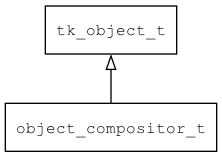

## object\_compositor\_t
### 概述


将两个对象包装为一个对象，优先访问第一个对象，如果访问失败则访问第二个对象。
----------------------------------
### 函数
<p id="object_compositor_t_methods">

| 函数名称 | 说明 | 
| -------- | ------------ | 
| <a href="#object_compositor_t_object_compositor_create">object\_compositor\_create</a> | 创建对象。 |
#### object\_compositor\_create 函数
-----------------------

* 函数功能：

> <p id="object_compositor_t_object_compositor_create">创建对象。

* 函数原型：

```
object_t* object_compositor_create (object_t* obj1, object_t* obj2);
```

* 参数说明：

| 参数 | 类型 | 说明 |
| -------- | ----- | --------- |
| 返回值 | object\_t* | 返回object对象。 |
| obj1 | object\_t* | 对象1。 |
| obj2 | object\_t* | 对象2。 |
