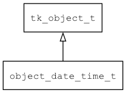

## object\_date\_time\_t
### 概述


将date_time包装成object。
----------------------------------
### 函数
<p id="object_date_time_t_methods">

| 函数名称 | 说明 | 
| -------- | ------------ | 
| <a href="#object_date_time_t_object_date_time_cast">object\_date\_time\_cast</a> | 转换为object_date_time对象。 |
| <a href="#object_date_time_t_object_date_time_create">object\_date\_time\_create</a> | 创建对象。 |
### 属性
<p id="object_date_time_t_properties">

| 属性名称 | 类型 | 说明 | 
| -------- | ----- | ------------ | 
| <a href="#object_date_time_t_dt">dt</a> | date\_time\_t* | date time对象。 |
#### object\_date\_time\_cast 函数
-----------------------

* 函数功能：

> <p id="object_date_time_t_object_date_time_cast">转换为object_date_time对象。

* 函数原型：

```
object_date_time_t* object_date_time_cast (tk_object_t* obj);
```

* 参数说明：

| 参数 | 类型 | 说明 |
| -------- | ----- | --------- |
| 返回值 | object\_date\_time\_t* | object\_date\_time对象。 |
| obj | tk\_object\_t* | object\_date\_time对象。 |
#### object\_date\_time\_create 函数
-----------------------

* 函数功能：

> <p id="object_date_time_t_object_date_time_create">创建对象。

* 函数原型：

```
tk_object_t* object_date_time_create ();
```

* 参数说明：

| 参数 | 类型 | 说明 |
| -------- | ----- | --------- |
| 返回值 | tk\_object\_t* | 返回object对象。 |
#### dt 属性
-----------------------
> <p id="object_date_time_t_dt">date time对象。

* 类型：date\_time\_t*

| 特性 | 是否支持 |
| -------- | ----- |
| 可直接读取 | 是 |
| 可直接修改 | 否 |
