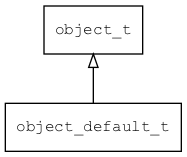

## object\_default\_t
### 概述



 对象接口的缺省实现。

 内部使用有序数组保存所有属性，可以快速查找指定名称的属性。


----------------------------------
### 函数
<p id="object_default_t_methods">

| 函数名称 | 说明 | 
| -------- | ------------ | 
| <a href="#object_default_t_object_default_create">object\_default\_create</a> |  |
| <a href="#object_default_t_object_default_create">object\_default\_create</a> |  |
| <a href="#object_default_t_object_default_unref">object\_default\_unref</a> |  |
### 属性
<p id="object_default_t_properties">

| 属性名称 | 类型 | 说明 | 
| -------- | ----- | ------------ | 
| <a href="#object_default_t_props">props</a> | named\_value\_t | 属性数组。 |
| <a href="#object_default_t_props_capacity">props\_capacity</a> | uint32\_t | 属性数组的容量。 |
| <a href="#object_default_t_props_size">props\_size</a> | uint32\_t | 属性个数。 |
#### object\_default\_create 函数
-----------------------

* 函数功能：

> <p id="object_default_t_object_default_create">
 创建对象。


* 函数原型：

```
object_t* object_default_create ();
```

* 参数说明：

| 参数 | 类型 | 说明 |
| -------- | ----- | --------- |
| 返回值 | object\_t* | 返回object对象。 |
#### object\_default\_create 函数
-----------------------

* 函数功能：

> <p id="object_default_t_object_default_create">
 克隆对象。


* 函数原型：

```
object_t* object_default_create (object_default_t* o);
```

* 参数说明：

| 参数 | 类型 | 说明 |
| -------- | ----- | --------- |
| 返回值 | object\_t* | 返回object对象。 |
| o | object\_default\_t* | 被克隆的对象。 |
#### object\_default\_unref 函数
-----------------------

* 函数功能：

> <p id="object_default_t_object_default_unref">
 for script gc


* 函数原型：

```
ret_t object_default_unref (object_t* obj);
```

* 参数说明：

| 参数 | 类型 | 说明 |
| -------- | ----- | --------- |
| 返回值 | ret\_t | 返回RET\_OK表示成功，否则表示失败。 |
| obj | object\_t* | 对象。 |
#### props 属性
-----------------------
> <p id="object_default_t_props"> 属性数组。


* 类型：named\_value\_t

| 特性 | 是否支持 |
| -------- | ----- |
| 可直接读取 | 是 |
| 可直接修改 | 否 |
#### props\_capacity 属性
-----------------------
> <p id="object_default_t_props_capacity"> 属性数组的容量。


* 类型：uint32\_t

| 特性 | 是否支持 |
| -------- | ----- |
| 可直接读取 | 是 |
| 可直接修改 | 否 |
#### props\_size 属性
-----------------------
> <p id="object_default_t_props_size"> 属性个数。


* 类型：uint32\_t

| 特性 | 是否支持 |
| -------- | ----- |
| 可直接读取 | 是 |
| 可直接修改 | 否 |
| 可脚本化   | 是 |
