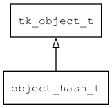

## object\_hash\_t
### 概述


对象接口的散列值查询属性的object实现。

通用当作 map 数据结构使用，内部用有序数组保存所有属性，因此可以快速查找指定名称的属性。

示例

```c
// 创建默认对象
tk_object_t *obj = object_hash_create();

// 设置属性
tk_object_set_prop_str(obj, "name", "awplc");
tk_object_set_prop_int(obj, "age", 18);
tk_object_set_prop_double(obj, "weight", 60.5);

// 获取属性
ENSURE(tk_str_eq(tk_object_get_prop_str(obj, "name"), "awplc"));
ENSURE(tk_object_get_prop_int(obj, "age", 0) == 18);
ENSURE(tk_object_get_prop_double(obj, "weight", 0) == 60.5);

// 遍历属性
tk_object_foreach_prop(obj, visit_obj, NULL);

// 释放对象
TK_OBJECT_UNREF(obj);
```
----------------------------------
### 函数
<p id="object_hash_t_methods">

| 函数名称 | 说明 | 
| -------- | ------------ | 
| <a href="#object_hash_t_object_hash_cast">object\_hash\_cast</a> | 转换为object_hash对象。 |
| <a href="#object_hash_t_object_hash_create">object\_hash\_create</a> | 创建对象。 |
| <a href="#object_hash_t_object_hash_create_ex">object\_hash\_create\_ex</a> | 创建对象。 |
| <a href="#object_hash_t_object_hash_set_keep_prop_type">object\_hash\_set\_keep\_prop\_type</a> | 设置属性值时不改变属性的类型。 |
| <a href="#object_hash_t_object_hash_set_keep_props_order">object\_hash\_set\_keep\_props\_order</a> | 设置是否保持属性间的顺序。 |
#### object\_hash\_cast 函数
-----------------------

* 函数功能：

> <p id="object_hash_t_object_hash_cast">转换为object_hash对象。

* 函数原型：

```
object_hash_t* object_hash_cast (tk_object_t* obj);
```

* 参数说明：

| 参数 | 类型 | 说明 |
| -------- | ----- | --------- |
| 返回值 | object\_hash\_t* | object\_hash对象。 |
| obj | tk\_object\_t* | object\_hash对象。 |
#### object\_hash\_create 函数
-----------------------

* 函数功能：

> <p id="object_hash_t_object_hash_create">创建对象。

* 函数原型：

```
tk_object_t* object_hash_create ();
```

* 参数说明：

| 参数 | 类型 | 说明 |
| -------- | ----- | --------- |
| 返回值 | tk\_object\_t* | 返回object对象。 |
#### object\_hash\_create\_ex 函数
-----------------------

* 函数功能：

> <p id="object_hash_t_object_hash_create_ex">创建对象。

* 函数原型：

```
tk_object_t* object_hash_create_ex (bool_t enable_path);
```

* 参数说明：

| 参数 | 类型 | 说明 |
| -------- | ----- | --------- |
| 返回值 | tk\_object\_t* | 返回object对象。 |
| enable\_path | bool\_t | 是否支持按路径访问属性。 |
#### object\_hash\_set\_keep\_prop\_type 函数
-----------------------

* 函数功能：

> <p id="object_hash_t_object_hash_set_keep_prop_type">设置属性值时不改变属性的类型。

* 函数原型：

```
ret_t object_hash_set_keep_prop_type (tk_object_t* obj, bool_t keep_prop_type);
```

* 参数说明：

| 参数 | 类型 | 说明 |
| -------- | ----- | --------- |
| 返回值 | ret\_t | 返回RET\_OK表示成功，否则表示失败。 |
| obj | tk\_object\_t* | 对象。 |
| keep\_prop\_type | bool\_t | 不改变属性的类型。 |
#### object\_hash\_set\_keep\_props\_order 函数
-----------------------

* 函数功能：

> <p id="object_hash_t_object_hash_set_keep_props_order">设置是否保持属性间的顺序。

* 函数原型：

```
ret_t object_hash_set_keep_props_order (tk_object_t* obj, bool_t keep_props_order);
```

* 参数说明：

| 参数 | 类型 | 说明 |
| -------- | ----- | --------- |
| 返回值 | ret\_t | 返回RET\_OK表示成功，否则表示失败。 |
| obj | tk\_object\_t* | 对象。 |
| keep\_props\_order | bool\_t | 保持属性间的顺序。 |
