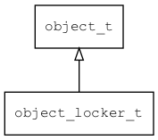

## object\_locker\_t
### 概述


对现有的object对象进行装饰，添加访问互斥功能。
----------------------------------
### 函数
<p id="object_locker_t_methods">

| 函数名称 | 说明 | 
| -------- | ------------ | 
| <a href="#object_locker_t_object_locker_create">object\_locker\_create</a> | 创建对象。 |
#### object\_locker\_create 函数
-----------------------

* 函数功能：

> <p id="object_locker_t_object_locker_create">创建对象。

* 函数原型：

```
object_t* object_locker_create (object_t* obj);
```

* 参数说明：

| 参数 | 类型 | 说明 |
| -------- | ----- | --------- |
| 返回值 | object\_t* | 返回object对象。 |
| obj | object\_t* | 待装饰的对象。 |
