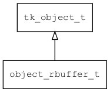

## object\_rbuffer\_t
### 概述


将rbuffer包装成object。
----------------------------------
### 函数
<p id="object_rbuffer_t_methods">

| 函数名称 | 说明 | 
| -------- | ------------ | 
| <a href="#object_rbuffer_t_object_rbuffer_create">object\_rbuffer\_create</a> | 创建rbuffer对象。 |
### 属性
<p id="object_rbuffer_t_properties">

| 属性名称 | 类型 | 说明 | 
| -------- | ----- | ------------ | 
| <a href="#object_rbuffer_t_rbuffer">rbuffer</a> | rbuffer\_t* | rbuffer对象。 |
#### object\_rbuffer\_create 函数
-----------------------

* 函数功能：

> <p id="object_rbuffer_t_object_rbuffer_create">创建rbuffer对象。

* 函数原型：

```
object_t* object_rbuffer_create (const uint8_t* data, uint16_t capacity);
```

* 参数说明：

| 参数 | 类型 | 说明 |
| -------- | ----- | --------- |
| 返回值 | object\_t* | 返回object对象。 |
| data | const uint8\_t* | 缓冲区。 |
| capacity | uint16\_t | 缓冲区的容量。 |
#### rbuffer 属性
-----------------------
> <p id="object_rbuffer_t_rbuffer">rbuffer对象。

* 类型：rbuffer\_t*

| 特性 | 是否支持 |
| -------- | ----- |
| 可直接读取 | 是 |
| 可直接修改 | 否 |
