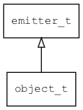

## object\_t
### 概述


对象接口。
----------------------------------
### 函数
<p id="object_t_methods">

| 函数名称 | 说明 | 
| -------- | ------------ | 
| <a href="#object_t_object_can_exec">object\_can\_exec</a> | 检查是否可以执行指定的命令。 |
| <a href="#object_t_object_compare">object\_compare</a> | 比较两个对象。 |
| <a href="#object_t_object_copy_prop">object\_copy\_prop</a> | 拷贝指定的属性。 |
| <a href="#object_t_object_create">object\_create</a> | 创建对象。 |
| <a href="#object_t_object_eval">object\_eval</a> | 计算一个表达式，表达式中引用的变量从prop中获取。 |
| <a href="#object_t_object_exec">object\_exec</a> | 执行指定的命令。 |
| <a href="#object_t_object_foreach_prop">object\_foreach\_prop</a> | 遍历所有属性。 |
| <a href="#object_t_object_get_desc">object\_get\_desc</a> | 获取对象的描述信息。 |
| <a href="#object_t_object_get_prop">object\_get\_prop</a> | 获取指定属性的值。 |
| <a href="#object_t_object_get_prop_bool">object\_get\_prop\_bool</a> | 获取指定属性的bool类型的值。 |
| <a href="#object_t_object_get_prop_bool_by_path">object\_get\_prop\_bool\_by\_path</a> | 获取指定属性的bool类型的值。 |
| <a href="#object_t_object_get_prop_by_path">object\_get\_prop\_by\_path</a> | 获取指定path属性的值。 |
| <a href="#object_t_object_get_prop_float">object\_get\_prop\_float</a> | 获取指定属性的浮点数类型的值。 |
| <a href="#object_t_object_get_prop_float_by_path">object\_get\_prop\_float\_by\_path</a> | 获取指定属性的浮点数类型的值。 |
| <a href="#object_t_object_get_prop_int">object\_get\_prop\_int</a> | 获取指定属性的整数类型的值。 |
| <a href="#object_t_object_get_prop_int_by_path">object\_get\_prop\_int\_by\_path</a> | 获取指定属性的整数类型的值。 |
| <a href="#object_t_object_get_prop_object">object\_get\_prop\_object</a> | 获取指定属性的object类型的值。 |
| <a href="#object_t_object_get_prop_object_by_path">object\_get\_prop\_object\_by\_path</a> | 获取指定属性的object类型的值。 |
| <a href="#object_t_object_get_prop_pointer">object\_get\_prop\_pointer</a> | 获取指定属性的指针类型的值。 |
| <a href="#object_t_object_get_prop_pointer_by_path">object\_get\_prop\_pointer\_by\_path</a> | 获取指定属性的指针类型的值。 |
| <a href="#object_t_object_get_prop_str">object\_get\_prop\_str</a> | 获取指定属性的字符串类型的值。 |
| <a href="#object_t_object_get_prop_str_by_path">object\_get\_prop\_str\_by\_path</a> | 获取指定属性的字符串类型的值。 |
| <a href="#object_t_object_get_size">object\_get\_size</a> | 获取对象占用内存的大小。 |
| <a href="#object_t_object_get_type">object\_get\_type</a> | 获取对象的类型名称。 |
| <a href="#object_t_object_has_prop">object\_has\_prop</a> | 检查是否存在指定的属性。 |
| <a href="#object_t_object_is_collection">object\_is\_collection</a> | 判断对象是否是集合。 |
| <a href="#object_t_object_notify_changed">object\_notify\_changed</a> | 触发EVT_PROPS_CHANGED事件。 |
| <a href="#object_t_object_ref">object\_ref</a> | 引用计数加1。 |
| <a href="#object_t_object_remove_prop">object\_remove\_prop</a> | 删除指定属性。 |
| <a href="#object_t_object_set_name">object\_set\_name</a> | 设置对象的名称。 |
| <a href="#object_t_object_set_prop">object\_set\_prop</a> | 设置指定属性的值。 |
| <a href="#object_t_object_set_prop_bool">object\_set\_prop\_bool</a> | 设置指定属性的bool类型的值。 |
| <a href="#object_t_object_set_prop_float">object\_set\_prop\_float</a> | 设置指定属性的浮点数类型的值。 |
| <a href="#object_t_object_set_prop_int">object\_set\_prop\_int</a> | 设置指定属性的整数类型的值。 |
| <a href="#object_t_object_set_prop_object">object\_set\_prop\_object</a> | 设置指定属性的object类型的值。 |
| <a href="#object_t_object_set_prop_pointer">object\_set\_prop\_pointer</a> | 设置指定属性的指针类型的值。 |
| <a href="#object_t_object_set_prop_str">object\_set\_prop\_str</a> | 设置指定属性的字符串类型的值。 |
| <a href="#object_t_object_unref">object\_unref</a> | 引用计数减1。引用计数为0时，销毁对象。 |
### 属性
<p id="object_t_properties">

| 属性名称 | 类型 | 说明 | 
| -------- | ----- | ------------ | 
| <a href="#object_t_name">name</a> | char* | 对象的名称。 |
| <a href="#object_t_ref_count">ref\_count</a> | int32\_t | 引用计数。 |
#### object\_can\_exec 函数
-----------------------

* 函数功能：

> <p id="object_t_object_can_exec">检查是否可以执行指定的命令。

* 函数原型：

```
bool_t object_can_exec (object_t* obj, const char* name, const char* args);
```

* 参数说明：

| 参数 | 类型 | 说明 |
| -------- | ----- | --------- |
| 返回值 | bool\_t | 返回TRUE表示可以执行，否则表示不可以执行。 |
| obj | object\_t* | object对象。 |
| name | const char* | 命令的名称。 |
| args | const char* | 命令的参数。 |
#### object\_compare 函数
-----------------------

* 函数功能：

> <p id="object_t_object_compare">比较两个对象。

* 函数原型：

```
int object_compare (object_t* obj, object_t* other);
```

* 参数说明：

| 参数 | 类型 | 说明 |
| -------- | ----- | --------- |
| 返回值 | int | 返回比较结果。 |
| obj | object\_t* | object对象。 |
| other | object\_t* | 比较的object对象。 |
#### object\_copy\_prop 函数
-----------------------

* 函数功能：

> <p id="object_t_object_copy_prop">拷贝指定的属性。

* 函数原型：

```
ret_t object_copy_prop (object_t* obj, object_t* src, const char* name);
```

* 参数说明：

| 参数 | 类型 | 说明 |
| -------- | ----- | --------- |
| 返回值 | ret\_t | 返回RET\_OK表示成功，否则表示失败。 |
| obj | object\_t* | 目标对象。 |
| src | object\_t* | 源对象。 |
| name | const char* | 属性的名称。 |
#### object\_create 函数
-----------------------

* 函数功能：

> <p id="object_t_object_create">创建对象。

> 仅供子类调用。

* 函数原型：

```
ret_t object_create (const object_vtable_t* vt);
```

* 参数说明：

| 参数 | 类型 | 说明 |
| -------- | ----- | --------- |
| 返回值 | ret\_t | 返回object对象。 |
| vt | const object\_vtable\_t* | 虚函数表。 |
#### object\_eval 函数
-----------------------

* 函数功能：

> <p id="object_t_object_eval">计算一个表达式，表达式中引用的变量从prop中获取。

* 函数原型：

```
ret_t object_eval (object_t* obj, const char* expr, value_t* v);
```

* 参数说明：

| 参数 | 类型 | 说明 |
| -------- | ----- | --------- |
| 返回值 | ret\_t | 返回RET\_OK表示成功，否则表示失败。 |
| obj | object\_t* | object对象。 |
| expr | const char* | 表达式。 |
| v | value\_t* | 返回计算结果。 |
#### object\_exec 函数
-----------------------

* 函数功能：

> <p id="object_t_object_exec">执行指定的命令。

* 函数原型：

```
ret_t object_exec (object_t* obj, const char* name, const char* args);
```

* 参数说明：

| 参数 | 类型 | 说明 |
| -------- | ----- | --------- |
| 返回值 | ret\_t | 返回RET\_OK表示成功，否则表示失败。 |
| obj | object\_t* | object对象。 |
| name | const char* | 命令的名称。 |
| args | const char* | 命令的参数。 |
#### object\_foreach\_prop 函数
-----------------------

* 函数功能：

> <p id="object_t_object_foreach_prop">遍历所有属性。

* 函数原型：

```
ret_t object_foreach_prop (object_t* obj, tk_visit_t on_prop, void* ctx);
```

* 参数说明：

| 参数 | 类型 | 说明 |
| -------- | ----- | --------- |
| 返回值 | ret\_t | 返回RET\_OK表示成功，否则表示失败。 |
| obj | object\_t* | object对象。 |
| on\_prop | tk\_visit\_t | 回调函数。 |
| ctx | void* | 回调函数上下文。 |
#### object\_get\_desc 函数
-----------------------

* 函数功能：

> <p id="object_t_object_get_desc">获取对象的描述信息。

* 函数原型：

```
const char* object_get_desc (object_t* obj);
```

* 参数说明：

| 参数 | 类型 | 说明 |
| -------- | ----- | --------- |
| 返回值 | const char* | 返回对象的描述信息。 |
| obj | object\_t* | object对象。 |
#### object\_get\_prop 函数
-----------------------

* 函数功能：

> <p id="object_t_object_get_prop">获取指定属性的值。

* 函数原型：

```
ret_t object_get_prop (object_t* obj, const char* name, value_t* v);
```

* 参数说明：

| 参数 | 类型 | 说明 |
| -------- | ----- | --------- |
| 返回值 | ret\_t | 返回RET\_OK表示成功，否则表示失败。 |
| obj | object\_t* | object对象。 |
| name | const char* | 属性的名称。 |
| v | value\_t* | 返回属性的值。 |
#### object\_get\_prop\_bool 函数
-----------------------

* 函数功能：

> <p id="object_t_object_get_prop_bool">获取指定属性的bool类型的值。

* 函数原型：

```
bool_t object_get_prop_bool (object_t* obj, const char* name, bool_t defval);
```

* 参数说明：

| 参数 | 类型 | 说明 |
| -------- | ----- | --------- |
| 返回值 | bool\_t | 返回指定属性的bool类型的值。 |
| obj | object\_t* | object对象。 |
| name | const char* | 属性的名称。 |
| defval | bool\_t | 缺省值。 |
#### object\_get\_prop\_bool\_by\_path 函数
-----------------------

* 函数功能：

> <p id="object_t_object_get_prop_bool_by_path">获取指定属性的bool类型的值。

* 函数原型：

```
bool_t object_get_prop_bool_by_path (object_t* obj, const char* path, bool_t defval);
```

* 参数说明：

| 参数 | 类型 | 说明 |
| -------- | ----- | --------- |
| 返回值 | bool\_t | 返回指定属性的bool类型的值。 |
| obj | object\_t* | object对象。 |
| path | const char* | 属性的path。 |
| defval | bool\_t | 缺省值。 |
#### object\_get\_prop\_by\_path 函数
-----------------------

* 函数功能：

> <p id="object_t_object_get_prop_by_path">获取指定path属性的值。

* 函数原型：

```
ret_t object_get_prop_by_path (object_t* obj, const char* path, value_t* v);
```

* 参数说明：

| 参数 | 类型 | 说明 |
| -------- | ----- | --------- |
| 返回值 | ret\_t | 返回RET\_OK表示成功，否则表示失败。 |
| obj | object\_t* | object对象。 |
| path | const char* | 属性的path，各级之间用.分隔。 |
| v | value\_t* | 返回属性的值。 |
#### object\_get\_prop\_float 函数
-----------------------

* 函数功能：

> <p id="object_t_object_get_prop_float">获取指定属性的浮点数类型的值。

* 函数原型：

```
float_t object_get_prop_float (object_t* obj, const char* name, float_t defval);
```

* 参数说明：

| 参数 | 类型 | 说明 |
| -------- | ----- | --------- |
| 返回值 | float\_t | 返回指定属性的浮点数类型的值。 |
| obj | object\_t* | object对象。 |
| name | const char* | 属性的名称。 |
| defval | float\_t | 缺省值。 |
#### object\_get\_prop\_float\_by\_path 函数
-----------------------

* 函数功能：

> <p id="object_t_object_get_prop_float_by_path">获取指定属性的浮点数类型的值。

* 函数原型：

```
float_t object_get_prop_float_by_path (object_t* obj, const char* path, float_t defval);
```

* 参数说明：

| 参数 | 类型 | 说明 |
| -------- | ----- | --------- |
| 返回值 | float\_t | 返回指定属性的浮点数类型的值。 |
| obj | object\_t* | object对象。 |
| path | const char* | 属性的path。 |
| defval | float\_t | 缺省值。 |
#### object\_get\_prop\_int 函数
-----------------------

* 函数功能：

> <p id="object_t_object_get_prop_int">获取指定属性的整数类型的值。

* 函数原型：

```
int32_t object_get_prop_int (object_t* obj, const char* name, int32_t defval);
```

* 参数说明：

| 参数 | 类型 | 说明 |
| -------- | ----- | --------- |
| 返回值 | int32\_t | 返回指定属性的整数类型的值。 |
| obj | object\_t* | object对象。 |
| name | const char* | 属性的名称。 |
| defval | int32\_t | 缺省值。 |
#### object\_get\_prop\_int\_by\_path 函数
-----------------------

* 函数功能：

> <p id="object_t_object_get_prop_int_by_path">获取指定属性的整数类型的值。

* 函数原型：

```
int32_t object_get_prop_int_by_path (object_t* obj, const char* path, int32_t defval);
```

* 参数说明：

| 参数 | 类型 | 说明 |
| -------- | ----- | --------- |
| 返回值 | int32\_t | 返回指定属性的整数类型的值。 |
| obj | object\_t* | object对象。 |
| path | const char* | 属性的path。 |
| defval | int32\_t | 缺省值。 |
#### object\_get\_prop\_object 函数
-----------------------

* 函数功能：

> <p id="object_t_object_get_prop_object">获取指定属性的object类型的值。

* 函数原型：

```
object_t* object_get_prop_object (object_t* obj, const char* name);
```

* 参数说明：

| 参数 | 类型 | 说明 |
| -------- | ----- | --------- |
| 返回值 | object\_t* | 返回指定属性的object类型的值。 |
| obj | object\_t* | object对象。 |
| name | const char* | 属性的名称。 |
#### object\_get\_prop\_object\_by\_path 函数
-----------------------

* 函数功能：

> <p id="object_t_object_get_prop_object_by_path">获取指定属性的object类型的值。

* 函数原型：

```
object_t* object_get_prop_object_by_path (object_t* obj, const char* path);
```

* 参数说明：

| 参数 | 类型 | 说明 |
| -------- | ----- | --------- |
| 返回值 | object\_t* | 返回指定属性的object类型的值。 |
| obj | object\_t* | object对象。 |
| path | const char* | 属性的path。 |
#### object\_get\_prop\_pointer 函数
-----------------------

* 函数功能：

> <p id="object_t_object_get_prop_pointer">获取指定属性的指针类型的值。

* 函数原型：

```
void* object_get_prop_pointer (object_t* obj, const char* name);
```

* 参数说明：

| 参数 | 类型 | 说明 |
| -------- | ----- | --------- |
| 返回值 | void* | 返回指定属性的指针类型的值。 |
| obj | object\_t* | object对象。 |
| name | const char* | 属性的名称。 |
#### object\_get\_prop\_pointer\_by\_path 函数
-----------------------

* 函数功能：

> <p id="object_t_object_get_prop_pointer_by_path">获取指定属性的指针类型的值。

* 函数原型：

```
void* object_get_prop_pointer_by_path (object_t* obj, const char* path);
```

* 参数说明：

| 参数 | 类型 | 说明 |
| -------- | ----- | --------- |
| 返回值 | void* | 返回指定属性的指针类型的值。 |
| obj | object\_t* | object对象。 |
| path | const char* | 属性的path。 |
#### object\_get\_prop\_str 函数
-----------------------

* 函数功能：

> <p id="object_t_object_get_prop_str">获取指定属性的字符串类型的值。

* 函数原型：

```
const char* object_get_prop_str (object_t* obj, const char* name);
```

* 参数说明：

| 参数 | 类型 | 说明 |
| -------- | ----- | --------- |
| 返回值 | const char* | 返回指定属性的字符串类型的值。 |
| obj | object\_t* | object对象。 |
| name | const char* | 属性的名称。 |
#### object\_get\_prop\_str\_by\_path 函数
-----------------------

* 函数功能：

> <p id="object_t_object_get_prop_str_by_path">获取指定属性的字符串类型的值。

* 函数原型：

```
const char* object_get_prop_str_by_path (object_t* obj, const char* path);
```

* 参数说明：

| 参数 | 类型 | 说明 |
| -------- | ----- | --------- |
| 返回值 | const char* | 返回指定属性的字符串类型的值。 |
| obj | object\_t* | object对象。 |
| path | const char* | 属性的path。 |
#### object\_get\_size 函数
-----------------------

* 函数功能：

> <p id="object_t_object_get_size">获取对象占用内存的大小。

* 函数原型：

```
uint32_t object_get_size (object_t* obj);
```

* 参数说明：

| 参数 | 类型 | 说明 |
| -------- | ----- | --------- |
| 返回值 | uint32\_t | 返回对象占用内存的大小。 |
| obj | object\_t* | object对象。 |
#### object\_get\_type 函数
-----------------------

* 函数功能：

> <p id="object_t_object_get_type">获取对象的类型名称。

* 函数原型：

```
const char* object_get_type (object_t* obj);
```

* 参数说明：

| 参数 | 类型 | 说明 |
| -------- | ----- | --------- |
| 返回值 | const char* | 返回对象的类型名称。 |
| obj | object\_t* | object对象。 |
#### object\_has\_prop 函数
-----------------------

* 函数功能：

> <p id="object_t_object_has_prop">检查是否存在指定的属性。

* 函数原型：

```
bool_t object_has_prop (object_t* obj, const char* name);
```

* 参数说明：

| 参数 | 类型 | 说明 |
| -------- | ----- | --------- |
| 返回值 | bool\_t | 返回TRUE表示存在，否则表示不存在。 |
| obj | object\_t* | object对象。 |
| name | const char* | 属性的名称。 |
#### object\_is\_collection 函数
-----------------------

* 函数功能：

> <p id="object_t_object_is_collection">判断对象是否是集合。

* 函数原型：

```
bool_t object_is_collection (object_t* obj);
```

* 参数说明：

| 参数 | 类型 | 说明 |
| -------- | ----- | --------- |
| 返回值 | bool\_t | 返回TRUE表示是集合，否则不是。 |
| obj | object\_t* | object对象。 |
#### object\_notify\_changed 函数
-----------------------

* 函数功能：

> <p id="object_t_object_notify_changed">触发EVT_PROPS_CHANGED事件。

* 函数原型：

```
ret_t object_notify_changed (object_t* obj);
```

* 参数说明：

| 参数 | 类型 | 说明 |
| -------- | ----- | --------- |
| 返回值 | ret\_t | 返回RET\_OK表示成功，否则表示失败。 |
| obj | object\_t* | object对象。 |
#### object\_ref 函数
-----------------------

* 函数功能：

> <p id="object_t_object_ref">引用计数加1。

* 函数原型：

```
object_t* object_ref (object_t* obj);
```

* 参数说明：

| 参数 | 类型 | 说明 |
| -------- | ----- | --------- |
| 返回值 | object\_t* | 返回object对象。 |
| obj | object\_t* | object对象。 |
#### object\_remove\_prop 函数
-----------------------

* 函数功能：

> <p id="object_t_object_remove_prop">删除指定属性。

* 函数原型：

```
ret_t object_remove_prop (object_t* obj, const char* name);
```

* 参数说明：

| 参数 | 类型 | 说明 |
| -------- | ----- | --------- |
| 返回值 | ret\_t | 返回RET\_OK表示成功，否则表示失败。 |
| obj | object\_t* | object对象。 |
| name | const char* | 属性的名称。 |
#### object\_set\_name 函数
-----------------------

* 函数功能：

> <p id="object_t_object_set_name">设置对象的名称。

* 函数原型：

```
ret_t object_set_name (object_t* obj, const char* name);
```

* 参数说明：

| 参数 | 类型 | 说明 |
| -------- | ----- | --------- |
| 返回值 | ret\_t | 返回RET\_OK表示成功，否则表示失败。 |
| obj | object\_t* | object对象。 |
| name | const char* | 对象的名称。 |
#### object\_set\_prop 函数
-----------------------

* 函数功能：

> <p id="object_t_object_set_prop">设置指定属性的值。

* 函数原型：

```
ret_t object_set_prop (object_t* obj, const char* name, value_t* value);
```

* 参数说明：

| 参数 | 类型 | 说明 |
| -------- | ----- | --------- |
| 返回值 | ret\_t | 返回RET\_OK表示成功，否则表示失败。 |
| obj | object\_t* | object对象。 |
| name | const char* | 属性的名称。 |
| value | value\_t* | 属性的值。 |
#### object\_set\_prop\_bool 函数
-----------------------

* 函数功能：

> <p id="object_t_object_set_prop_bool">设置指定属性的bool类型的值。

* 函数原型：

```
ret_t object_set_prop_bool (object_t* obj, const char* name, bool_t value);
```

* 参数说明：

| 参数 | 类型 | 说明 |
| -------- | ----- | --------- |
| 返回值 | ret\_t | 返回RET\_OK表示成功，否则表示失败。 |
| obj | object\_t* | object对象。 |
| name | const char* | 属性的名称。 |
| value | bool\_t | 属性的值。 |
#### object\_set\_prop\_float 函数
-----------------------

* 函数功能：

> <p id="object_t_object_set_prop_float">设置指定属性的浮点数类型的值。

* 函数原型：

```
ret_t object_set_prop_float (object_t* obj, const char* name, float_t value);
```

* 参数说明：

| 参数 | 类型 | 说明 |
| -------- | ----- | --------- |
| 返回值 | ret\_t | 返回RET\_OK表示成功，否则表示失败。 |
| obj | object\_t* | object对象。 |
| name | const char* | 属性的名称。 |
| value | float\_t | 属性的值。 |
#### object\_set\_prop\_int 函数
-----------------------

* 函数功能：

> <p id="object_t_object_set_prop_int">设置指定属性的整数类型的值。

* 函数原型：

```
ret_t object_set_prop_int (object_t* obj, const char* name, int32_t value);
```

* 参数说明：

| 参数 | 类型 | 说明 |
| -------- | ----- | --------- |
| 返回值 | ret\_t | 返回RET\_OK表示成功，否则表示失败。 |
| obj | object\_t* | object对象。 |
| name | const char* | 属性的名称。 |
| value | int32\_t | 属性的值。 |
#### object\_set\_prop\_object 函数
-----------------------

* 函数功能：

> <p id="object_t_object_set_prop_object">设置指定属性的object类型的值。

* 函数原型：

```
ret_t object_set_prop_object (object_t* obj, const char* name, object_t* value);
```

* 参数说明：

| 参数 | 类型 | 说明 |
| -------- | ----- | --------- |
| 返回值 | ret\_t | 返回RET\_OK表示成功，否则表示失败。 |
| obj | object\_t* | object对象。 |
| name | const char* | 属性的名称。 |
| value | object\_t* | 属性的值。 |
#### object\_set\_prop\_pointer 函数
-----------------------

* 函数功能：

> <p id="object_t_object_set_prop_pointer">设置指定属性的指针类型的值。

* 函数原型：

```
ret_t object_set_prop_pointer (object_t* obj, const char* name, void* value);
```

* 参数说明：

| 参数 | 类型 | 说明 |
| -------- | ----- | --------- |
| 返回值 | ret\_t | 返回RET\_OK表示成功，否则表示失败。 |
| obj | object\_t* | object对象。 |
| name | const char* | 属性的名称。 |
| value | void* | 属性的值。 |
#### object\_set\_prop\_str 函数
-----------------------

* 函数功能：

> <p id="object_t_object_set_prop_str">设置指定属性的字符串类型的值。

* 函数原型：

```
ret_t object_set_prop_str (object_t* obj, const char* name, const char* value);
```

* 参数说明：

| 参数 | 类型 | 说明 |
| -------- | ----- | --------- |
| 返回值 | ret\_t | 返回RET\_OK表示成功，否则表示失败。 |
| obj | object\_t* | object对象。 |
| name | const char* | 属性的名称。 |
| value | const char* | 属性的值。 |
#### object\_unref 函数
-----------------------

* 函数功能：

> <p id="object_t_object_unref">引用计数减1。引用计数为0时，销毁对象。

* 函数原型：

```
ret_t object_unref (object_t* obj);
```

* 参数说明：

| 参数 | 类型 | 说明 |
| -------- | ----- | --------- |
| 返回值 | ret\_t | 返回RET\_OK表示成功，否则表示失败。 |
| obj | object\_t* | object对象。 |
#### name 属性
-----------------------
> <p id="object_t_name">对象的名称。

* 类型：char*

| 特性 | 是否支持 |
| -------- | ----- |
| 可直接读取 | 是 |
| 可直接修改 | 否 |
| 可脚本化   | 是 |
#### ref\_count 属性
-----------------------
> <p id="object_t_ref_count">引用计数。

* 类型：int32\_t

| 特性 | 是否支持 |
| -------- | ----- |
| 可直接读取 | 是 |
| 可直接修改 | 否 |
| 可脚本化   | 是 |
