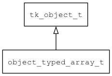

## object\_typed\_array\_t
### 概述


将typed_array包装成object。
----------------------------------
### 函数
<p id="object_typed_array_t_methods">

| 函数名称 | 说明 | 
| -------- | ------------ | 
| <a href="#object_typed_array_t_object_typed_array_create">object\_typed\_array\_create</a> | 创建对象。 |
### 属性
<p id="object_typed_array_t_properties">

| 属性名称 | 类型 | 说明 | 
| -------- | ----- | ------------ | 
| <a href="#object_typed_array_t_arr">arr</a> | typed\_array\_t* | typed array对象。 |
#### object\_typed\_array\_create 函数
-----------------------

* 函数功能：

> <p id="object_typed_array_t_object_typed_array_create">创建对象。

* 函数原型：

```
object_t* object_typed_array_create (value_type_t type, uint32_t capacity);
```

* 参数说明：

| 参数 | 类型 | 说明 |
| -------- | ----- | --------- |
| 返回值 | object\_t* | 返回object对象。 |
| type | value\_type\_t | 元素的类型。 |
| capacity | uint32\_t | 数组的初始容量(元素个数)。 |
#### arr 属性
-----------------------
> <p id="object_typed_array_t_arr">typed array对象。

* 类型：typed\_array\_t*

| 特性 | 是否支持 |
| -------- | ----- |
| 可直接读取 | 是 |
| 可直接修改 | 否 |
