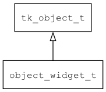

## object\_widget\_t
### 概述


将widget包装成object。
> 备注：主要用于 fscript 实现 widget.prop 方式访问控件属性。
----------------------------------
### 函数
<p id="object_widget_t_methods">

| 函数名称 | 说明 | 
| -------- | ------------ | 
| <a href="#object_widget_t_object_widget_create">object\_widget\_create</a> | 创建widget对象。 |
### 属性
<p id="object_widget_t_properties">

| 属性名称 | 类型 | 说明 | 
| -------- | ----- | ------------ | 
| <a href="#object_widget_t_widget">widget</a> | widget\_t* | widget对象。 |
#### object\_widget\_create 函数
-----------------------

* 函数功能：

> <p id="object_widget_t_object_widget_create">创建widget对象。

* 函数原型：

```
object_t* object_widget_create (widget_t* widget);
```

* 参数说明：

| 参数 | 类型 | 说明 |
| -------- | ----- | --------- |
| 返回值 | object\_t* | 返回object对象。 |
| widget | widget\_t* | 控件。 |
#### widget 属性
-----------------------
> <p id="object_widget_t_widget">widget对象。

* 类型：widget\_t*

| 特性 | 是否支持 |
| -------- | ----- |
| 可直接读取 | 是 |
| 可直接修改 | 否 |
