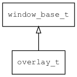

## overlay\_t
### 概述


overlay窗口。

overlay窗口有点类似于非模态的dialog，但是它位置和大小是完全自由的，窗口管理器不会对它做任何限制。

如果overlay窗口有透明或半透效果，则不支持窗口动画，但可以通过移动窗口位置来实现类似动画的效果。

overlay\_t是[window\_base\_t](window_base_t.md)的子类控件，window\_base\_t的函数均适用于overlay\_t控件。

在xml中使用"overlay"标签创建窗口。需要指定坐标和大小，可以指定主题和动画名称。如：

```xml
<overlay theme="basic" x="100" y="100" w="200" h="300">
...
</overlay>
```

>
更多用法请参考：[overlay.xml](https://github.com/zlgopen/awtk/blob/master/design/default/ui/)

在c代码中使用函数overlay\_create创建窗口。如：

```c
widget_t* overlay = overlay_create(NULL, 100, 100, 200, 300);
```

> 完整示例请参考：[overlay
demo](https://github.com/zlgopen/awtk-c-demos/blob/master/demos/)

可用通过style来设置窗口的风格，如背景颜色或图片等。如：

```xml
<style name="bricks">
<normal bg_image="bricks"  bg_image_draw_type="repeat"/>
</style>
```

> 更多用法请参考：[theme
default](https://github.com/zlgopen/awtk/blob/master/design/default/styles/default.xml#L0)
----------------------------------
### 函数
<p id="overlay_t_methods">

| 函数名称 | 说明 | 
| -------- | ------------ | 
| <a href="#overlay_t_overlay_cast">overlay\_cast</a> | 转换为overlay对象(供脚本语言使用)。 |
| <a href="#overlay_t_overlay_create">overlay\_create</a> | 创建overlay对象 |
#### overlay\_cast 函数
-----------------------

* 函数功能：

> <p id="overlay_t_overlay_cast">转换为overlay对象(供脚本语言使用)。

* 函数原型：

```
widget_t* overlay_cast (widget_t* widget);
```

* 参数说明：

| 参数 | 类型 | 说明 |
| -------- | ----- | --------- |
| 返回值 | widget\_t* | overlay对象。 |
| widget | widget\_t* | overlay对象。 |
#### overlay\_create 函数
-----------------------

* 函数功能：

> <p id="overlay_t_overlay_create">创建overlay对象

* 函数原型：

```
widget_t* overlay_create (widget_t* parent, xy_t x, xy_t y, wh_t w, wh_t h);
```

* 参数说明：

| 参数 | 类型 | 说明 |
| -------- | ----- | --------- |
| 返回值 | widget\_t* | 对象。 |
| parent | widget\_t* | 父控件 |
| x | xy\_t | x坐标 |
| y | xy\_t | y坐标 |
| w | wh\_t | 宽度 |
| h | wh\_t | 高度 |
