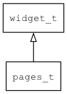

## pages\_t
### 概述


页面管理控件。

只有一个Page处于active状态，处于active状态的Page才能显示并接收事件。
常用于实现标签控件中的页面管理。

pages\_t是[widget\_t](widget_t.md)的子类控件，
widget\_t的函数均适用于pages\_t控件。

在xml中使用"pages"标签创建页面管理控件。如：

```xml
<tab_control x="0" y="0" w="100%" h="100%" >
<pages x="c" y="20" w="90%" h="-60" value="1">
...
</pages>
<tab_button_group>
...
</tab_button_group>
</tab_control>
```

> 更多用法请参考：
[tab control](https://github.com/zlgopen/awtk/blob/master/design/default/ui/)
----------------------------------
### 函数
<p id="pages_t_methods">

| 函数名称 | 说明 | 
| -------- | ------------ | 
| <a href="#pages_t_pages_cast">pages\_cast</a> | 转换为pages对象(供脚本语言使用)。 |
| <a href="#pages_t_pages_create">pages\_create</a> | 创建pages对象 |
| <a href="#pages_t_pages_set_active">pages\_set\_active</a> | 设置当前的Page。 |
| <a href="#pages_t_pages_set_active_by_name">pages\_set\_active\_by\_name</a> | 通过页面的名字设置当前的Page。 |
### 属性
<p id="pages_t_properties">

| 属性名称 | 类型 | 说明 | 
| -------- | ----- | ------------ | 
| <a href="#pages_t_active">active</a> | uint32\_t | 当前活跃的page。 |
### 事件
<p id="pages_t_events">

| 事件名称 | 类型  | 说明 | 
| -------- | ----- | ------- | 
| EVT\_VALUE\_WILL\_CHANGE | event\_t | 值(当前页)即将改变事件。 |
| EVT\_VALUE\_CHANGED | event\_t | 值(当前页)改变事件。 |
#### pages\_cast 函数
-----------------------

* 函数功能：

> <p id="pages_t_pages_cast">转换为pages对象(供脚本语言使用)。

* 函数原型：

```
widget_t* pages_cast (widget_t* widget);
```

* 参数说明：

| 参数 | 类型 | 说明 |
| -------- | ----- | --------- |
| 返回值 | widget\_t* | pages对象。 |
| widget | widget\_t* | pages对象。 |
#### pages\_create 函数
-----------------------

* 函数功能：

> <p id="pages_t_pages_create">创建pages对象

* 函数原型：

```
widget_t* pages_create (widget_t* parent, xy_t x, xy_t y, wh_t w, wh_t h);
```

* 参数说明：

| 参数 | 类型 | 说明 |
| -------- | ----- | --------- |
| 返回值 | widget\_t* | 对象。 |
| parent | widget\_t* | 父控件 |
| x | xy\_t | x坐标 |
| y | xy\_t | y坐标 |
| w | wh\_t | 宽度 |
| h | wh\_t | 高度 |
#### pages\_set\_active 函数
-----------------------

* 函数功能：

> <p id="pages_t_pages_set_active">设置当前的Page。

* 函数原型：

```
ret_t pages_set_active (widget_t* widget, uint32_t index);
```

* 参数说明：

| 参数 | 类型 | 说明 |
| -------- | ----- | --------- |
| 返回值 | ret\_t | 返回RET\_OK表示成功，否则表示失败。 |
| widget | widget\_t* | 控件对象。 |
| index | uint32\_t | 当前Page的序号。 |
#### pages\_set\_active\_by\_name 函数
-----------------------

* 函数功能：

> <p id="pages_t_pages_set_active_by_name">通过页面的名字设置当前的Page。

* 函数原型：

```
ret_t pages_set_active_by_name (widget_t* widget, char* name);
```

* 参数说明：

| 参数 | 类型 | 说明 |
| -------- | ----- | --------- |
| 返回值 | ret\_t | 返回RET\_OK表示成功，否则表示失败。 |
| widget | widget\_t* | 控件对象。 |
| name | char* | 当前Page的名字。 |
#### active 属性
-----------------------
> <p id="pages_t_active">当前活跃的page。

* 类型：uint32\_t

| 特性 | 是否支持 |
| -------- | ----- |
| 可直接读取 | 是 |
| 可直接修改 | 否 |
| 可持久化   | 是 |
| 可脚本化   | 是 |
| 可在IDE中设置 | 是 |
| 可在XML中设置 | 是 |
| 可通过widget\_get\_prop读取 | 是 |
| 可通过widget\_set\_prop修改 | 是 |
