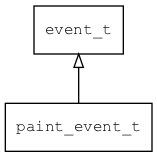

## paint\_event\_t
### 概述


绘制事件。
----------------------------------
### 函数
<p id="paint_event_t_methods">

| 函数名称 | 说明 | 
| -------- | ------------ | 
| <a href="#paint_event_t_paint_event_cast">paint\_event\_cast</a> | 把event对象转paint_event_t对象。主要给脚本语言使用。 |
| <a href="#paint_event_t_paint_event_init">paint\_event\_init</a> | 初始化事件。 |
### 属性
<p id="paint_event_t_properties">

| 属性名称 | 类型 | 说明 | 
| -------- | ----- | ------------ | 
| <a href="#paint_event_t_c">c</a> | canvas\_t* | canvas。 |
#### paint\_event\_cast 函数
-----------------------

* 函数功能：

> <p id="paint_event_t_paint_event_cast">把event对象转paint_event_t对象。主要给脚本语言使用。

* 函数原型：

```
paint_event_t* paint_event_cast (event_t* event);
```

* 参数说明：

| 参数 | 类型 | 说明 |
| -------- | ----- | --------- |
| 返回值 | paint\_event\_t* | event 对象。 |
| event | event\_t* | event对象。 |
#### paint\_event\_init 函数
-----------------------

* 函数功能：

> <p id="paint_event_t_paint_event_init">初始化事件。

* 函数原型：

```
event_t* paint_event_init (paint_event_t* event, void* target, uint32_t type, canvas_t* c);
```

* 参数说明：

| 参数 | 类型 | 说明 |
| -------- | ----- | --------- |
| 返回值 | event\_t* | event对象。 |
| event | paint\_event\_t* | event对象。 |
| target | void* | 事件目标。 |
| type | uint32\_t | 事件类型。 |
| c | canvas\_t* | canvas对象。 |
#### c 属性
-----------------------
> <p id="paint_event_t_c">canvas。

* 类型：canvas\_t*

| 特性 | 是否支持 |
| -------- | ----- |
| 可直接读取 | 是 |
| 可直接修改 | 否 |
| 可脚本化   | 是 |
