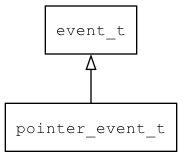

## pointer\_event\_t
### 概述


指针事件。
----------------------------------
### 函数
<p id="pointer_event_t_methods">

| 函数名称 | 说明 | 
| -------- | ------------ | 
| <a href="#pointer_event_t_pointer_event_cast">pointer\_event\_cast</a> | 把event对象转pointer_event_t对象，主要给脚本语言使用。 |
| <a href="#pointer_event_t_pointer_event_init">pointer\_event\_init</a> | 初始化事件。 |
### 属性
<p id="pointer_event_t_properties">

| 属性名称 | 类型 | 说明 | 
| -------- | ----- | ------------ | 
| <a href="#pointer_event_t_alt">alt</a> | bool\_t | alt键是否按下。 |
| <a href="#pointer_event_t_button">button</a> | uint8\_t | button。 |
| <a href="#pointer_event_t_cmd">cmd</a> | bool\_t | cmd键是否按下。 |
| <a href="#pointer_event_t_ctrl">ctrl</a> | bool\_t | ctrl键是否按下。 |
| <a href="#pointer_event_t_menu">menu</a> | bool\_t | menu键是否按下。 |
| <a href="#pointer_event_t_pressed">pressed</a> | bool\_t | 指针是否按下。 |
| <a href="#pointer_event_t_shift">shift</a> | bool\_t | shift键是否按下。 |
| <a href="#pointer_event_t_x">x</a> | xy\_t | x坐标。 |
| <a href="#pointer_event_t_y">y</a> | xy\_t | y坐标。 |
#### pointer\_event\_cast 函数
-----------------------

* 函数功能：

> <p id="pointer_event_t_pointer_event_cast">把event对象转pointer_event_t对象，主要给脚本语言使用。

* 函数原型：

```
pointer_event_t* pointer_event_cast (event_t* event);
```

* 参数说明：

| 参数 | 类型 | 说明 |
| -------- | ----- | --------- |
| 返回值 | pointer\_event\_t* | event对象。 |
| event | event\_t* | event对象。 |
#### pointer\_event\_init 函数
-----------------------

* 函数功能：

> <p id="pointer_event_t_pointer_event_init">初始化事件。

* 函数原型：

```
event_t* pointer_event_init (pointer_event_t* event, void* target, uint32_t type, int32_t x, int32_t y);
```

* 参数说明：

| 参数 | 类型 | 说明 |
| -------- | ----- | --------- |
| 返回值 | event\_t* | event对象。 |
| event | pointer\_event\_t* | event对象。 |
| target | void* | 事件目标。 |
| type | uint32\_t | 事件类型。 |
| x | int32\_t | x的值。 |
| y | int32\_t | y的值。 |
#### alt 属性
-----------------------
> <p id="pointer_event_t_alt">alt键是否按下。

* 类型：bool\_t

| 特性 | 是否支持 |
| -------- | ----- |
| 可直接读取 | 是 |
| 可直接修改 | 否 |
| 可脚本化   | 是 |
#### button 属性
-----------------------
> <p id="pointer_event_t_button">button。

* 类型：uint8\_t

| 特性 | 是否支持 |
| -------- | ----- |
| 可直接读取 | 是 |
| 可直接修改 | 否 |
| 可脚本化   | 是 |
#### cmd 属性
-----------------------
> <p id="pointer_event_t_cmd">cmd键是否按下。

* 类型：bool\_t

| 特性 | 是否支持 |
| -------- | ----- |
| 可直接读取 | 是 |
| 可直接修改 | 否 |
| 可脚本化   | 是 |
#### ctrl 属性
-----------------------
> <p id="pointer_event_t_ctrl">ctrl键是否按下。

* 类型：bool\_t

| 特性 | 是否支持 |
| -------- | ----- |
| 可直接读取 | 是 |
| 可直接修改 | 否 |
| 可脚本化   | 是 |
#### menu 属性
-----------------------
> <p id="pointer_event_t_menu">menu键是否按下。

* 类型：bool\_t

| 特性 | 是否支持 |
| -------- | ----- |
| 可直接读取 | 是 |
| 可直接修改 | 否 |
| 可脚本化   | 是 |
#### pressed 属性
-----------------------
> <p id="pointer_event_t_pressed">指针是否按下。

* 类型：bool\_t

| 特性 | 是否支持 |
| -------- | ----- |
| 可直接读取 | 是 |
| 可直接修改 | 否 |
| 可脚本化   | 是 |
#### shift 属性
-----------------------
> <p id="pointer_event_t_shift">shift键是否按下。

* 类型：bool\_t

| 特性 | 是否支持 |
| -------- | ----- |
| 可直接读取 | 是 |
| 可直接修改 | 否 |
| 可脚本化   | 是 |
#### x 属性
-----------------------
> <p id="pointer_event_t_x">x坐标。

* 类型：xy\_t

| 特性 | 是否支持 |
| -------- | ----- |
| 可直接读取 | 是 |
| 可直接修改 | 否 |
| 可脚本化   | 是 |
#### y 属性
-----------------------
> <p id="pointer_event_t_y">y坐标。

* 类型：xy\_t

| 特性 | 是否支持 |
| -------- | ----- |
| 可直接读取 | 是 |
| 可直接修改 | 否 |
| 可脚本化   | 是 |
