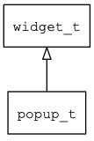

## popup\_t
### 概述


弹出窗口。

弹出窗口是一种特殊的窗口，大小和位置可以自由设置，主要用来实现右键菜单和combo\_box的下列列表等功能。

popup\_t是[window\_base\_t](window_base_t.md)的子类控件，window\_base\_t的函数均适用于popup\_t控件。

在xml中使用"popup"标签创建弹出窗口。如：

```xml
<popup close_when_click_outside="true" x="c" y="m" w="80%" h="80" >
<list_view x="0"  y="0" w="100%" h="100%" item_height="30">
<scroll_view name="view" x="0"  y="0" w="-12" h="100%">
<combo_box_item tr_text="english"/>
<combo_box_item tr_text="chinese" />
</scroll_view>
<scroll_bar_d name="bar" x="right" y="0" w="12" h="100%" value="0"/>
</list_view>
</popup>
```

>
更多用法请参考：[popup](https://github.com/zlgopen/awtk/blob/master/design/default/ui/)

在c代码中使用函数popup\_create创建弹出窗口。如：

```c
widget_t* win = popup_create(NULL, 0, 0, w, h);
popup_set_close_when_click_outside(win, TRUE);
```

> 创建之后，和使用普通窗口是一样的。

> 完整示例请参考：[combo_box.c](https://github.com/zlgopen/awtk-c-demos/blob/master/demos/combo_box.c)

可用通过style来设置控件的显示风格，如字体的大小和颜色等等。如：

```xml
<popup>
<style name="default" border_color="#a0a0a0">
<normal bg_color="#f0f0f0"/>
</style>
</popup>
```

> 更多用法请参考：[theme
default](https://github.com/zlgopen/awtk/blob/master/design/default/styles/default.xml#L324)
----------------------------------
### 函数
<p id="popup_t_methods">

| 函数名称 | 说明 | 
| -------- | ------------ | 
| <a href="#popup_t_popup_cast">popup\_cast</a> | 转换为popup对象(供脚本语言使用)。 |
| <a href="#popup_t_popup_create">popup\_create</a> | 创建popup对象。 |
| <a href="#popup_t_popup_set_close_when_click">popup\_set\_close\_when\_click</a> | 设置点击时是否关闭窗口。 |
| <a href="#popup_t_popup_set_close_when_click_outside">popup\_set\_close\_when\_click\_outside</a> | 设置点击窗口外部时是否关闭窗口。 |
### 属性
<p id="popup_t_properties">

| 属性名称 | 类型 | 说明 | 
| -------- | ----- | ------------ | 
| <a href="#popup_t_close_when_click">close\_when\_click</a> | bool\_t | 点击时是否关闭窗口。 |
| <a href="#popup_t_close_when_click_outside">close\_when\_click\_outside</a> | bool\_t | 点击到窗口外时是否关闭窗口。 |
#### popup\_cast 函数
-----------------------

* 函数功能：

> <p id="popup_t_popup_cast">转换为popup对象(供脚本语言使用)。

* 函数原型：

```
widget_t* popup_cast (widget_t* widget);
```

* 参数说明：

| 参数 | 类型 | 说明 |
| -------- | ----- | --------- |
| 返回值 | widget\_t* | popup对象。 |
| widget | widget\_t* | popup对象。 |
#### popup\_create 函数
-----------------------

* 函数功能：

> <p id="popup_t_popup_create">创建popup对象。

* 函数原型：

```
widget_t* popup_create (widget_t* parent, xy_t x, xy_t y, wh_t w, wh_t h);
```

* 参数说明：

| 参数 | 类型 | 说明 |
| -------- | ----- | --------- |
| 返回值 | widget\_t* | popup对象。 |
| parent | widget\_t* | 父控件 |
| x | xy\_t | x坐标 |
| y | xy\_t | y坐标 |
| w | wh\_t | 宽度 |
| h | wh\_t | 高度 |
#### popup\_set\_close\_when\_click 函数
-----------------------

* 函数功能：

> <p id="popup_t_popup_set_close_when_click">设置点击时是否关闭窗口。

* 函数原型：

```
ret_t popup_set_close_when_click (widget_t* widget, bool_t close_when_click);
```

* 参数说明：

| 参数 | 类型 | 说明 |
| -------- | ----- | --------- |
| 返回值 | ret\_t | 返回RET\_OK表示成功，否则表示失败。 |
| widget | widget\_t* | 控件对象。 |
| close\_when\_click | bool\_t | 点击时是否关闭窗口。 |
#### popup\_set\_close\_when\_click\_outside 函数
-----------------------

* 函数功能：

> <p id="popup_t_popup_set_close_when_click_outside">设置点击窗口外部时是否关闭窗口。

* 函数原型：

```
ret_t popup_set_close_when_click_outside (widget_t* widget, bool_t close_when_click_outside);
```

* 参数说明：

| 参数 | 类型 | 说明 |
| -------- | ----- | --------- |
| 返回值 | ret\_t | 返回RET\_OK表示成功，否则表示失败。 |
| widget | widget\_t* | 控件对象。 |
| close\_when\_click\_outside | bool\_t | 点击窗口外部时是否关闭窗口。 |
#### close\_when\_click 属性
-----------------------
> <p id="popup_t_close_when_click">点击时是否关闭窗口。

* 类型：bool\_t

| 特性 | 是否支持 |
| -------- | ----- |
| 可直接读取 | 是 |
| 可直接修改 | 否 |
| 可持久化   | 是 |
| 可脚本化   | 是 |
| 可在IDE中设置 | 是 |
| 可在XML中设置 | 是 |
| 可通过widget\_get\_prop读取 | 是 |
| 可通过widget\_set\_prop修改 | 是 |
#### close\_when\_click\_outside 属性
-----------------------
> <p id="popup_t_close_when_click_outside">点击到窗口外时是否关闭窗口。

* 类型：bool\_t

| 特性 | 是否支持 |
| -------- | ----- |
| 可直接读取 | 是 |
| 可直接修改 | 否 |
| 可持久化   | 是 |
| 可脚本化   | 是 |
| 可在IDE中设置 | 是 |
| 可在XML中设置 | 是 |
| 可通过widget\_get\_prop读取 | 是 |
| 可通过widget\_set\_prop修改 | 是 |
