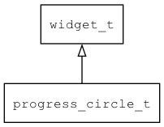

## progress\_circle\_t
### 概述


进度圆环控件。

progress\_circle\_t是[widget\_t](widget_t.md)的子类控件，widget\_t的函数均适用于progress\_circle\_t控件。

在xml中使用"progress\_circle"标签创建进度圆环控件。如：

```xml
<progress_circle max="360" show_text="true" start_angle="90" />
```

> 更多用法请参考：
[progress_circle.xml](https://github.com/zlgopen/awtk/blob/master/design/default/ui/progress_circle.xml)

在c代码中使用函数progress\_circle\_create创建进度圆环控件。如：

```c
progress_circle = progress_circle_create(win, 10, 10, 200, 200);
progress_circle_set_max(progress_circle, 360);
widget_set_value(progress_circle, 128);
```

> 完整示例请参考：
[progress_circle
demo](https://github.com/zlgopen/awtk-c-demos/blob/master/demos/progress_circle.c)

可用通过style来设置控件的显示风格，如字体的大小和颜色等等。如：

```xml
<style name="default">
<normal text_color="green" fg_color="black" />
</style>
```

> 更多用法请参考：
[theme
default](https://github.com/zlgopen/awtk/blob/master/design/default/styles/default.xml#L467)
----------------------------------
### 函数
<p id="progress_circle_t_methods">

| 函数名称 | 说明 | 
| -------- | ------------ | 
| <a href="#progress_circle_t_progress_circle_cast">progress\_circle\_cast</a> | 转换为progress_circle对象(供脚本语言使用)。 |
| <a href="#progress_circle_t_progress_circle_create">progress\_circle\_create</a> | 创建progress_circle对象 |
| <a href="#progress_circle_t_progress_circle_set_counter_clock_wise">progress\_circle\_set\_counter\_clock\_wise</a> | 设置是否为逆时针方向。 |
| <a href="#progress_circle_t_progress_circle_set_line_cap">progress\_circle\_set\_line\_cap</a> | 设置线帽类型。 |
| <a href="#progress_circle_t_progress_circle_set_line_width">progress\_circle\_set\_line\_width</a> | 设置环线的厚度。 |
| <a href="#progress_circle_t_progress_circle_set_max">progress\_circle\_set\_max</a> | 设置最大值。 |
| <a href="#progress_circle_t_progress_circle_set_show_text">progress\_circle\_set\_show\_text</a> | 设置是否显示文本。 |
| <a href="#progress_circle_t_progress_circle_set_start_angle">progress\_circle\_set\_start\_angle</a> | 设置起始角度。 |
| <a href="#progress_circle_t_progress_circle_set_unit">progress\_circle\_set\_unit</a> | 设置单位。 |
| <a href="#progress_circle_t_progress_circle_set_value">progress\_circle\_set\_value</a> | 设置值。 |
### 属性
<p id="progress_circle_t_properties">

| 属性名称 | 类型 | 说明 | 
| -------- | ----- | ------------ | 
| <a href="#progress_circle_t_counter_clock_wise">counter\_clock\_wise</a> | bool\_t | 是否为逆时针方向(缺省为FALSE)。 |
| <a href="#progress_circle_t_line_cap">line\_cap</a> | char* | 线帽类型(round:圆头，square:方头)。 |
| <a href="#progress_circle_t_line_width">line\_width</a> | uint32\_t | 环线的厚度(缺省为8)。 |
| <a href="#progress_circle_t_max">max</a> | uint32\_t | 最大值(缺省为100)。 |
| <a href="#progress_circle_t_show_text">show\_text</a> | bool\_t | 是否显示文本(缺省为TRUE)。 |
| <a href="#progress_circle_t_start_angle">start\_angle</a> | int32\_t | 起始角度(单位为度，缺省-90)。 |
| <a href="#progress_circle_t_unit">unit</a> | char* | 单元(缺省无)。 |
| <a href="#progress_circle_t_value">value</a> | float\_t | 值(缺省为0)。 |
### 事件
<p id="progress_circle_t_events">

| 事件名称 | 类型  | 说明 | 
| -------- | ----- | ------- | 
| EVT\_VALUE\_WILL\_CHANGE | event\_t | 值即将改变事件。 |
| EVT\_VALUE\_CHANGED | event\_t | 值改变事件。 |
#### progress\_circle\_cast 函数
-----------------------

* 函数功能：

> <p id="progress_circle_t_progress_circle_cast">转换为progress_circle对象(供脚本语言使用)。

* 函数原型：

```
widget_t* progress_circle_cast (widget_t* widget);
```

* 参数说明：

| 参数 | 类型 | 说明 |
| -------- | ----- | --------- |
| 返回值 | widget\_t* | progress\_circle对象。 |
| widget | widget\_t* | progress\_circle对象。 |
#### progress\_circle\_create 函数
-----------------------

* 函数功能：

> <p id="progress_circle_t_progress_circle_create">创建progress_circle对象

* 函数原型：

```
widget_t* progress_circle_create (widget_t* parent, xy_t x, xy_t y, wh_t w, wh_t h);
```

* 参数说明：

| 参数 | 类型 | 说明 |
| -------- | ----- | --------- |
| 返回值 | widget\_t* | 对象。 |
| parent | widget\_t* | 父控件 |
| x | xy\_t | x坐标 |
| y | xy\_t | y坐标 |
| w | wh\_t | 宽度 |
| h | wh\_t | 高度 |
#### progress\_circle\_set\_counter\_clock\_wise 函数
-----------------------

* 函数功能：

> <p id="progress_circle_t_progress_circle_set_counter_clock_wise">设置是否为逆时针方向。

* 函数原型：

```
ret_t progress_circle_set_counter_clock_wise (widget_t* widget, bool_t counter_clock_wise);
```

* 参数说明：

| 参数 | 类型 | 说明 |
| -------- | ----- | --------- |
| 返回值 | ret\_t | 返回RET\_OK表示成功，否则表示失败。 |
| widget | widget\_t* | 控件对象。 |
| counter\_clock\_wise | bool\_t | 是否为逆时针方向。 |
#### progress\_circle\_set\_line\_cap 函数
-----------------------

* 函数功能：

> <p id="progress_circle_t_progress_circle_set_line_cap">设置线帽类型。

* 函数原型：

```
ret_t progress_circle_set_line_cap (widget_t* widget, const char* line_cap);
```

* 参数说明：

| 参数 | 类型 | 说明 |
| -------- | ----- | --------- |
| 返回值 | ret\_t | 返回RET\_OK表示成功，否则表示失败。 |
| widget | widget\_t* | 控件对象。 |
| line\_cap | const char* | 线帽类型(round:圆头，square:方头)。。 |
#### progress\_circle\_set\_line\_width 函数
-----------------------

* 函数功能：

> <p id="progress_circle_t_progress_circle_set_line_width">设置环线的厚度。

* 函数原型：

```
ret_t progress_circle_set_line_width (widget_t* widget, uint32_t line_width);
```

* 参数说明：

| 参数 | 类型 | 说明 |
| -------- | ----- | --------- |
| 返回值 | ret\_t | 返回RET\_OK表示成功，否则表示失败。 |
| widget | widget\_t* | 控件对象。 |
| line\_width | uint32\_t | 环线的厚度。 |
#### progress\_circle\_set\_max 函数
-----------------------

* 函数功能：

> <p id="progress_circle_t_progress_circle_set_max">设置最大值。

* 函数原型：

```
ret_t progress_circle_set_max (widget_t* widget, uint32_t max);
```

* 参数说明：

| 参数 | 类型 | 说明 |
| -------- | ----- | --------- |
| 返回值 | ret\_t | 返回RET\_OK表示成功，否则表示失败。 |
| widget | widget\_t* | 控件对象。 |
| max | uint32\_t | 最大值。 |
#### progress\_circle\_set\_show\_text 函数
-----------------------

* 函数功能：

> <p id="progress_circle_t_progress_circle_set_show_text">设置是否显示文本。

* 函数原型：

```
ret_t progress_circle_set_show_text (widget_t* widget, bool_t show_text);
```

* 参数说明：

| 参数 | 类型 | 说明 |
| -------- | ----- | --------- |
| 返回值 | ret\_t | 返回RET\_OK表示成功，否则表示失败。 |
| widget | widget\_t* | 控件对象。 |
| show\_text | bool\_t | 是否显示文本。 |
#### progress\_circle\_set\_start\_angle 函数
-----------------------

* 函数功能：

> <p id="progress_circle_t_progress_circle_set_start_angle">设置起始角度。

* 函数原型：

```
ret_t progress_circle_set_start_angle (widget_t* widget, int32_t start_angle);
```

* 参数说明：

| 参数 | 类型 | 说明 |
| -------- | ----- | --------- |
| 返回值 | ret\_t | 返回RET\_OK表示成功，否则表示失败。 |
| widget | widget\_t* | 控件对象。 |
| start\_angle | int32\_t | 起始角度。 |
#### progress\_circle\_set\_unit 函数
-----------------------

* 函数功能：

> <p id="progress_circle_t_progress_circle_set_unit">设置单位。

* 函数原型：

```
ret_t progress_circle_set_unit (widget_t* widget, const char* unit);
```

* 参数说明：

| 参数 | 类型 | 说明 |
| -------- | ----- | --------- |
| 返回值 | ret\_t | 返回RET\_OK表示成功，否则表示失败。 |
| widget | widget\_t* | 控件对象。 |
| unit | const char* | 单位。 |
#### progress\_circle\_set\_value 函数
-----------------------

* 函数功能：

> <p id="progress_circle_t_progress_circle_set_value">设置值。

* 函数原型：

```
ret_t progress_circle_set_value (widget_t* widget, float_t value);
```

* 参数说明：

| 参数 | 类型 | 说明 |
| -------- | ----- | --------- |
| 返回值 | ret\_t | 返回RET\_OK表示成功，否则表示失败。 |
| widget | widget\_t* | 控件对象。 |
| value | float\_t | 值。 |
#### counter\_clock\_wise 属性
-----------------------
> <p id="progress_circle_t_counter_clock_wise">是否为逆时针方向(缺省为FALSE)。

* 类型：bool\_t

| 特性 | 是否支持 |
| -------- | ----- |
| 可直接读取 | 是 |
| 可直接修改 | 否 |
| 可持久化   | 是 |
| 可脚本化   | 是 |
| 可在IDE中设置 | 是 |
| 可在XML中设置 | 是 |
| 可通过widget\_get\_prop读取 | 是 |
| 可通过widget\_set\_prop修改 | 是 |
#### line\_cap 属性
-----------------------
> <p id="progress_circle_t_line_cap">线帽类型(round:圆头，square:方头)。

* 类型：char*

| 特性 | 是否支持 |
| -------- | ----- |
| 可直接读取 | 是 |
| 可直接修改 | 否 |
| 可持久化   | 是 |
| 可脚本化   | 是 |
| 可在IDE中设置 | 是 |
| 可在XML中设置 | 是 |
| 可通过widget\_get\_prop读取 | 是 |
| 可通过widget\_set\_prop修改 | 是 |
#### line\_width 属性
-----------------------
> <p id="progress_circle_t_line_width">环线的厚度(缺省为8)。

* 类型：uint32\_t

| 特性 | 是否支持 |
| -------- | ----- |
| 可直接读取 | 是 |
| 可直接修改 | 否 |
| 可持久化   | 是 |
| 可脚本化   | 是 |
| 可在IDE中设置 | 是 |
| 可在XML中设置 | 是 |
| 可通过widget\_get\_prop读取 | 是 |
| 可通过widget\_set\_prop修改 | 是 |
#### max 属性
-----------------------
> <p id="progress_circle_t_max">最大值(缺省为100)。

* 类型：uint32\_t

| 特性 | 是否支持 |
| -------- | ----- |
| 可直接读取 | 是 |
| 可直接修改 | 否 |
| 可持久化   | 是 |
| 可脚本化   | 是 |
| 可在IDE中设置 | 是 |
| 可在XML中设置 | 是 |
| 可通过widget\_get\_prop读取 | 是 |
| 可通过widget\_set\_prop修改 | 是 |
#### show\_text 属性
-----------------------
> <p id="progress_circle_t_show_text">是否显示文本(缺省为TRUE)。

* 类型：bool\_t

| 特性 | 是否支持 |
| -------- | ----- |
| 可直接读取 | 是 |
| 可直接修改 | 否 |
| 可持久化   | 是 |
| 可脚本化   | 是 |
| 可在IDE中设置 | 是 |
| 可在XML中设置 | 是 |
| 可通过widget\_get\_prop读取 | 是 |
| 可通过widget\_set\_prop修改 | 是 |
#### start\_angle 属性
-----------------------
> <p id="progress_circle_t_start_angle">起始角度(单位为度，缺省-90)。

* 类型：int32\_t

| 特性 | 是否支持 |
| -------- | ----- |
| 可直接读取 | 是 |
| 可直接修改 | 否 |
| 可持久化   | 是 |
| 可脚本化   | 是 |
| 可在IDE中设置 | 是 |
| 可在XML中设置 | 是 |
| 可通过widget\_get\_prop读取 | 是 |
| 可通过widget\_set\_prop修改 | 是 |
#### unit 属性
-----------------------
> <p id="progress_circle_t_unit">单元(缺省无)。

* 类型：char*

| 特性 | 是否支持 |
| -------- | ----- |
| 可直接读取 | 是 |
| 可直接修改 | 否 |
| 可持久化   | 是 |
| 可脚本化   | 是 |
| 可在IDE中设置 | 是 |
| 可在XML中设置 | 是 |
| 可通过widget\_get\_prop读取 | 是 |
| 可通过widget\_set\_prop修改 | 是 |
#### value 属性
-----------------------
> <p id="progress_circle_t_value">值(缺省为0)。

* 类型：float\_t

| 特性 | 是否支持 |
| -------- | ----- |
| 可直接读取 | 是 |
| 可直接修改 | 否 |
| 可持久化   | 是 |
| 可脚本化   | 是 |
| 可在IDE中设置 | 是 |
| 可在XML中设置 | 是 |
| 可通过widget\_get\_prop读取 | 是 |
| 可通过widget\_set\_prop修改 | 是 |
