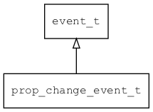

## prop\_change\_event\_t
### 概述


对象属性变化事件。
----------------------------------
### 函数
<p id="prop_change_event_t_methods">

| 函数名称 | 说明 | 
| -------- | ------------ | 
| <a href="#prop_change_event_t_prop_change_event_cast">prop\_change\_event\_cast</a> | 把event对象转prop_change_event_t对象，主要给脚本语言使用。 |
| <a href="#prop_change_event_t_prop_change_event_init">prop\_change\_event\_init</a> | 初始prop change event。 |
### 属性
<p id="prop_change_event_t_properties">

| 属性名称 | 类型 | 说明 | 
| -------- | ----- | ------------ | 
| <a href="#prop_change_event_t_name">name</a> | const char* | 属性的名称。 |
| <a href="#prop_change_event_t_value">value</a> | const value\_t* | 属性的值。 |
#### prop\_change\_event\_cast 函数
-----------------------

* 函数功能：

> <p id="prop_change_event_t_prop_change_event_cast">把event对象转prop_change_event_t对象，主要给脚本语言使用。

* 函数原型：

```
prop_change_event_t* prop_change_event_cast (event_t* event);
```

* 参数说明：

| 参数 | 类型 | 说明 |
| -------- | ----- | --------- |
| 返回值 | prop\_change\_event\_t* | 返回event对象。 |
| event | event\_t* | event对象。 |
#### prop\_change\_event\_init 函数
-----------------------

* 函数功能：

> <p id="prop_change_event_t_prop_change_event_init">初始prop change event。

* 函数原型：

```
event_t* prop_change_event_init (prop_change_event_t* event, uint32_t type, const char* name, const value_t* value);
```

* 参数说明：

| 参数 | 类型 | 说明 |
| -------- | ----- | --------- |
| 返回值 | event\_t* | 返回event对象。 |
| event | prop\_change\_event\_t* | event对象。 |
| type | uint32\_t | 事件类型。 |
| name | const char* | 属性名。 |
| value | const value\_t* | 属性的值。 |
#### name 属性
-----------------------
> <p id="prop_change_event_t_name">属性的名称。

* 类型：const char*

| 特性 | 是否支持 |
| -------- | ----- |
| 可直接读取 | 是 |
| 可直接修改 | 否 |
| 可脚本化   | 是 |
#### value 属性
-----------------------
> <p id="prop_change_event_t_value">属性的值。

* 类型：const value\_t*

| 特性 | 是否支持 |
| -------- | ----- |
| 可直接读取 | 是 |
| 可直接修改 | 否 |
| 可脚本化   | 是 |
